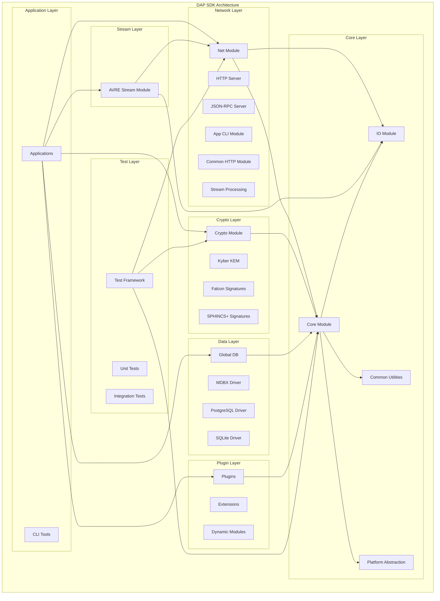
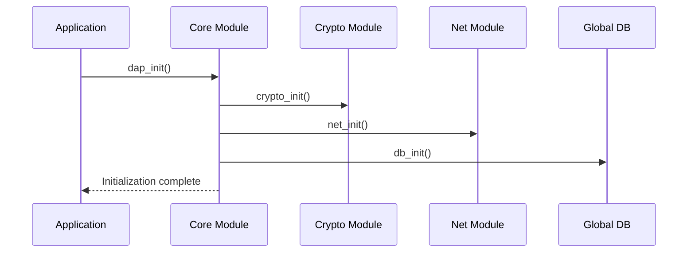
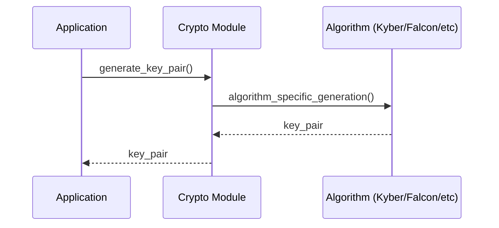
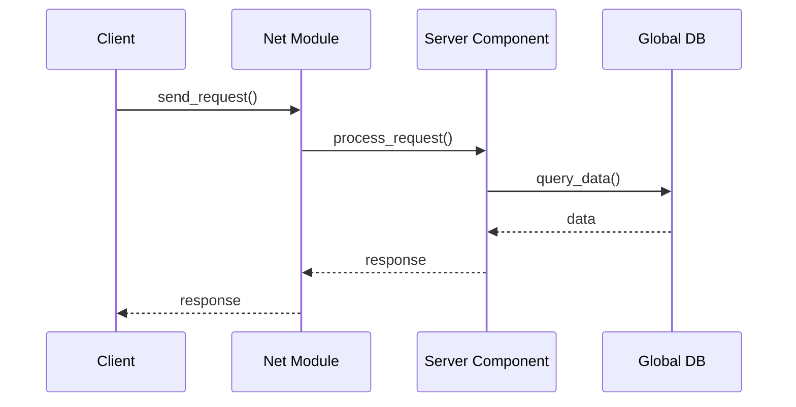

# DAP SDK Architecture

## Architecture overview

DAP SDK is built on a modular architecture where each module encapsulates a specific responsibility. Core principles:

- **Modularity**: Each component is isolated and reusable
- **Extensibility**: Easy to add new modules and algorithms
- **Cross‑platform**: Linux, macOS, Windows support
- **Quantum resistance**: Built‑in support for post‑quantum algorithms

## Architecture diagram



## Main components

### 1. Core Module

**Purpose**: Base functionality and common utilities

**Key components**:
- `dap_common.h` - Common definitions and data structures
- `dap_list.h` - Linked lists
- `dap_hash.h` - Hash functions
- `dap_time.h` - Time utilities
- `dap_module.h` - Modules system
- `dap_config.h` - Configuration system
- `dap_binary_tree.h` - Binary search trees
- `dap_file_utils.h` - File utilities

**Detailed docs**: [Core Module](./modules/core.md)

**Platform‑specific implementations**:
- `core/src/unix/` - Unix/Linux
- `core/src/darwin/` - macOS
- `core/src/win32/` - Windows

### 1.1. IO Module

**Purpose**: I/O system, event handling, and server infrastructure

**Key components**:
- `dap_events.h` - Events and signal handling
- `dap_context.h` - Execution contexts and threads
- `dap_server.h` - Server infra and network connections
- `dap_timerfd.h` - Timer FDs
- `dap_proc_thread.h` - Process/thread control

**Functionality**:
- Async event processing
- Network connection management
- Timers and scheduling
- Multithreaded processing
- Platform‑specific optimizations

### 2. Crypto Module

**Purpose**: Cryptographic algorithms and operations

**Supported algorithms**:

#### Post‑quantum algorithms
- **Kyber**: Key Encapsulation Mechanism (KEM)
  - Kyber512, Kyber768, Kyber1024
- **Falcon**: Lattice‑based digital signatures
- **SPHINCS+**: Hash‑based signatures
- **Dilithium**: Lattice‑based digital signatures
- **Bliss**: Bimodal lattice‑based signatures

#### Specialized algorithms
- **Chipmunk**: Lattice‑based multisignatures
- **XKCP**: Extended Keccak collection

**Detailed docs**: [Crypto Module](./modules/crypto.md)

### 3. Net Module

**Purpose**: Network communications and servers

**Server components**:
- **HTTP Server**: Web server with client support
- **JSON-RPC Server**: JSON‑RPC API server
- **Encryption Server**: Encryption server
- **Notification Server**: Notification server
- **App CLI Module**: Command‑line interface
- **Common HTTP Module**: Common HTTP utilities

**Client components**:
- **HTTP Client**: HTTP client
- **Stream Processing**: Data stream processing
- **Link Manager**: Network connections management

**Detailed docs**: [Net Module](./modules/net.md)

### 3.1. AVRE Stream Module (Streaming)

**Purpose**: Specialized A/V streaming and clustering

**Key components**:
- `avrs_cluster.h` - A/V stream clustering
- `avrs_ch_session.h` - Channel session management
- `avrs_ch_cluster.h` - Channel clusters and routing

**Functionality**:
- Real‑time A/V processing
- Clustering and load balancing
- Session and channel management
- Stream routing
- Synchronization and buffering

### 4. Global DB Module (Database)

**Purpose**: Data management and persistence

**Supported drivers**:
- **MDBX**: High‑performance embedded DB
- **PostgreSQL**: Relational DB
- **SQLite**: Lightweight embedded DB

### 5. Plugin System

**Purpose**: Dynamic loading and extension management

**Key capabilities**:
- Dynamic plugin loading
- Plugin lifecycle management
- API for integration with the host app
- Plugin isolation
- Hot‑swap without restart

### 6. Test Framework

**Purpose**: Automated testing of SDK components

**Key components**:
- `dap_test.h` - Core testing functions
- `dap_test_generator.h` - Test data generators

**Features**:
- Unit testing
- Integration testing
- Test data generation
- Code coverage reports
- Automated execution

## Data flows

### 1. System initialization



### 2. Cryptographic operations



### 3. Network operations



## Configuration and build

### CMake configuration

```cmake
# Core options
option(DAP_INT128_SUPPORT "Use 128-bit variables" ON)
option(BUILD_DAP_SDK_TESTS "Build test suite" OFF)

# Modules
set(DAPSDK_MODULES "core;crypto;net;global-db")

# Dependencies
find_package(Threads REQUIRED)
find_package(PkgConfig REQUIRED)
```

### Modular build

```bash
# Build only the core module
cmake -DDAPSDK_MODULES="core" ..

# Build with tests
cmake -DBUILD_DAP_SDK_TESTS=ON ..

# Build with INT128 disabled
cmake -DDAP_INT128_SUPPORT=OFF ..
```

## Security

### Security principles

1. **Fail Fast**: Rapid error detection and handling
2. **Zero Trust**: Validate all inputs
3. **Defense in Depth**: Multi‑layered protection
4. **Secure by Default**: Secure defaults

### Cryptographic guarantees

- **Quantum resistance**: Support for NIST‑recommended algorithms
- **Perfect Forward Secrecy**: Protects past communications
- **Side‑channel resistance**: Mitigates side‑channel attacks

## Performance

### Optimizations

- **SIMD instructions**: Vectorized operations
- **Parallelism**: Multithreaded processing
- **Caching**: Efficient memory usage
- **Batch operations**: Operation batching

### Benchmarks

| Algorithm | Operation | Performance |
|-----------|-----------|--------------|
| Kyber512 | Key Generation | ~1000 ops/sec |
| Falcon512 | Sign | ~500 ops/sec |
| SPHINCS+ | Sign | ~50 ops/sec |

## Extensibility

### Adding a new algorithm

1. Create implementation in `crypto/src/`
2. Add header in `crypto/include/`
3. Update `crypto/CMakeLists.txt`
4. Add tests in `crypto/test/`

### Adding a new server

1. Create implementation under `net/server/`
2. Add target to `net/server/CMakeLists.txt`
3. Implement the API interface
4. Add documentation

## Debugging and monitoring

### Logging

```c
#include "dap_log.h"

// Various log levels
dap_log(L_DEBUG, "Debug message");
dap_log(L_INFO, "Info message");
dap_log(L_WARNING, "Warning message");
dap_log(L_ERROR, "Error message");
```

### Profiling

```bash
# Build with profiling
cmake -DCMAKE_BUILD_TYPE=RelWithDebInfo ..

# Run with profiling
perf record ./your_application
perf report
```

## Conclusion

DAP SDK provides a powerful and flexible platform for developing decentralized applications with a strong focus on security and performance. Its modular architecture makes it easy to adapt the system to project‑specific requirements.
