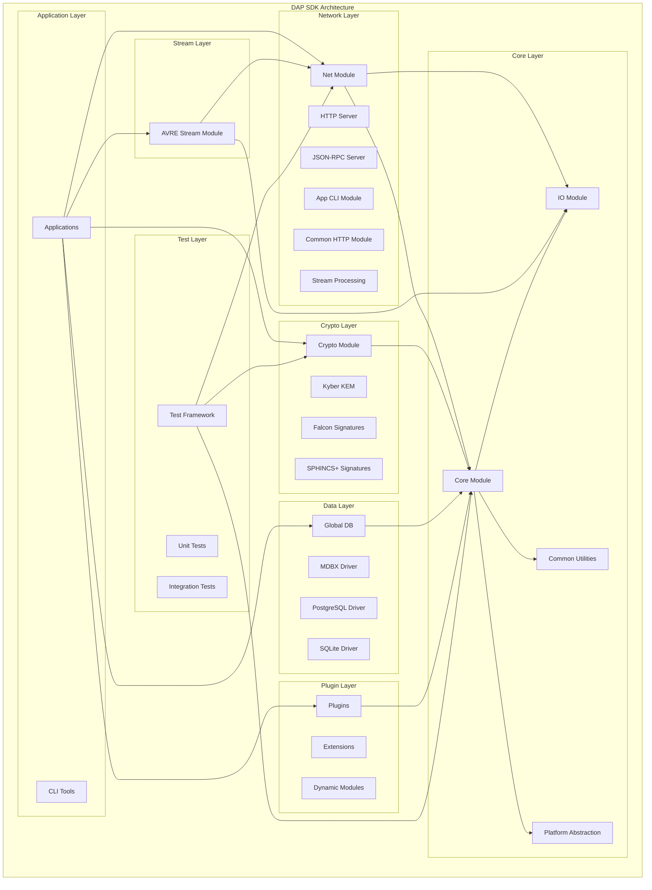
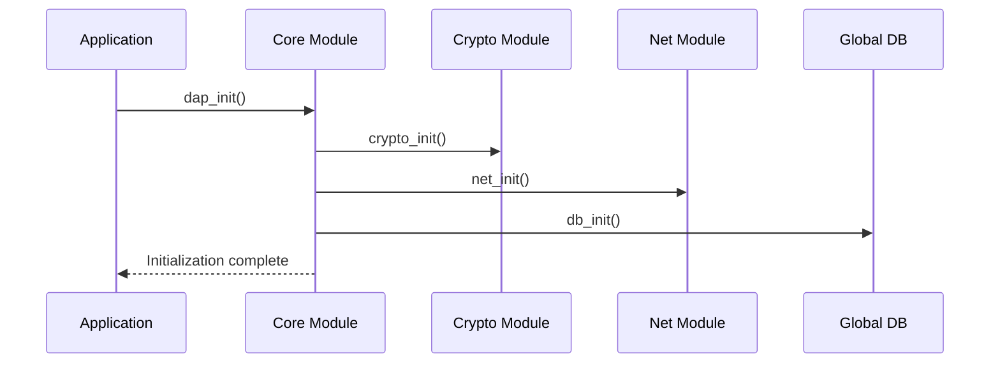
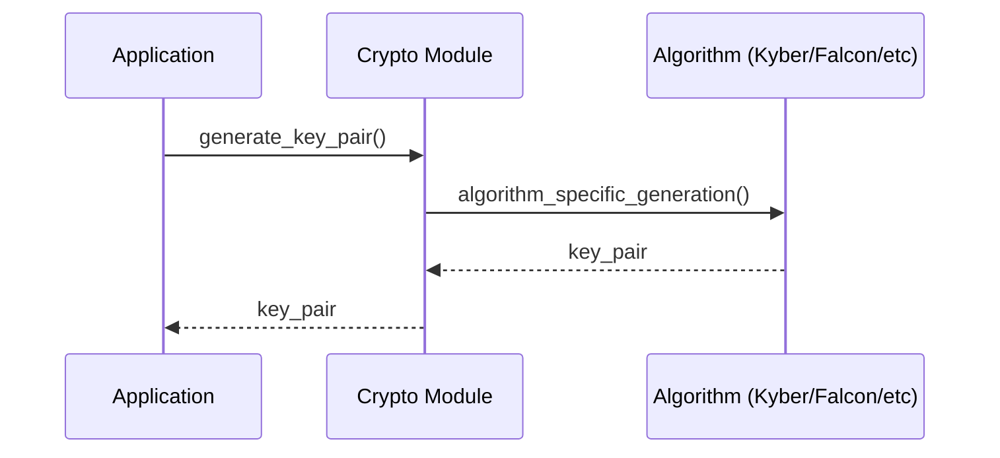
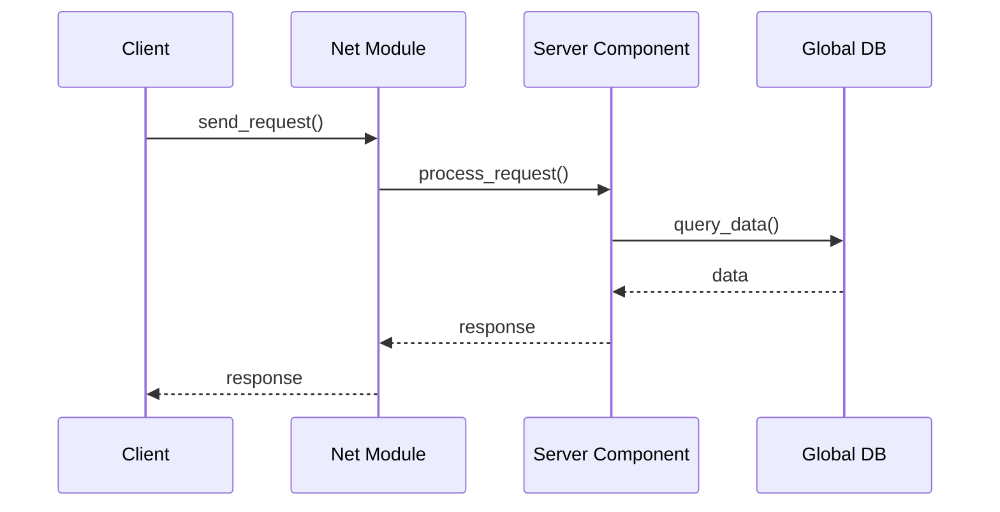

# Архитектура DAP SDK

## Обзор архитектуры

DAP SDK построен на модульной архитектуре, где каждый модуль отвечает за определенную функциональность. Основные принципы:

- **Модульность**: Каждый компонент изолирован и может использоваться независимо
- **Расширяемость**: Легкое добавление новых модулей и алгоритмов
- **Кроссплатформенность**: Поддержка Linux, macOS, Windows
- **Квантово-устойчивость**: Встроенная поддержка пост-квантовых алгоритмов

## Диаграмма архитектуры



## Основные компоненты

### 1. Core Module (Ядро)

**Назначение**: Базовая функциональность и общие утилиты

**Ключевые компоненты**:
- `dap_common.h` - Общие определения и структуры данных
- `dap_list.h` - Реализация связанных списков
- `dap_hash.h` - Хеш-функции
- `dap_time.h` - Работа с временем
- `dap_module.h` - Система модулей
- `dap_config.h` - Система конфигурации
- `dap_binary_tree.h` - Бинарные деревья поиска
- `dap_file_utils.h` - Утилиты работы с файлами

**Подробная документация**: [Core Module](./modules/core.md)

**Платформо-специфичные реализации**:
- `core/src/unix/` - Unix/Linux реализация
- `core/src/darwin/` - macOS реализация
- `core/src/win32/` - Windows реализация

### 1.1. IO Module (Ввод/вывод)

**Назначение**: Система ввода/вывода, событийная обработка и серверная инфраструктура

**Ключевые компоненты**:
- `dap_events.h` - Система событий и обработка сигналов
- `dap_context.h` - Контексты выполнения и управление потоками
- `dap_server.h` - Серверная инфраструктура и сетевые соединения
- `dap_timerfd.h` - Таймеры на базе файловых дескрипторов
- `dap_proc_thread.h` - Управление процессами и потоками

**Функциональность**:
- Асинхронная обработка событий
- Управление сетевыми соединениями
- Таймеры и планировщик задач
- Многопоточная обработка
- Платформо-специфичная оптимизация

### 2. Crypto Module (Криптография)

**Назначение**: Криптографические алгоритмы и операции

**Поддерживаемые алгоритмы**:

#### Пост-квантовые алгоритмы
- **Kyber**: Ключевое инкапсулирование (KEM)
  - Kyber512, Kyber768, Kyber1024
- **Falcon**: Цифровые подписи на основе решеток
- **SPHINCS+**: Хеш-базированные подписи
- **Dilithium**: Цифровые подписи на основе решеток
- **Bliss**: Бимодальные подписи на основе решеток

#### Специализированные алгоритмы
- **Chipmunk**: Мультиподписи на основе решеток
- **XKCP**: Расширенная коллекция Keccak

**Подробная документация**: [Crypto Module](./modules/crypto.md)

### 3. Net Module (Сеть)

**Назначение**: Сетевые коммуникации и серверы

**Серверные компоненты**:
- **HTTP Server**: Веб-сервер с поддержкой клиентов
- **JSON-RPC Server**: JSON-RPC API сервер
- **Encryption Server**: Сервер шифрования
- **Notification Server**: Сервер уведомлений
- **App CLI Module**: Интерфейс командной строки
- **Common HTTP Module**: Общие HTTP функции

**Клиентские компоненты**:
- **HTTP Client**: HTTP клиент
- **Stream Processing**: Обработка потоков данных
- **Link Manager**: Управление сетевыми соединениями

**Подробная документация**: [Net Module](./modules/net.md)

### 3.1. AVRE Stream Module (Потоковая обработка)

**Назначение**: Специализированная обработка аудио/видео потоков и кластеризация

**Ключевые компоненты**:
- `avrs_cluster.h` - Кластеризация аудио/видео потоков
- `avrs_ch_session.h` - Управление сессиями каналов
- `avrs_ch_cluster.h` - Кластеры каналов и маршрутизация

**Функциональность**:
- Обработка аудио/видео потоков в реальном времени
- Кластеризация и балансировка нагрузки
- Управление сессиями и каналами
- Маршрутизация потоков
- Синхронизация и буферизация

### 4. Global DB Module (База данных)

**Назначение**: Управление данными и персистентность

**Поддерживаемые драйверы**:
- **MDBX**: Высокопроизводительная встроенная БД
- **PostgreSQL**: Реляционная БД
- **SQLite**: Легковесная встроенная БД

### 5. Plugin System (Система плагинов)

**Назначение**: Динамическая загрузка и управление расширениями

**Ключевые возможности**:
- Динамическая загрузка плагинов
- Управление жизненным циклом плагинов
- API для взаимодействия с основным приложением
- Изоляция плагинов
- Горячая замена без перезапуска

### 6. Test Framework (Фреймворк тестирования)

**Назначение**: Автоматизированное тестирование компонентов SDK

**Ключевые компоненты**:
- `dap_test.h` - Основные функции тестирования
- `dap_test_generator.h` - Генераторы тестовых данных

**Возможности**:
- Unit-тестирование модулей
- Интеграционное тестирование
- Генерация тестовых данных
- Отчеты о покрытии кода
- Автоматизированное выполнение

## Потоки данных

### 1. Инициализация системы



### 2. Криптографические операции



### 3. Сетевые операции



## Конфигурация и сборка

### CMake конфигурация

```cmake
# Основные опции
option(DAP_INT128_SUPPORT "Use 128-bit variables" ON)
option(BUILD_DAP_SDK_TESTS "Build test suite" OFF)

# Модули
set(DAPSDK_MODULES "core;crypto;net;global-db")

# Зависимости
find_package(Threads REQUIRED)
find_package(PkgConfig REQUIRED)
```

### Модульная сборка

```bash
# Сборка только core модуля
cmake -DDAPSDK_MODULES="core" ..

# Сборка с тестами
cmake -DBUILD_DAP_SDK_TESTS=ON ..

# Сборка с отключенным INT128
cmake -DDAP_INT128_SUPPORT=OFF ..
```

## Безопасность

### Принципы безопасности

1. **Fail Fast**: Быстрое обнаружение и обработка ошибок
2. **Zero Trust**: Проверка всех входных данных
3. **Defense in Depth**: Многоуровневая защита
4. **Secure by Default**: Безопасные настройки по умолчанию

### Криптографические гарантии

- **Квантово-устойчивость**: Поддержка NIST-рекомендованных алгоритмов
- **Perfect Forward Secrecy**: Защита прошлых коммуникаций
- **Side-channel Resistance**: Защита от атак по побочным каналам

## Производительность

### Оптимизации

- **SIMD инструкции**: Использование векторных операций
- **Параллелизм**: Многопоточная обработка
- **Кэширование**: Эффективное управление памятью
- **Batch операции**: Группировка операций

### Бенчмарки

| Алгоритм | Операция | Производительность |
|----------|----------|-------------------|
| Kyber512 | Key Generation | ~1000 ops/sec |
| Falcon512 | Sign | ~500 ops/sec |
| SPHINCS+ | Sign | ~50 ops/sec |

## Расширение системы

### Добавление нового алгоритма

1. Создать реализацию в `crypto/src/`
2. Добавить заголовочный файл в `crypto/include/`
3. Обновить `crypto/CMakeLists.txt`
4. Добавить тесты в `crypto/test/`

### Добавление нового сервера

1. Создать реализацию в `net/server/`
2. Добавить в `net/server/CMakeLists.txt`
3. Реализовать API интерфейс
4. Добавить документацию

## Отладка и мониторинг

### Логирование

```c
#include "dap_log.h"

// Различные уровни логирования
dap_log(L_DEBUG, "Debug message");
dap_log(L_INFO, "Info message");
dap_log(L_WARNING, "Warning message");
dap_log(L_ERROR, "Error message");
```

### Профилирование

```bash
# Сборка с профилированием
cmake -DCMAKE_BUILD_TYPE=RelWithDebInfo ..

# Запуск с профилированием
perf record ./your_application
perf report
```

## Заключение

DAP SDK предоставляет мощную и гибкую платформу для разработки децентрализованных приложений с акцентом на безопасность и производительность. Модульная архитектура позволяет легко адаптировать систему под конкретные требования проекта.
