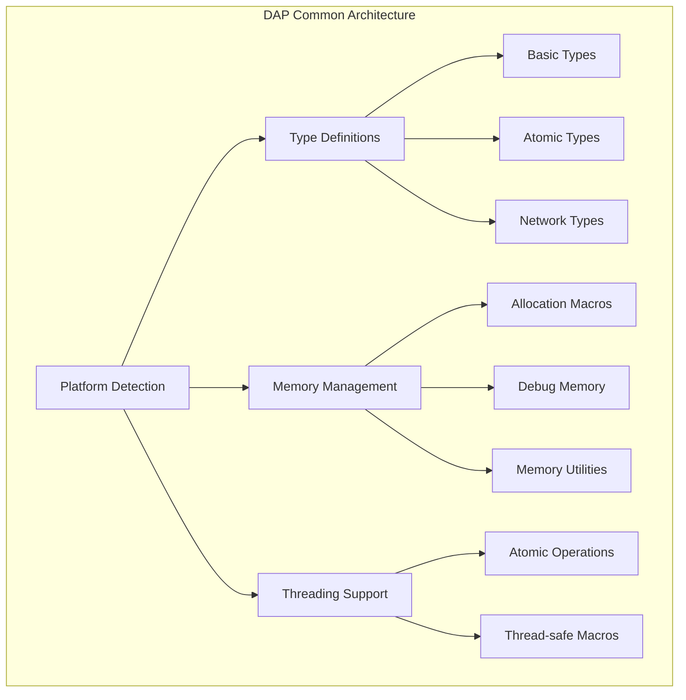

# DAP Common Module (dap_common.h/c)

## Обзор

Модуль `dap_common.h/c` является фундаментальным компонентом DAP SDK, предоставляющим основные определения типов, макросы, утилиты и кроссплатформенные абстракции. Этот модуль является основой для всех остальных компонентов SDK.

## Основные возможности

- **Кроссплатформенные определения**: Обеспечивает совместимость между Windows, Linux и macOS
- **Базовые типы данных**: Определения стандартных типов и структур
- **Управление памятью**: Макросы и функции для безопасного управления памятью
- **Атомарные операции**: Поддержка многопоточного программирования
- **Вспомогательные макросы**: Утилиты для преобразования типов и отладки
- **Сетевые утилиты**: Функции для работы с сетевыми адресами и данными

## Архитектура



## Основные определения типов

### Базовые типы

```c
// Основные типы данных
typedef uint8_t byte_t;           // Базовый байтовый тип
typedef int dap_spinlock_t;       // Спинлок для многопоточной синхронизации

// Платформо-зависимые типы
#ifdef DAP_OS_WINDOWS
typedef HANDLE dap_file_handle_t; // Файловый дескриптор Windows
typedef DWORD dap_errnum_t;       // Код ошибки Windows
#else
typedef int dap_file_handle_t;    // Файловый дескриптор Unix
typedef int dap_errnum_t;         // Код ошибки Unix
#endif
```

### Атомарные типы

```c
// Атомарные переменные для многопоточного программирования
#ifndef __cplusplus
#include <stdatomic.h>
#define _Atomic(X) std::atomic<X>
#define atomic_bool _Atomic(bool)
#define atomic_uint _Atomic(uint)
#define atomic_int _Atomic(int)
#endif
```

### Сетевые типы

```c
// Структура сетевого адреса узла
typedef union dap_stream_node_addr {
    uint64_t uint64;              // 64-битное представление
    uint16_t words[4];            // Доступ к 16-битным словам
    uint8_t raw[8];               // Доступ к отдельным байтам
} DAP_ALIGN_PACKED dap_stream_node_addr_t;
```

## Управление памятью

### Основные макросы выделения памяти

```c
// Базовые операции с памятью
#define DAP_MALLOC(size)         malloc(size)           // Выделение памяти
#define DAP_FREE(ptr)           free(ptr)              // Освобождение памяти
#define DAP_CALLOC(n, size)     calloc(n, size)        // Выделение с обнулением
#define DAP_REALLOC(ptr, size)  realloc(ptr, size)     // Перераспределение

// Безопасные операции (с проверками)
#define DAP_NEW(type)           (type*)malloc(sizeof(type))
#define DAP_NEW_Z(type)         (type*)calloc(1, sizeof(type))
#define DAP_DELETE(ptr)         do { free(ptr); ptr = NULL; } while(0)
#define DAP_DEL_Z(ptr)          do { free(ptr); ptr = NULL; } while(0)
```

### Отладочная память (только в режиме отладки)

```c
#ifdef DAP_SYS_DEBUG
// Отладочные функции выделения памяти
static inline void *s_vm_get(const char *file, int line, ssize_t size);
static inline void *s_vm_get_z(const char *file, int line, ssize_t n, ssize_t size);
static inline void s_vm_free(const char *file, int line, void *ptr);

// Макросы с трассировкой
#define DAP_MALLOC(size)       s_vm_get(__FILE__, __LINE__, size)
#define DAP_FREE(ptr)          s_vm_free(__FILE__, __LINE__, ptr)
#endif
```

## Вспомогательные макросы

### Преобразование типов

```c
// Преобразование указатель ↔ целое
#define DAP_INT_TO_POINTER(i)      ((void*)(size_t)(i))
#define DAP_POINTER_TO_INT(p)      ((int)(size_t)(void*)(p))
#define DAP_UINT_TO_POINTER(u)     ((void*)(unsigned long)(u))
#define DAP_POINTER_TO_UINT(p)     ((unsigned int)(unsigned long)(p))
#define DAP_SIZE_TO_POINTER(s)     ((void*)(size_t)(s))
#define DAP_POINTER_TO_SIZE(p)     ((size_t)(p))
```

### Битовые операции

```c
#define BIT(x) (1 << (x))  // Получение бита по номеру
```

### Выравнивание и упаковка

```c
// GCC/Clang специфичные
#ifdef __GNUC__
#define DAP_ALIGN_PACKED        __attribute__((aligned(1),packed))
#define DAP_PACKED             __attribute__((packed))
#define DAP_STATIC_INLINE      static __attribute__((always_inline)) inline
#define DAP_INLINE             __attribute__((always_inline)) inline
#define DAP_ALIGNED(x)         __attribute__((aligned(x)))
#endif

// Microsoft Visual C++
#ifdef _MSC_VER
#define DAP_STATIC_INLINE      static __forceinline
#define DAP_INLINE             __forceinline
#define DAP_ALIGNED(x)         __declspec(align(x))
#endif
```

## Атомарные операции

```c
// Спинлоки для многопоточной синхронизации
DAP_STATIC_INLINE void DAP_AtomicLock(dap_spinlock_t *lock) {
    __sync_lock_test_and_set(lock, 1);
}

DAP_STATIC_INLINE void DAP_AtomicUnlock(dap_spinlock_t *lock) {
    __sync_lock_release(lock);
}
```

## Сетевые утилиты

### Работа с сетевыми адресами

```c
// Форматирование адресов узлов
#define NODE_ADDR_FP_STR      "%04hX::%04hX::%04hX::%04hX"
#define NODE_ADDR_FP_ARGS(a)  (a)->words[3],(a)->words[2],(a)->words[1],(a)->words[0]

// Преобразование строки в адрес
DAP_STATIC_INLINE int dap_stream_node_addr_from_str(
    dap_stream_node_addr_t *addr,
    const char *addr_str
);

// Преобразование адреса в строку
dap_node_addr_str_t dap_stream_node_addr_to_str_static(dap_stream_node_addr_t addr);
#define dap_stream_node_addr_to_str_static(a) \
    dap_stream_node_addr_to_str_static_(a).s
```

## Математические утилиты

### Безопасная арифметика

```c
// Макросы с проверкой переполнения
#define dap_add(a,b) ({ \
    __typeof__(a) _a = (a); __typeof__(b) _b = (b); \
    if (!__builtin_add_overflow_p(_a,_b,_a)) { _a += _b; } \
    _a; \
})

#define dap_sub(a,b) ({ \
    __typeof__(a) _a = (a); __typeof__(b) _b = (b); \
    if (!__builtin_sub_overflow_p(_a,_b,_a)) { _a -= _b; } \
    _a; \
})
```

### Утилиты для работы с числами

```c
// Максимальные/минимальные значения типов
#define dap_maxval(v) _Generic((v), \
    signed char: SCHAR_MAX, \
    unsigned char: UCHAR_MAX, \
    int: INT_MAX, \
    unsigned int: UINT_MAX, \
    /* ... и т.д. */ \
)

// Проверка знака
#define dap_is_signed(v) (dap_minval(v) < 0)
```

## Строковые функции

### ASCII-классификация символов

```c
// Таблица ASCII символов (256 элементов)
static const uint16_t s_ascii_table_data[256] = { ... };

// Макросы классификации
#define dap_ascii_isspace(c) (s_ascii_table_data[(unsigned char)(c)] & DAP_ASCII_SPACE)
#define dap_ascii_isalpha(c) (s_ascii_table_data[(unsigned char)(c)] & DAP_ASCII_ALPHA)
#define dap_ascii_isdigit(c) (s_ascii_table_data[(unsigned char)(c)] & DAP_ASCII_DIGIT)
```

### Преобразование чисел в строки

```c
// Безопасное преобразование чисел в строки
dap_maxint_str_t dap_itoa_(long long i);
dap_maxint_str_t dap_utoa_(unsigned long long i);

#define dap_itoa(i) (char*)dap_itoa_(i).s
#define dap_utoa(i) (char*)dap_utoa_(i).s
```

## Работа с временем

### Таймеры и интервалы

```c
typedef void *dap_interval_timer_t;
typedef void (*dap_timer_callback_t)(void *param);

// Создание таймера
dap_interval_timer_t dap_interval_timer_create(
    unsigned int msec,
    dap_timer_callback_t callback,
    void *param
);

// Удаление таймера
void dap_interval_timer_delete(dap_interval_timer_t timer);
```

### Работа со страницами памяти

```c
// Размер страницы памяти
DAP_STATIC_INLINE unsigned long dap_pagesize();

// Выравнивание по границам страниц
DAP_STATIC_INLINE uint64_t dap_page_roundup(uint64_t a);
DAP_STATIC_INLINE uint64_t dap_page_rounddown(uint64_t a);
```

## Логирование

### Уровни логирования

```c
typedef enum dap_log_level {
    L_DEBUG = 0,      // Отладочная информация
    L_INFO = 1,       // Информационные сообщения
    L_NOTICE = 2,     // Уведомления
    L_MSG = 3,        // Сообщения
    L_DAP = 4,        // DAP-специфичные сообщения
    L_WARNING = 5,    // Предупреждения
    L_ATT = 6,        // Внимание
    L_ERROR = 7,      // Ошибки
    L_CRITICAL = 8,   // Критические ошибки
    L_TOTAL           // Общее количество уровней
} dap_log_level_t;
```

### Функции логирования

```c
// Основная функция логирования
void _log_it(const char *func_name, int line_num, const char *log_tag,
            enum dap_log_level level, const char *format, ...);

// Удобные макросы
#define log_it(level, ...) _log_it(NULL, 0, LOG_TAG, level, ##__VA_ARGS__)
#define log_it_fl(level, ...) _log_it(__FUNCTION__, __LINE__, LOG_TAG, level, ##__VA_ARGS__)
```

## Примеры использования

### 1. Базовое управление памятью

```c
#include <dap_common.h>

// Выделение памяти
int *array = DAP_NEW_Z_COUNT(int, 10);  // Массив из 10 int, инициализированный нулями

// Освобождение памяти
DAP_DELETE(array);
```

### 2. Работа с сетевыми адресами

```c
#include <dap_common.h>

dap_stream_node_addr_t addr;

// Преобразование строки в адрес
if (dap_stream_node_addr_from_str(&addr, "1234::5678::9ABC::DEF0") == 0) {
    // Адрес успешно преобразован
}

// Преобразование адреса в строку
const char *addr_str = dap_stream_node_addr_to_str_static(addr);
printf("Address: %s\n", addr_str);
```

### 3. Атомарные операции

```c
#include <dap_common.h>

dap_spinlock_t lock = 0;

// Захват спинлока
DAP_AtomicLock(&lock);

// Критическая секция
// ... операции с разделяемыми данными ...

// Освобождение спинлока
DAP_AtomicUnlock(&lock);
```

### 4. Логирование

```c
#include <dap_common.h>

// Определение тега для модуля
#define LOG_TAG "MY_MODULE"

// Логирование сообщений разных уровней
log_it(L_INFO, "Module initialized");
log_it(L_WARNING, "Configuration file not found, using defaults");
log_it(L_ERROR, "Failed to connect to database: %s", error_msg);
```

### 5. Безопасная арифметика

```c
#include <dap_common.h>

size_t a = 100, b = 50;

// Безопасное сложение с проверкой переполнения
size_t result = dap_add(a, b);

// Безопасное вычитание
size_t diff = dap_sub(a, b);
```

## Безопасность

### Принципы безопасности

1. **Защита от переполнения**: Все арифметические операции проверяются на переполнение
2. **Безопасное освобождение памяти**: Макросы `DAP_DEL_Z` устанавливают указатели в NULL
3. **Платформо-зависимая безопасность**: Корректная обработка различий между платформами
4. **Атомарные операции**: Безопасная работа в многопоточном окружении

### Рекомендации по использованию

- Всегда используйте макросы DAP SDK вместо стандартных функций
- Проверяйте возвращаемые значения операций выделения памяти
- Используйте атомарные операции для многопоточной синхронизации
- Применяйте безопасную арифметику для предотвращения переполнений

## Производительность

### Оптимизации

- **Встраиваемые функции**: Многие утилиты реализованы как `inline` функции
- **Компиляторные оптимизации**: Использование `__builtin_expect` для branch prediction
- **SIMD-friendly**: Выравнивание структур для векторных операций
- **Кэш-эффективные**: Оптимизированные структуры данных

### Бенчмарки

| Операция | Производительность | Комментарий |
|----------|-------------------|-------------|
| DAP_MALLOC | ~10-50ns | С трассировкой в debug режиме |
| dap_add/dap_sub | ~5-10ns | С проверкой переполнения |
| dap_ascii_* | ~1-2ns | Табличные функции |

## Совместимость

### Поддерживаемые платформы

- **Linux**: Полная поддержка всех функций
- **macOS**: Полная поддержка, включая Grand Central Dispatch
- **Windows**: Поддержка через MinGW и MSVC
- **Android**: Поддержка через NDK

### Версии компиляторов

- **GCC**: 4.8+
- **Clang**: 3.5+
- **MSVC**: 2015+

## Заключение

Модуль `dap_common.h/c` является фундаментом всего DAP SDK, предоставляя надежные и безопасные базовые примитивы для построения высокопроизводительных и кроссплатформенных приложений. Правильное использование этого модуля гарантирует совместимость, безопасность и оптимальную производительность приложений.
