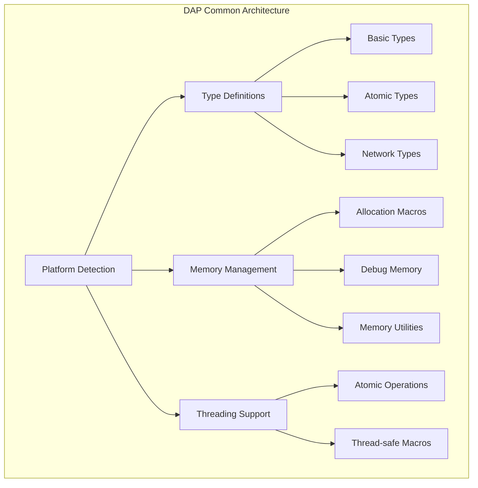

# DAP Common Module (dap_common.h/c)

## Overview

The `dap_common.h/c` module is a foundational component of the DAP SDK, providing core type definitions, macros, utilities, and cross‑platform abstractions. It is the basis for all other SDK components.

## Key features

- **Cross‑platform definitions**: Compatibility across Windows, Linux, and macOS
- **Basic data types**: Standard types and structures
- **Memory management**: Macros and functions for safe memory handling
- **Atomic operations**: Multithreading support
- **Helper macros**: Utilities for type conversion and debugging
- **Networking utilities**: Functions for working with node addresses and data

## Architecture



## Core type definitions

### Basic types

```c
// Fundamental data types
typedef uint8_t byte_t;           // Base byte type
typedef int dap_spinlock_t;       // Spinlock for multithreaded sync

// Platform‑dependent types
#ifdef DAP_OS_WINDOWS
typedef HANDLE dap_file_handle_t; // Windows file handle
typedef DWORD dap_errnum_t;       // Windows error code
#else
typedef int dap_file_handle_t;    // Unix file descriptor
typedef int dap_errnum_t;         // Unix error code
#endif
```

### Atomic types

```c
// Atomic variables for multithreaded programming
#ifndef __cplusplus
#include <stdatomic.h>
#define _Atomic(X) std::atomic<X>
#define atomic_bool _Atomic(bool)
#define atomic_uint _Atomic(uint)
#define atomic_int _Atomic(int)
#endif
```

### Network types

```c
// Node network address structure
typedef union dap_stream_node_addr {
    uint64_t uint64;              // 64‑bit representation
    uint16_t words[4];            // 16‑bit word access
    uint8_t raw[8];               // Raw byte access
} DAP_ALIGN_PACKED dap_stream_node_addr_t;
```

## Memory management

### Core allocation macros

```c
// Basic memory operations
#define DAP_MALLOC(size)         malloc(size)           // Allocate
#define DAP_FREE(ptr)           free(ptr)              // Free
#define DAP_CALLOC(n, size)     calloc(n, size)        // Zeroed allocation
#define DAP_REALLOC(ptr, size)  realloc(ptr, size)     // Reallocate

// Safe operations (with checks)
#define DAP_NEW(type)           (type*)malloc(sizeof(type))
#define DAP_NEW_Z(type)         (type*)calloc(1, sizeof(type))
#define DAP_DELETE(ptr)         do { free(ptr); ptr = NULL; } while(0)
#define DAP_DEL_Z(ptr)          do { free(ptr); ptr = NULL; } while(0)
```

### Debug memory (debug builds only)

```c
#ifdef DAP_SYS_DEBUG
// Debug allocation functions
static inline void *s_vm_get(const char *file, int line, ssize_t size);
static inline void *s_vm_get_z(const char *file, int line, ssize_t n, ssize_t size);
static inline void s_vm_free(const char *file, int line, void *ptr);

// Tracing macros
#define DAP_MALLOC(size)       s_vm_get(__FILE__, __LINE__, size)
#define DAP_FREE(ptr)          s_vm_free(__FILE__, __LINE__, ptr)
#endif
```

## Helper macros

### Type conversions

```c
// Pointer ↔ integer conversions
#define DAP_INT_TO_POINTER(i)      ((void*)(size_t)(i))
#define DAP_POINTER_TO_INT(p)      ((int)(size_t)(void*)(p))
#define DAP_UINT_TO_POINTER(u)     ((void*)(unsigned long)(u))
#define DAP_POINTER_TO_UINT(p)     ((unsigned int)(unsigned long)(p))
#define DAP_SIZE_TO_POINTER(s)     ((void*)(size_t)(s))
#define DAP_POINTER_TO_SIZE(p)     ((size_t)(p))
```

### Bit operations

```c
#define BIT(x) (1 << (x))  // Get bit by index
```

### Alignment and packing

```c
// GCC/Clang specific
#ifdef __GNUC__
#define DAP_ALIGN_PACKED        __attribute__((aligned(1),packed))
#define DAP_PACKED             __attribute__((packed))
#define DAP_STATIC_INLINE      static __attribute__((always_inline)) inline
#define DAP_INLINE             __attribute__((always_inline)) inline
#define DAP_ALIGNED(x)         __attribute__((aligned(x)))
#endif

// Microsoft Visual C++
#ifdef _MSC_VER
#define DAP_STATIC_INLINE      static __forceinline
#define DAP_INLINE             __forceinline
#define DAP_ALIGNED(x)         __declspec(align(x))
#endif
```

## Atomic operations

```c
// Spinlocks for multithreaded synchronization
DAP_STATIC_INLINE void DAP_AtomicLock(dap_spinlock_t *lock) {
    __sync_lock_test_and_set(lock, 1);
}

DAP_STATIC_INLINE void DAP_AtomicUnlock(dap_spinlock_t *lock) {
    __sync_lock_release(lock);
}
```

## Networking utilities

### Node addresses

```c
// Node address formatting
#define NODE_ADDR_FP_STR      "%04hX::%04hX::%04hX::%04hX"
#define NODE_ADDR_FP_ARGS(a)  (a)->words[3],(a)->words[2],(a)->words[1],(a)->words[0]

// String to address
DAP_STATIC_INLINE int dap_stream_node_addr_from_str(
    dap_stream_node_addr_t *addr,
    const char *addr_str
);

// Address to string
dap_node_addr_str_t dap_stream_node_addr_to_str_static(dap_stream_node_addr_t addr);
#define dap_stream_node_addr_to_str_static(a) \
    dap_stream_node_addr_to_str_static_(a).s
```

## Math utilities

### Safe arithmetic

```c
// Overflow‑checked macros
#define dap_add(a,b) ({ \
    __typeof__(a) _a = (a); __typeof__(b) _b = (b); \
    if (!__builtin_add_overflow_p(_a,_b,_a)) { _a += _b; } \
    _a; \
})

#define dap_sub(a,b) ({ \
    __typeof__(a) _a = (a); __typeof__(b) _b = (b); \
    if (!__builtin_sub_overflow_p(_a,_b,_a)) { _a -= _b; } \
    _a; \
})
```

### Numeric helpers

```c
// Type max/min helpers
#define dap_maxval(v) _Generic((v), \
    signed char: SCHAR_MAX, \
    unsigned char: UCHAR_MAX, \
    int: INT_MAX, \
    unsigned int: UINT_MAX, \
    /* ... etc. */ \
)

// Sign check
#define dap_is_signed(v) (dap_minval(v) < 0)
```

## String utilities

### ASCII character classes

```c
// ASCII table (256 entries)
static const uint16_t s_ascii_table_data[256] = { ... };

// Classification macros
#define dap_ascii_isspace(c) (s_ascii_table_data[(unsigned char)(c)] & DAP_ASCII_SPACE)
#define dap_ascii_isalpha(c) (s_ascii_table_data[(unsigned char)(c)] & DAP_ASCII_ALPHA)
#define dap_ascii_isdigit(c) (s_ascii_table_data[(unsigned char)(c)] & DAP_ASCII_DIGIT)
```

### Number‑to‑string conversion

```c
// Safe number‑to‑string conversion
dap_maxint_str_t dap_itoa_(long long i);
dap_maxint_str_t dap_utoa_(unsigned long long i);

#define dap_itoa(i) (char*)dap_itoa_(i).s
#define dap_utoa(i) (char*)dap_utoa_(i).s
```

## Time utilities

### Timers and intervals

```c
typedef void *dap_interval_timer_t;
typedef void (*dap_timer_callback_t)(void *param);

// Create timer
dap_interval_timer_t dap_interval_timer_create(
    unsigned int msec,
    dap_timer_callback_t callback,
    void *param
);

// Delete timer
void dap_interval_timer_delete(dap_interval_timer_t timer);
```

### Memory page utilities

```c
// Page size
DAP_STATIC_INLINE unsigned long dap_pagesize();

// Page‑aligned rounding
DAP_STATIC_INLINE uint64_t dap_page_roundup(uint64_t a);
DAP_STATIC_INLINE uint64_t dap_page_rounddown(uint64_t a);
```

## Logging

### Log levels

```c
typedef enum dap_log_level {
    L_DEBUG = 0,      // Debug info
    L_INFO = 1,       // Information
    L_NOTICE = 2,     // Notice
    L_MSG = 3,        // Message
    L_DAP = 4,        // DAP‑specific
    L_WARNING = 5,    // Warning
    L_ATT = 6,        // Attention
    L_ERROR = 7,      // Error
    L_CRITICAL = 8,   // Critical
    L_TOTAL           // Total number of levels
} dap_log_level_t;
```

### Logging functions

```c
// Core logging function
void _log_it(const char *func_name, int line_num, const char *log_tag,
            enum dap_log_level level, const char *format, ...);

// Convenience macros
#define log_it(level, ...) _log_it(NULL, 0, LOG_TAG, level, ##__VA_ARGS__)
#define log_it_fl(level, ...) _log_it(__FUNCTION__, __LINE__, LOG_TAG, level, ##__VA_ARGS__)
```

## Usage examples

### 1. Basic memory management

```c
#include <dap_common.h>

// Allocate
int *array = DAP_NEW_Z_COUNT(int, 10);  // 10 ints, zero‑initialized

// Free
DAP_DELETE(array);
```

### 2. Working with node addresses

```c
#include <dap_common.h>

dap_stream_node_addr_t addr;

// String to address
if (dap_stream_node_addr_from_str(&addr, "1234::5678::9ABC::DEF0") == 0) {
    // Converted successfully
}

// Address to string
const char *addr_str = dap_stream_node_addr_to_str_static(addr);
printf("Address: %s\n", addr_str);
```

### 3. Atomic operations

```c
#include <dap_common.h>

dap_spinlock_t lock = 0;

// Acquire spinlock
DAP_AtomicLock(&lock);

// Critical section
// ... shared data operations ...

// Release spinlock
DAP_AtomicUnlock(&lock);
```

### 4. Logging

```c
#include <dap_common.h>

// Define module tag
#define LOG_TAG "MY_MODULE"

// Log messages of different levels
log_it(L_INFO, "Module initialized");
log_it(L_WARNING, "Configuration file not found, using defaults");
log_it(L_ERROR, "Failed to connect to database: %s", error_msg);
```

### 5. Safe arithmetic

```c
#include <dap_common.h>

size_t a = 100, b = 50;

// Overflow‑checked addition
size_t result = dap_add(a, b);

// Overflow‑checked subtraction
size_t diff = dap_sub(a, b);
```

## Security

### Security principles

1. **Overflow protection**: All arithmetic ops are overflow‑checked
2. **Safe freeing**: `DAP_DEL_Z` macros set pointers to NULL
3. **Platform‑aware safety**: Proper handling of platform differences
4. **Atomic operations**: Safe multithreaded execution

### Usage recommendations

- Always use DAP SDK macros instead of raw stdlib calls
- Check return values of allocation operations
- Use atomic operations for multithreaded synchronization
- Use safe arithmetic to prevent overflows

## Performance

### Optimizations

- **Inlined functions**: Many utilities are `inline`
- **Compiler optimizations**: `__builtin_expect` for branch prediction
- **SIMD‑friendly**: Aligned structures for vector ops
- **Cache‑efficient**: Optimized data structures

### Benchmarks

| Operation | Performance | Notes |
|----------|-------------|-------|
| DAP_MALLOC | ~10-50ns | With tracing in debug |
| dap_add/dap_sub | ~5-10ns | Overflow‑checked |
| dap_ascii_* | ~1-2ns | Table‑based |

## Compatibility

### Supported platforms

- **Linux**: Full support
- **macOS**: Full support (incl. GCD)
- **Windows**: MinGW and MSVC
- **Android**: NDK

### Compiler versions

- **GCC**: 4.8+
- **Clang**: 3.5+
- **MSVC**: 2015+

## Conclusion

The `dap_common.h/c` module is the foundation of the DAP SDK, providing reliable and safe building blocks for high‑performance, cross‑platform applications. Proper use ensures compatibility, security, and optimal performance.
