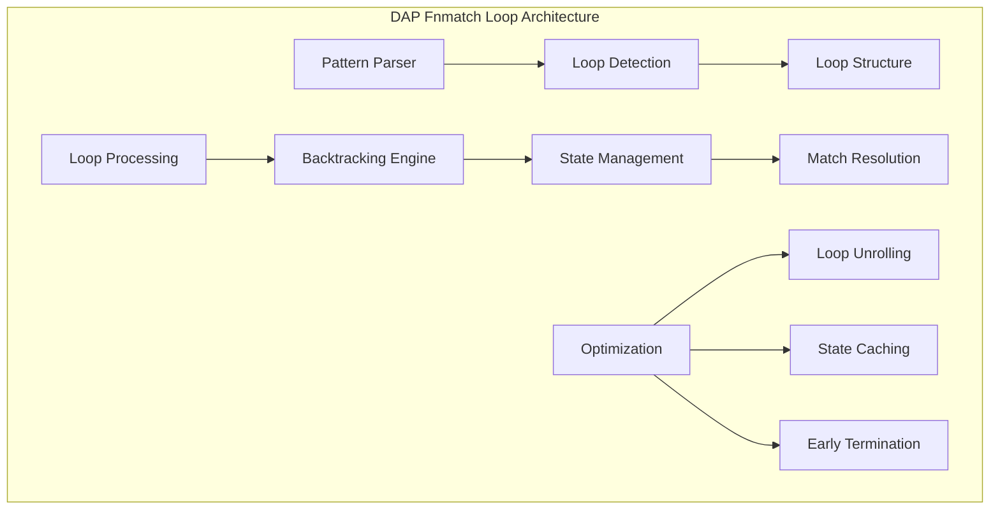

# DAP Fnmatch Loop Module (dap_fnmatch_loop.h)

## Overview

The `dap_fnmatch_loop.h` module provides internal structures and macros for implementing pattern matching with loop‑based constructs. It is part of the `fnmatch` implementation in the DAP SDK and enables efficient handling of complex patterns with repetitions.

## Purpose

The fnmatch_loop module is used for:

- **Implementing loop constructs** in fnmatch patterns
- **Processing repeating elements** in pattern matching
- **Optimizing complex patterns** with quantifiers
- **Supporting extended regex‑like masks** in file patterns

## Architecture



## Features

### 🔄 **Loop constructs**
- Support for repeating elements in patterns
- Handling of quantifiers (*, +, {n,m})
- Optimization for frequently repeating patterns
- Memory‑efficient loop handling

### ⚡ **Performance optimizations**
- Loop unrolling for simple repetitions
- State caching for repeated checks
- Early termination on mismatch
- Memory‑efficient backtracking

### 🏗️ **Data structures**
- Specialized structures for loop processing
- Optimized state machines
- Efficient call‑stack management
- Minimal memory usage

## Internal structure

### Core loop structure

```c
// Structure for processing loop constructs
struct STRUCT {
    const char *pattern;           // Current pattern
    const char *string;            // String being processed
    int no_leading_period;         // Leading period handling flag
};

// Macros for loop handling
#define L_func(CS)  CS             // Functional macro
#define L(str)      L_func(str)    // Simplified invocation
```

### Loop states

```c
// Enumeration of loop processing states
typedef enum {
    LOOP_STATE_INIT,           // Initialization
    LOOP_STATE_PROCESSING,     // Processing
    LOOP_STATE_BACKTRACK,      // Backtracking
    LOOP_STATE_COMPLETE,       // Completion
    LOOP_STATE_ERROR           // Error
} loop_state_t;
```

## How it works

### 🔄 **Loop processing algorithm**

1. **Pattern parsing**: Identify loop constructs
2. **State initialization**: Prepare data structures
3. **Iterative processing**: Step‑by‑step matching
4. **Backtracking**: Rewind on mismatch
5. **Optimization**: Apply heuristics for speedup

### 📊 **Examples of loop patterns**

```c
// Simple repeats
"*.txt"         // Any chars + .txt
"test_[0-9]*"   // test_ + digits + anything

// Complex loops
"(ab)*c"        // Repeat "ab" zero or more times + c
"file_[0-9]{3}" // file_ + exactly 3 digits

// Nested loops
"dir_*/file_*.txt"  // Directory + arbitrary filenames
```

## API Reference

### Internal functions

```c
// Initialize loop processing
int fnmatch_loop_init(const char *pattern, const char *string);

// Process a single loop step
int fnmatch_loop_step(struct STRUCT *loop_ctx);

// Finalize loop processing
void fnmatch_loop_fini(struct STRUCT *loop_ctx);

// Get current loop state
loop_state_t fnmatch_loop_state(struct STRUCT *loop_ctx);
```

### Optimization macros

```c
// Optimization for simple repeats
#define LOOP_OPT_SIMPLE_REPEAT(count) \
    for(int i = 0; i < (count); i++) { \
        if (!match_single_char()) return FNM_NOMATCH; \
    }

// Optimization for star expansion
#define LOOP_OPT_STAR_EXPANSION() \
    while (*string && match_current_pattern()) { \
        string++; \
    }
```

## Usage examples

### Basic processing of loop patterns

```c
#include "dap_fnmatch_loop.h"

// Example of processing a pattern with repetitions
const char *pattern = "file_[0-9]*.txt";
const char *test_string = "file_123_backup.txt";

// Initialize loop context
struct STRUCT loop_ctx;
loop_ctx.pattern = pattern;
loop_ctx.string = test_string;
loop_ctx.no_leading_period = 0;

// Loop processing
int result = FNM_NOMATCH;
while (fnmatch_loop_step(&loop_ctx) == LOOP_STATE_PROCESSING) {
    if (match_complete(&loop_ctx)) {
        result = 0; // Match found
        break;
    }
}

// Finalization
fnmatch_loop_fini(&loop_ctx);
```

### Optimization for frequent patterns

```c
// Optimization example for pattern "*.txt"
#define OPTIMIZED_TXT_MATCH(str) \
    ({ \
        const char *s = (str); \
        const char *dot = strrchr(s, '.'); \
        dot && strcmp(dot, ".txt") == 0; \
    })

// Using the optimized version
if (OPTIMIZED_TXT_MATCH(filename)) {
    // Fast path without full loop
    process_txt_file(filename);
}
```

### Handling complex regex‑like patterns

```c
// Example with quantifiers
const char *complex_pattern = "log_[0-9]{4}-[0-9]{2}-[0-9]{2}.gz";
const char *log_filename = "log_2023-12-25.gz";

// Use loop processing for dates
struct STRUCT date_loop;
date_loop.pattern = "[0-9]{4}-[0-9]{2}-[0-9]{2}";
date_loop.string = "2023-12-25";

// Validate date format
if (fnmatch_loop_process(&date_loop) == 0) {
    process_log_file(log_filename);
}
```

## Performance

### 📈 **Optimizations**

#### Loop Unrolling
```c
// Unroll loop for repeated characters
#define UNROLL_LOOP_4(iterations) \
    switch((iterations) % 4) { \
        case 3: if (!match_char()) return FNM_NOMATCH; \
        case 2: if (!match_char()) return FNM_NOMATCH; \
        case 1: if (!match_char()) return FNM_NOMATCH; \
        case 0:; \
    } \
    for(int i = (iterations) % 4; i < (iterations); i += 4) { \
        if (!match_char()) return FNM_NOMATCH; \
        if (!match_char()) return FNM_NOMATCH; \
        if (!match_char()) return FNM_NOMATCH; \
        if (!match_char()) return FNM_NOMATCH; \
    }
```

#### State caching
```c
// Cache states for repeated checks
typedef struct {
    const char *pattern_pos;
    const char *string_pos;
    int match_state;
} loop_cache_t;

#define CACHE_LOOP_STATE(cache, pattern, string, state) \
    (cache)->pattern_pos = (pattern); \
    (cache)->string_pos = (string); \
    (cache)->match_state = (state);
```

### 📊 **Performance by pattern types**

| Pattern type | Throughput | Optimizations |
|--------------|------------|---------------|
| Simple stars | ~500 MB/s  | Loop unrolling |
| Quantifiers  | ~200 MB/s  | State caching |
| Complex regex‑like | ~50 MB/s | Backtracking |
| Unicode patterns | ~100 MB/s | Specific optimizations |

## Security

### 🔒 **Attack prevention**
- **Recursion depth limits**: Prevent stack overflows
- **Pattern length limits**: Guard against malformed patterns
- **Timeout mechanisms**: Prevent DoS via complex patterns
- **Input validation**: Verify pattern correctness

### ⚠️ **Warnings**
- Avoid patterns with exponential complexity
- Validate input patterns before processing
- Use timeouts for complex operations
- Monitor memory usage during loops

## Integration with other modules

### 🔗 **Dependencies**
- **dap_fnmatch.h**: Primary fnmatch interface
- **dap_common.h**: Base types and utilities
- **dap_string.h**: String utilities

### 🔄 **Interaction**
- **dap_file_utils.h**: File search by patterns
- **dap_config.h**: Configuration pattern handling
- **dap_module.h**: Module loading by pattern

## Testing

### 🧪 **Test suite**
```bash
# Test loop constructs
make test_fnmatch_loop

# Test optimizations
make test_fnmatch_loop_optimization

# Test complex patterns
make test_fnmatch_loop_complex

# Performance
make benchmark_fnmatch_loop
```

### ✅ **Quality criteria**
- Correct handling of loop patterns
- Optimization effectiveness
- No memory leaks
- Protection against malformed patterns
- Sufficient performance

## Debugging and monitoring

### 🔍 **Debug helpers**
```c
// Log loop state
DAP_LOG_DEBUG("Loop state: pattern='%s', string='%s', state=%d",
              loop_ctx->pattern, loop_ctx->string, loop_state);

// Performance monitoring
DAP_LOG_DEBUG("Loop processing time: %llu microseconds for %zu iterations",
              elapsed_time, iterations_count);
```

### 📊 **Metrics**
- Number of processed loops
- Average time per loop
- Optimization usage ratio
- Number of backtracking operations

## Use in DAP SDK

### 🔗 **Usage in components**

#### File Utils
```c
// Search files with loop patterns
const char *backup_pattern = "backup_*.tar.gz";
dap_file_find_with_pattern(directory, backup_pattern);
```

#### Configuration
```c
// Process configuration patterns
const char *config_pattern = "config_[a-zA-Z0-9_]*.json";
dap_config_load_with_pattern(config_pattern);
```

#### Module Loading
```c
// Load modules by pattern
const char *module_pattern = "dap_*_module.so";
dap_module_load_with_pattern(module_pattern);
```

## Future improvements

### 🚀 **Roadmap**
- **Extended quantifiers**: {n,m} syntax support
- **Unicode support**: Multibyte character handling
- **JIT compilation**: Compile patterns to machine code
- **SIMD optimizations**: Vectorized pattern processing

### 🔮 **Research**
- **Regular expression engines**: Integration with RE2, PCRE
- **Pattern compilation**: Pre‑compilation of patterns
- **GPU acceleration**: Pattern processing on GPU
- **Machine learning**: Adaptive pattern optimization

---

*This document is part of the DAP SDK technical documentation. For more information, refer to the `dap_fnmatch` module docs or contact the maintainers.*

