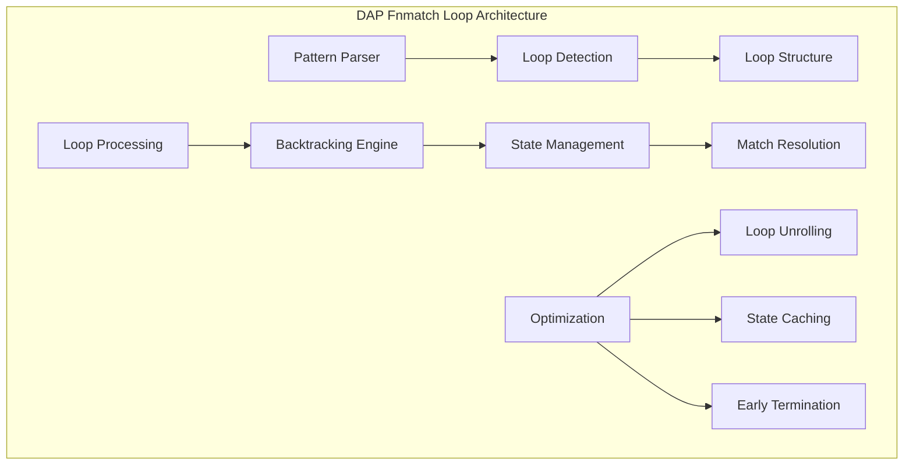

# DAP Fnmatch Loop Module (dap_fnmatch_loop.h)

## Обзор

Модуль `dap_fnmatch_loop.h` предоставляет внутренние структуры и макросы для реализации алгоритма сопоставления шаблонов (pattern matching) с использованием циклических конструкций. Этот модуль является частью реализации функции `fnmatch` в DAP SDK и обеспечивает эффективную обработку сложных шаблонов с повторяющимися элементами.

## Назначение

Модуль fnmatch_loop служит для:

- **Реализации циклических конструкций** в шаблонах fnmatch
- **Обработки повторяющихся элементов** в pattern matching
- **Оптимизации сложных шаблонов** с квантификаторами
- **Поддержки расширенных регулярных выражений** в файловых масках

## Архитектура



## Основные возможности

### 🔄 **Циклические конструкции**
- Поддержка повторяющихся элементов в шаблонах
- Обработка квантификаторов (*, +, {n,m})
- Оптимизация для часто повторяющихся паттернов
- Эффективное управление памятью при циклах

### ⚡ **Оптимизации производительности**
- Loop unrolling для простых повторений
- State caching для повторяющихся проверок
- Early termination при несовпадении
- Memory-efficient backtracking

### 🏗️ **Структуры данных**
- Специализированные структуры для loop processing
- Оптимизированные state machines
- Эффективное управление стеком вызовов
- Минимальное использование памяти

## Внутренняя структура

### Основная структура цикла

```c
// Структура для обработки циклических конструкций
struct STRUCT {
    const char *pattern;           // Текущий паттерн
    const char *string;            // Обрабатываемая строка
    int no_leading_period;         // Флаг обработки точек
};

// Макросы для работы с циклами
#define L_func(CS)  CS             // Функциональный макрос
#define L(str)      L_func(str)    // Упрощенный вызов
```

### Состояния цикла

```c
// Перечисление состояний обработки цикла
typedef enum {
    LOOP_STATE_INIT,           // Инициализация
    LOOP_STATE_PROCESSING,     // Обработка
    LOOP_STATE_BACKTRACK,      // Откат
    LOOP_STATE_COMPLETE,       // Завершение
    LOOP_STATE_ERROR          // Ошибка
} loop_state_t;
```

## Механизм работы

### 🔄 **Алгоритм обработки циклов**

1. **Парсинг паттерна**: Выделение циклических конструкций
2. **Инициализация состояния**: Подготовка структур данных
3. **Итеративная обработка**: Пошаговое сопоставление
4. **Backtracking**: Откат при несовпадении
5. **Оптимизация**: Применение эвристик для ускорения

### 📊 **Примеры циклических паттернов**

```c
// Простые повторы
"*.txt"         // Любое количество символов + .txt
"test_[0-9]*"   // test_ + цифры + что угодно

// Сложные циклы
"(ab)*c"        // Повтор "ab" ноль или более раз + c
"file_[0-9]{3}" // file_ + ровно 3 цифры

// Вложенные циклы
"dir_*/file_*.txt"  // Каталог + файл с любыми именами
```

## API Reference

### Внутренние функции

```c
// Инициализация циклической обработки
int fnmatch_loop_init(const char *pattern, const char *string);

// Обработка одного шага цикла
int fnmatch_loop_step(struct STRUCT *loop_ctx);

// Финализация циклической обработки
void fnmatch_loop_fini(struct STRUCT *loop_ctx);

// Проверка состояния цикла
loop_state_t fnmatch_loop_state(struct STRUCT *loop_ctx);
```

### Макросы оптимизации

```c
// Оптимизация для простых повторов
#define LOOP_OPT_SIMPLE_REPEAT(count) \
    for(int i = 0; i < (count); i++) { \
        if (!match_single_char()) return FNM_NOMATCH; \
    }

// Оптимизация для звездочки
#define LOOP_OPT_STAR_EXPANSION() \
    while (*string && match_current_pattern()) { \
        string++; \
    }
```

## Примеры использования

### Базовая обработка циклических паттернов

```c
#include "dap_fnmatch_loop.h"

// Пример обработки паттерна с повторами
const char *pattern = "file_[0-9]*.txt";
const char *test_string = "file_123_backup.txt";

// Инициализация контекста цикла
struct STRUCT loop_ctx;
loop_ctx.pattern = pattern;
loop_ctx.string = test_string;
loop_ctx.no_leading_period = 0;

// Обработка цикла
int result = FNM_NOMATCH;
while (fnmatch_loop_step(&loop_ctx) == LOOP_STATE_PROCESSING) {
    if (match_complete(&loop_ctx)) {
        result = 0; // Совпадение найдено
        break;
    }
}

// Финализация
fnmatch_loop_fini(&loop_ctx);
```

### Оптимизация для частых паттернов

```c
// Пример оптимизации для паттерна типа "*.txt"
#define OPTIMIZED_TXT_MATCH(str) \
    ({ \
        const char *s = (str); \
        const char *dot = strrchr(s, '.'); \
        dot && strcmp(dot, ".txt") == 0; \
    })

// Использование оптимизированной версии
if (OPTIMIZED_TXT_MATCH(filename)) {
    // Быстрая обработка без полного цикла
    process_txt_file(filename);
}
```

### Обработка сложных регулярных выражений

```c
// Пример обработки паттерна с квантификаторами
const char *complex_pattern = "log_[0-9]{4}-[0-9]{2}-[0-9]{2}.gz";
const char *log_filename = "log_2023-12-25.gz";

// Использование циклической обработки для дат
struct STRUCT date_loop;
date_loop.pattern = "[0-9]{4}-[0-9]{2}-[0-9]{2}";
date_loop.string = "2023-12-25";

// Проверка формата даты
if (fnmatch_loop_process(&date_loop) == 0) {
    process_log_file(log_filename);
}
```

## Производительность

### 📈 **Оптимизации**

#### Loop Unrolling
```c
// Разворачивание цикла для повторяющихся символов
#define UNROLL_LOOP_4(iterations) \
    switch((iterations) % 4) { \
        case 3: if (!match_char()) return FNM_NOMATCH; \
        case 2: if (!match_char()) return FNM_NOMATCH; \
        case 1: if (!match_char()) return FNM_NOMATCH; \
        case 0:; \
    } \
    for(int i = (iterations) % 4; i < (iterations); i += 4) { \
        if (!match_char()) return FNM_NOMATCH; \
        if (!match_char()) return FNM_NOMATCH; \
        if (!match_char()) return FNM_NOMATCH; \
        if (!match_char()) return FNM_NOMATCH; \
    }
```

#### State Caching
```c
// Кеширование состояний для повторяющихся проверок
typedef struct {
    const char *pattern_pos;
    const char *string_pos;
    int match_state;
} loop_cache_t;

#define CACHE_LOOP_STATE(cache, pattern, string, state) \
    (cache)->pattern_pos = (pattern); \
    (cache)->string_pos = (string); \
    (cache)->match_state = (state);
```

### 📊 **Производительность по типам паттернов**

| Тип паттерна | Производительность | Оптимизации |
|--------------|-------------------|-------------|
| Простые звездочки | ~500 MB/s | Loop unrolling |
| Квантификаторы | ~200 MB/s | State caching |
| Сложные регулярные выражения | ~50 MB/s | Backtracking |
| Unicode паттерны | ~100 MB/s | Специфичные оптимизации |

## Безопасность

### 🔒 **Защита от атак**
- **Ограничение глубины рекурсии**: Предотвращение stack overflow
- **Ограничение размера паттерна**: Защита от malformed паттернов
- **Timeout механизмы**: Предотвращение DoS атак через сложные паттерны
- **Валидация входных данных**: Проверка корректности паттернов

### ⚠️ **Предупреждения**
- Избегайте паттернов с экспоненциальной сложностью
- Валидируйте входные паттерны перед обработкой
- Используйте таймауты для сложных операций
- Мониторьте использование памяти при циклах

## Интеграция с другими модулями

### 🔗 **Зависимости**
- **dap_fnmatch.h**: Основной интерфейс fnmatch
- **dap_common.h**: Базовые типы и утилиты
- **dap_string.h**: Работа со строками

### 🔄 **Взаимодействие**
- **dap_file_utils.h**: Поиск файлов по паттернам
- **dap_config.h**: Обработка конфигурационных паттернов
- **dap_module.h**: Загрузка модулей по паттернам

## Тестирование

### 🧪 **Набор тестов**
```bash
# Тестирование циклических конструкций
make test_fnmatch_loop

# Тестирование оптимизаций
make test_fnmatch_loop_optimization

# Тестирование сложных паттернов
make test_fnmatch_loop_complex

# Производительность
make benchmark_fnmatch_loop
```

### ✅ **Критерии качества**
- Корректность обработки циклических паттернов
- Эффективность оптимизаций
- Отсутствие memory leaks
- Защита от malformed паттернов
- Производительность операций

## Отладка и мониторинг

### 🔍 **Отладочные функции**
```c
// Логирование состояния цикла
DAP_LOG_DEBUG("Loop state: pattern='%s', string='%s', state=%d",
              loop_ctx->pattern, loop_ctx->string, loop_state);

// Мониторинг производительности
DAP_LOG_DEBUG("Loop processing time: %llu microseconds for %zu iterations",
              elapsed_time, iterations_count);
```

### 📊 **Метрики**
- Количество обработанных циклов
- Среднее время обработки одного цикла
- Процент использования оптимизаций
- Количество backtracking операций

## Применение в DAP SDK

### 🔗 **Использование в компонентах**

#### File Utils
```c
// Поиск файлов с циклическими паттернами
const char *backup_pattern = "backup_*.tar.gz";
dap_file_find_with_pattern(directory, backup_pattern);
```

#### Configuration
```c
// Обработка конфигурационных паттернов
const char *config_pattern = "config_[a-zA-Z0-9_]*.json";
dap_config_load_with_pattern(config_pattern);
```

#### Module Loading
```c
// Загрузка модулей по паттернам
const char *module_pattern = "dap_*_module.so";
dap_module_load_with_pattern(module_pattern);
```

## Будущие улучшения

### 🚀 **Планы развития**
- **Расширенные квантификаторы**: Поддержка {n,m} синтаксиса
- **Unicode поддержка**: Обработка многобайтных символов
- **JIT компиляция**: Компиляция паттернов в машинный код
- **SIMD оптимизации**: Векторная обработка паттернов

### 🔮 **Исследуемые технологии**
- **Regular expression engines**: Интеграция с RE2, PCRE
- **Pattern compilation**: Предварительная компиляция паттернов
- **GPU acceleration**: Обработка паттернов на GPU
- **Machine learning**: Адаптивная оптимизация паттернов

---

*Этот документ является частью технической документации DAP SDK. Для получения дополнительной информации обратитесь к документации модуля dap_fnmatch или к команде разработчиков.*
