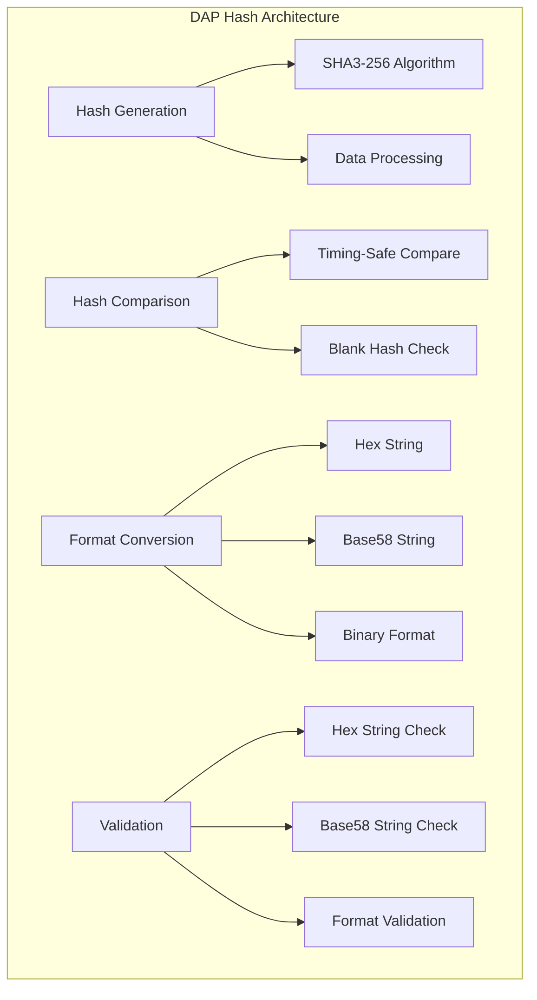

# DAP Hash Module (dap_hash.h/c)

## Обзор

Модуль `dap_hash.h/c` предоставляет высокопроизводительные криптографические хеш-функции для DAP SDK. Модуль основан на стандарте SHA3-256 (Keccak) и обеспечивает быструю генерацию хешей для различных типов данных.

## Основные возможности

- **SHA3-256 хеширование**: Быстрое и криптографически стойкое хеширование
- **Множественные форматы**: Поддержка hex, base58 и строковых представлений
- **Inline оптимизации**: Функции реализованы как inline для максимальной производительности
- **Безопасное сравнение**: Защищенное сравнение хешей без утечек по времени
- **Валидация данных**: Проверка корректности хеш-строк

## Архитектура



## Основные структуры данных

### Типы хешей

```c
// Перечисление типов хеш-функций
typedef enum dap_hash_type {
    DAP_HASH_TYPE_KECCAK = 0,    // Keccak (SHA3)
    DAP_HASH_TYPE_SLOW_0 = 1     // Медленная хеш-функция (для mining)
} dap_hash_type_t;

// Основная структура быстрого хеша (32 байта)
typedef union dap_chain_hash_fast {
    uint8_t raw[DAP_CHAIN_HASH_FAST_SIZE];  // 32 байта бинарных данных
} DAP_ALIGN_PACKED dap_chain_hash_fast_t;

// Алиасы для совместимости
typedef dap_chain_hash_fast_t dap_hash_fast_t;
typedef dap_hash_fast_t dap_hash_t;

// Строковое представление хеша
typedef struct dap_hash_str {
    char s[DAP_HASH_FAST_STR_SIZE];  // "0x" + 64 символа hex + '\0'
} dap_hash_str_t;
```

### Константы размеров

```c
#define DAP_HASH_FAST_SIZE           32
#define DAP_CHAIN_HASH_FAST_SIZE     DAP_HASH_FAST_SIZE  // 32 байта
#define DAP_CHAIN_HASH_FAST_STR_LEN  (DAP_HASH_FAST_SIZE * 2 + 2)  // "0x" + 64 hex символа
#define DAP_CHAIN_HASH_FAST_STR_SIZE (DAP_CHAIN_HASH_FAST_STR_LEN + 1)  // + завершающий '\0'
#define DAP_HASH_FAST_STR_SIZE       DAP_CHAIN_HASH_FAST_STR_SIZE
```

## Основные функции

### Генерация хеша

#### Быстрое хеширование SHA3-256

```c
DAP_STATIC_INLINE bool dap_hash_fast(
    const void *a_data_in,      // Входные данные
    size_t a_data_in_size,      // Размер входных данных
    dap_hash_fast_t *a_hash_out // Выходной хеш (32 байта)
);
```

**Пример использования:**
```c
#include <dap_hash.h>

// Хеширование строки
const char *data = "Hello, World!";
dap_hash_fast_t hash;
if (dap_hash_fast(data, strlen(data), &hash)) {
    // Хеш успешно сгенерирован в hash.raw
    printf("Hash generated successfully\n");
} else {
    printf("Hash generation failed\n");
}

// Хеширование бинарных данных
uint8_t binary_data[] = {0x01, 0x02, 0x03, 0x04};
dap_hash_fast(binary_data, sizeof(binary_data), &hash);
```

#### Хеширование с автоматическим созданием строки

```c
DAP_STATIC_INLINE char *dap_hash_fast_str_new(
    const void *a_data,      // Входные данные
    size_t a_data_size       // Размер данных
);
```

**Пример:**
```c
const char *message = "Important data";
char *hash_str = dap_hash_fast_str_new(message, strlen(message));
if (hash_str) {
    printf("Hash: %s\n", hash_str);  // Вывод: "0xabc123..."
    DAP_DELETE(hash_str);  // Освобождаем память
}
```

### Сравнение хешей

#### Безопасное сравнение хешей

```c
DAP_STATIC_INLINE bool dap_hash_fast_compare(
    const dap_hash_fast_t *a_hash1,  // Первый хеш
    const dap_hash_fast_t *a_hash2   // Второй хеш
);
```

**Пример:**
```c
dap_hash_fast_t hash1, hash2;

// Генерация хешей
dap_hash_fast("data1", 5, &hash1);
dap_hash_fast("data2", 5, &hash2);

// Сравнение (защищено от timing attacks)
if (dap_hash_fast_compare(&hash1, &hash2)) {
    printf("Hashes are identical\n");
} else {
    printf("Hashes are different\n");
}
```

#### Проверка на пустой хеш

```c
DAP_STATIC_INLINE bool dap_hash_fast_is_blank(
    const dap_hash_fast_t *a_hash  // Проверяемый хеш
);
```

**Пример:**
```c
dap_hash_fast_t hash = {};  // Нулевой хеш

if (dap_hash_fast_is_blank(&hash)) {
    printf("Hash is blank (all zeros)\n");
}
```

### Конвертация форматов

#### Преобразование хеша в строку

```c
DAP_STATIC_INLINE int dap_chain_hash_fast_to_str(
    const dap_hash_fast_t *a_hash,  // Входной хеш
    char *a_str,                    // Буфер для строки (минимум 67 байт)
    size_t a_str_max               // Размер буфера
);
```

**Пример:**
```c
dap_hash_fast_t hash;
dap_hash_fast("test", 4, &hash);

char hash_str[67];  // 2 + 64 + 1 байта
if (dap_chain_hash_fast_to_str(&hash, hash_str, sizeof(hash_str)) > 0) {
    printf("Hash string: %s\n", hash_str);  // "0xa665a45920422f9d417e4867efdc4fb8a04a1f3fff1fa07e998e86f7f7a27ae3"
}
```

#### Быстрое преобразование в строку

```c
DAP_STATIC_INLINE void dap_chain_hash_fast_to_str_do(
    const dap_hash_fast_t *a_hash,  // Входной хеш
    char *a_str                     // Буфер для строки (минимум 67 байт)
);
```

#### Преобразование с автоматическим выделением памяти

```c
DAP_STATIC_INLINE char *dap_chain_hash_fast_to_str_new(
    const dap_hash_fast_t *a_hash  // Входной хеш
);
```

**Пример:**
```c
dap_hash_fast_t hash;
dap_hash_fast("data", 4, &hash);

char *hash_str = dap_chain_hash_fast_to_str_new(&hash);
if (hash_str) {
    printf("Hash: %s\n", hash_str);
    DAP_DELETE(hash_str);
}
```

#### Преобразование строки в хеш

```c
int dap_chain_hash_fast_from_str(
    const char *a_hash_str,        // Строка хеша
    dap_hash_fast_t *a_hash        // Выходной хеш
);

int dap_chain_hash_fast_from_hex_str(
    const char *a_hex_str,         // Hex строка (с "0x")
    dap_hash_fast_t *a_hash        // Выходной хеш
);

int dap_chain_hash_fast_from_base58_str(
    const char *a_base58_str,      // Base58 строка
    dap_hash_fast_t *a_hash        // Выходной хеш
);
```

**Пример:**
```c
dap_hash_fast_t hash;

// Из hex строки
const char *hex_str = "0xa665a45920422f9d417e4867efdc4fb8a04a1f3fff1fa07e998e86f7f7a27ae3";
if (dap_chain_hash_fast_from_hex_str(hex_str, &hash) == 0) {
    printf("Hash parsed successfully\n");
}

// Из base58 строки
const char *b58_str = "QmSomeBase58Hash";
if (dap_chain_hash_fast_from_base58_str(b58_str, &hash) == 0) {
    printf("Base58 hash parsed successfully\n");
}
```

### Утилиты

#### Получение хеш-строки из данных

```c
DAP_STATIC_INLINE dap_hash_str_t dap_get_data_hash_str(
    const void *a_data,      // Данные
    size_t a_data_size       // Размер данных
);
```

**Пример:**
```c
const char *data = "Hello";
dap_hash_str_t hash_str = dap_get_data_hash_str(data, strlen(data));
printf("Hash: %s\n", hash_str.s);
```

#### Преобразование в статическую строку

```c
#define dap_chain_hash_fast_to_str_static(hash) \
    dap_chain_hash_fast_to_hash_str(hash).s

#define dap_hash_fast_to_str_static dap_chain_hash_fast_to_str_static
```

## Примеры использования

### 1. Проверка целостности данных

```c
#include <dap_hash.h>

bool verify_data_integrity(const void *data, size_t size, const char *expected_hash_str) {
    // Вычисляем хеш данных
    dap_hash_fast_t computed_hash;
    if (!dap_hash_fast(data, size, &computed_hash)) {
        return false;
    }

    // Парсим ожидаемый хеш
    dap_hash_fast_t expected_hash;
    if (dap_chain_hash_fast_from_hex_str(expected_hash_str, &expected_hash) != 0) {
        return false;
    }

    // Сравниваем хеши
    return dap_hash_fast_compare(&computed_hash, &expected_hash);
}

// Использование
const char *data = "Important message";
const char *expected = "0xa665a45920422f9d417e4867efdc4fb8a04a1f3fff1fa07e998e86f7f7a27ae3";

if (verify_data_integrity(data, strlen(data), expected)) {
    printf("Data integrity verified\n");
} else {
    printf("Data integrity check failed\n");
}
```

### 2. Создание цифровых отпечатков

```c
#include <dap_hash.h>

typedef struct {
    char *filename;
    size_t size;
    time_t modified;
} file_info_t;

// Создание отпечатка файла
char *create_file_fingerprint(const char *filename) {
    FILE *file = fopen(filename, "rb");
    if (!file) return NULL;

    // Читаем файл
    fseek(file, 0, SEEK_END);
    size_t size = ftell(file);
    fseek(file, 0, SEEK_SET);

    uint8_t *buffer = DAP_NEW_SIZE(uint8_t, size);
    if (!buffer) {
        fclose(file);
        return NULL;
    }

    fread(buffer, 1, size, file);
    fclose(file);

    // Создаем хеш
    char *fingerprint = dap_hash_fast_str_new(buffer, size);
    DAP_DELETE(buffer);

    return fingerprint;
}

// Использование
char *fingerprint = create_file_fingerprint("important.doc");
if (fingerprint) {
    printf("File fingerprint: %s\n", fingerprint);
    DAP_DELETE(fingerprint);
}
```

### 3. Реализация хеш-таблицы

```c
#include <dap_hash.h>

#define TABLE_SIZE 1024

typedef struct hash_entry {
    dap_hash_fast_t key;
    void *value;
    struct hash_entry *next;
} hash_entry_t;

typedef struct {
    hash_entry_t *buckets[TABLE_SIZE];
} hash_table_t;

// Вычисление индекса бакета
size_t get_bucket_index(const dap_hash_fast_t *key) {
    // Используем первые 4 байта хеша как индекс
    uint32_t hash_value;
    memcpy(&hash_value, key->raw, sizeof(uint32_t));
    return hash_value % TABLE_SIZE;
}

// Вставка в хеш-таблицу
void hash_table_put(hash_table_t *table, const dap_hash_fast_t *key, void *value) {
    size_t index = get_bucket_index(key);

    // Создаем новую запись
    hash_entry_t *entry = DAP_NEW(hash_entry_t);
    entry->key = *key;
    entry->value = value;
    entry->next = table->buckets[index];

    table->buckets[index] = entry;
}

// Поиск в хеш-таблице
void *hash_table_get(hash_table_t *table, const dap_hash_fast_t *key) {
    size_t index = get_bucket_index(key);

    hash_entry_t *entry = table->buckets[index];
    while (entry) {
        if (dap_hash_fast_compare(&entry->key, key)) {
            return entry->value;
        }
        entry = entry->next;
    }

    return NULL;
}
```

### 4. Проверка паролей с солью

```c
#include <dap_hash.h>
#include <dap_rand.h>  // Для генерации соли

typedef struct {
    uint8_t salt[16];        // 128-битная соль
    dap_hash_fast_t hash;    // Хеш пароля с солью
} password_hash_t;

// Создание хеша пароля
bool create_password_hash(const char *password, password_hash_t *result) {
    if (!password || !result) return false;

    // Генерируем соль
    if (dap_random(salt, sizeof(salt)) != sizeof(salt)) {
        return false;
    }

    // Комбинируем пароль и соль
    size_t pwd_len = strlen(password);
    size_t combined_len = pwd_len + sizeof(salt);
    uint8_t *combined = DAP_NEW_SIZE(uint8_t, combined_len);

    memcpy(combined, password, pwd_len);
    memcpy(combined + pwd_len, salt, sizeof(salt));

    // Вычисляем хеш
    bool success = dap_hash_fast(combined, combined_len, &result->hash);
    memcpy(result->salt, salt, sizeof(salt));

    DAP_DELETE(combined);
    return success;
}

// Проверка пароля
bool verify_password(const char *password, const password_hash_t *stored) {
    if (!password || !stored) return false;

    // Комбинируем пароль с хранимой солью
    size_t pwd_len = strlen(password);
    size_t combined_len = pwd_len + sizeof(stored->salt);
    uint8_t *combined = DAP_NEW_SIZE(uint8_t, combined_len);

    memcpy(combined, password, pwd_len);
    memcpy(combined + pwd_len, stored->salt, sizeof(stored->salt));

    // Вычисляем хеш
    dap_hash_fast_t computed_hash;
    if (!dap_hash_fast(combined, combined_len, &computed_hash)) {
        DAP_DELETE(combined);
        return false;
    }

    DAP_DELETE(combined);
    return dap_hash_fast_compare(&computed_hash, &stored->hash);
}
```

## Производительность

### Характеристики производительности

| Операция | Производительность | Комментарий |
|----------|-------------------|-------------|
| `dap_hash_fast()` | ~50-100 MB/s | Зависит от размера данных |
| `dap_hash_fast_compare()` | ~1-2 ns | Timing-safe сравнение |
| `dap_chain_hash_fast_to_str()` | ~10-20 ns | Преобразование в hex |
| `dap_chain_hash_fast_from_hex_str()` | ~20-30 ns | Парсинг hex строки |

### Оптимизации

- **SHA3 аппаратное ускорение**: Использование SIMD инструкций при наличии
- **Inline функции**: Минимизация накладных расходов на вызовы
- **Пакетная обработка**: Эффективная обработка больших объемов данных
- **Кэш-эффективность**: Оптимизированные структуры данных

## Безопасность

### Криптографическая безопасность

1. **SHA3-256**: Криптографически стойкий алгоритм хеширования
2. **Timing-safe сравнение**: Защита от атак по времени выполнения
3. **Предотвращение коллизий**: 256-битный выход для высокой стойкости
4. **Случайная соль**: Поддержка солей для защиты паролей

### Рекомендации по безопасности

- Используйте соль при хешировании паролей
- Применяйте timing-safe сравнение для аутентификации
- Проверяйте входные данные перед хешированием
- Используйте достаточную длину хешей (минимум 256 бит)

## Совместимость

### Поддерживаемые форматы

- **Hexadecimal**: "0x" + 64 hex символа
- **Base58**: Компактное представление для адресов
- **Binary**: Нативный 32-байтовый формат

### Интеграция с другими модулями

- **dap_common.h**: Использует макросы управления памятью
- **dap_enc_base58.h**: Для base58 кодирования
- **dap_strfuncs.h**: Для обработки строк

## Заключение

Модуль `dap_hash.h/c` предоставляет высокопроизводительные и безопасные криптографические хеш-функции, необходимые для обеспечения целостности данных, аутентификации и других криптографических операций в DAP SDK. Простой API в сочетании с высокой производительностью делает его идеальным выбором для широкого спектра приложений.