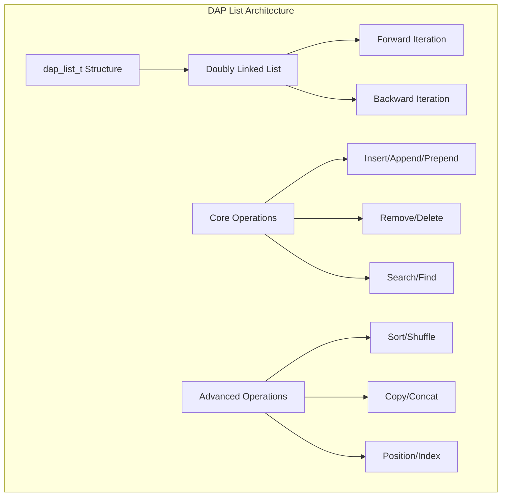

# DAP List Module (dap_list.h/c)

## Обзор

Модуль `dap_list.h/c` предоставляет реализацию двусвязных списков (doubly-linked lists) для DAP SDK. Этот модуль основан на высокооптимизированной библиотеке utlist и обеспечивает эффективную работу с динамическими коллекциями данных.

## Основные возможности

- **Двусвязные списки**: Поддержка итерации в обоих направлениях
- **Высокая производительность**: Оптимизированные операции вставки/удаления
- **Гибкие операции**: Добавление, удаление, поиск, сортировка
- **Безопасное управление памятью**: Интегрированные функции очистки
- **Callback-функции**: Поддержка пользовательских функций сравнения и копирования

## Архитектура



## Основные структуры данных

### Структура элемента списка

```c
typedef struct __dap_list__ {
    void *data;                    // Указатель на данные
    struct __dap_list__ *next;     // Следующий элемент
    struct __dap_list__ *prev;     // Предыдущий элемент
} dap_list_t;
```

### Callback-функции

```c
// Функция уничтожения данных
typedef void (*dap_callback_destroyed_t)(void *a_free_func);

// Функция сравнения элементов
typedef int (*dap_callback_compare_t)(dap_list_t *a_list1, dap_list_t *a_list2);

// Функция копирования данных
typedef void *(*dap_callback_copy_t)(const void *a_data, void *a_user_arg);
```

## Основные операции

### Создание и управление памятью

#### Освобождение списка

```c
// Освобождение списка без данных
void dap_list_free(dap_list_t *list);

// Освобождение списка с данными
void dap_list_free_full(dap_list_t *list, dap_callback_destroyed_t free_func);
```

**Пример использования:**
```c
// Список с простыми данными
dap_list_t *list = NULL;
list = dap_list_append(list, "Hello");
list = dap_list_append(list, "World");

// Освобождение только структуры списка
dap_list_free(list);

// Список с динамическими данными
typedef struct {
    char *name;
    int value;
} my_data_t;

void free_my_data(void *data) {
    my_data_t *item = (my_data_t *)data;
    DAP_DELETE(item->name);
    DAP_DELETE(item);
}

list = dap_list_append(list, DAP_NEW_Z(my_data_t));
// ... заполнение данных ...
dap_list_free_full(list, free_my_data);
```

### Добавление элементов

#### Добавление в конец списка

```c
dap_list_t *dap_list_append(dap_list_t *list, void *data);
```

**Пример:**
```c
dap_list_t *list = NULL;

// Добавление строк
list = dap_list_append(list, "First");
list = dap_list_append(list, "Second");
list = dap_list_append(list, "Third");

// Добавление чисел (требуется преобразование)
list = dap_list_append(list, DAP_INT_TO_POINTER(42));
list = dap_list_append(list, DAP_INT_TO_POINTER(123));
```

#### Добавление в начало списка

```c
dap_list_t *dap_list_prepend(dap_list_t *list, void *data);
```

**Пример:**
```c
dap_list_t *list = NULL;

list = dap_list_prepend(list, "Third");   // ["Third"]
list = dap_list_prepend(list, "Second");  // ["Second", "Third"]
list = dap_list_prepend(list, "First");   // ["First", "Second", "Third"]
```

#### Вставка по индексу

```c
dap_list_t *dap_list_insert(dap_list_t *list, void *data, uint64_t position);
```

**Пример:**
```c
dap_list_t *list = NULL;
list = dap_list_append(list, "First");
list = dap_list_append(list, "Third");

// Вставка во вторую позицию
list = dap_list_insert(list, "Second", 1);  // ["First", "Second", "Third"]
```

#### Сортированная вставка

```c
dap_list_t *dap_list_insert_sorted(dap_list_t *list, void *data,
                                  dap_callback_compare_t compare_func);
```

**Пример:**
```c
int compare_int(dap_list_t *a, dap_list_t *b) {
    int val_a = DAP_POINTER_TO_INT(a->data);
    int val_b = DAP_POINTER_TO_INT(b->data);
    return val_a - val_b;
}

dap_list_t *list = NULL;
list = dap_list_insert_sorted(list, DAP_INT_TO_POINTER(5), compare_int);
list = dap_list_insert_sorted(list, DAP_INT_TO_POINTER(1), compare_int);
list = dap_list_insert_sorted(list, DAP_INT_TO_POINTER(3), compare_int);
// Результат: [1, 3, 5]
```

### Удаление элементов

#### Удаление по данным

```c
dap_list_t *dap_list_remove(dap_list_t *list, const void *data);
```

**Пример:**
```c
dap_list_t *list = NULL;
list = dap_list_append(list, "First");
list = dap_list_append(list, "Second");
list = dap_list_append(list, "Third");

// Удаление элемента со значением "Second"
list = dap_list_remove(list, "Second");  // ["First", "Third"]
```

#### Удаление всех вхождений

```c
dap_list_t *dap_list_remove_all(dap_list_t *list, const void *data);
```

#### Удаление по ссылке

```c
dap_list_t *dap_list_remove_link(dap_list_t *list, dap_list_t *link);
dap_list_t *dap_list_delete_link(dap_list_t *list, dap_list_t *link);
```

**Пример:**
```c
dap_list_t *list = NULL;
list = dap_list_append(list, "A");
dap_list_t *second = dap_list_append(list, "B");
list = dap_list_append(list, "C");

// Удаление по ссылке (данные сохраняются)
list = dap_list_remove_link(list, second);  // ["A", "C"], "B" удален

// Удаление с уничтожением ссылки
list = dap_list_delete_link(list, dap_list_nth(list, 1));
```

### Навигация и доступ

#### Доступ к элементам

```c
// Доступ по индексу
dap_list_t *dap_list_nth(dap_list_t *list, uint64_t n);

// Доступ к данным по индексу
void *dap_list_nth_data(dap_list_t *list, uint64_t n);

// Доступ к предыдущему/следующему
#define dap_list_prev(list) ((dap_list_t*)(list))->prev
#define dap_list_next(list) ((dap_list_t*)(list))->next

// Доступ к первому/последнему
dap_list_t *dap_list_first(dap_list_t *list);
dap_list_t *dap_list_last(dap_list_t *list);
```

**Пример:**
```c
dap_list_t *list = NULL;
list = dap_list_append(list, "First");
list = dap_list_append(list, "Second");
list = dap_list_append(list, "Third");

// Доступ к элементам
dap_list_t *second_element = dap_list_nth(list, 1);  // "Second"
char *second_data = (char*)dap_list_nth_data(list, 1);  // "Second"

// Навигация
dap_list_t *first = dap_list_first(list);
dap_list_t *last = dap_list_last(list);
```

#### Информация о списке

```c
// Длина списка
uint64_t dap_list_length(dap_list_t *list);

// Позиция элемента
int dap_list_position(dap_list_t *list, dap_list_t *element);

// Индекс данных
int dap_list_index(dap_list_t *list, const void *data);
```

### Поиск элементов

```c
dap_list_t *dap_list_find(dap_list_t *list, const void *data,
                         dap_callback_compare_t compare_func);
```

**Пример:**
```c
int compare_strings(dap_list_t *elem, const char *target) {
    return strcmp((char*)elem->data, target);
}

dap_list_t *list = NULL;
list = dap_list_append(list, "Apple");
list = dap_list_append(list, "Banana");
list = dap_list_append(list, "Cherry");

// Поиск элемента
dap_list_t *found = dap_list_find(list, "Banana", (dap_callback_compare_t)compare_strings);
if (found) {
    printf("Found: %s\n", (char*)found->data);
}
```

### Расширенные операции

#### Копирование списков

```c
// Поверхностное копирование
dap_list_t *dap_list_copy(dap_list_t *list);

// Глубокое копирование
dap_list_t *dap_list_copy_deep(dap_list_t *list,
                              dap_callback_copy_t copy_func,
                              void *user_data);
```

**Пример глубокого копирования:**
```c
void *copy_string(const void *data, void *user_arg) {
    return strdup((const char*)data);
}

dap_list_t *original = NULL;
original = dap_list_append(original, "Hello");
original = dap_list_append(original, "World");

// Глубокое копирование
dap_list_t *copy = dap_list_copy_deep(original, copy_string, NULL);
```

#### Конкатенация списков

```c
dap_list_t *dap_list_concat(dap_list_t *list1, dap_list_t *list2);
```

**Пример:**
```c
dap_list_t *list1 = NULL, *list2 = NULL;
list1 = dap_list_append(list1, "A");
list1 = dap_list_append(list1, "B");

list2 = dap_list_append(list2, "C");
list2 = dap_list_append(list2, "D");

// Конкатенация: list1 + list2
dap_list_t *combined = dap_list_concat(list1, list2);
// Результат: ["A", "B", "C", "D"]
// list2 теперь пустой
```

#### Сортировка

```c
dap_list_t *dap_list_sort(dap_list_t *list, dap_callback_compare_t compare_func);
```

**Пример:**
```c
int compare_numbers(dap_list_t *a, dap_list_t *b) {
    int val_a = DAP_POINTER_TO_INT(a->data);
    int val_b = DAP_POINTER_TO_INT(b->data);
    return val_a - val_b;
}

dap_list_t *list = NULL;
list = dap_list_append(list, DAP_INT_TO_POINTER(3));
list = dap_list_append(list, DAP_INT_TO_POINTER(1));
list = dap_list_append(list, DAP_INT_TO_POINTER(4));
list = dap_list_append(list, DAP_INT_TO_POINTER(1));
list = dap_list_append(list, DAP_INT_TO_POINTER(5));

// Сортировка
list = dap_list_sort(list, compare_numbers);
// Результат: [1, 1, 3, 4, 5]
```

#### Перемешивание

```c
dap_list_t *dap_list_shuffle(dap_list_t *list);
```

**Пример:**
```c
dap_list_t *list = NULL;
list = dap_list_append(list, "A");
list = dap_list_append(list, "B");
list = dap_list_append(list, "C");
list = dap_list_append(list, "D");

// Перемешивание (результат случаен)
list = dap_list_shuffle(list);
```

## Итерация по списку

### Макросы для итерации

```c
// Простая итерация (из utlist.h)
DL_FOREACH(list, element) {
    // обработка element->data
}

// Безопасная итерация (с возможностью удаления)
DL_FOREACH_SAFE(list, element, temp) {
    if (should_remove(element)) {
        DL_DELETE(list, element);
        DAP_DELETE(element);
    }
}

// Обратная итерация
DL_FOREACH_BACKWARDS(list, element) {
    // обработка в обратном порядке
}
```

**Пример полной итерации:**
```c
dap_list_t *list = NULL;
// ... заполнение списка ...

// Прямая итерация
printf("Forward: ");
dap_list_t *current;
DL_FOREACH(list, current) {
    printf("%s ", (char*)current->data);
}
printf("\n");

// Обратная итерация
printf("Backward: ");
DL_FOREACH_BACKWARDS(list, current) {
    printf("%s ", (char*)current->data);
}
printf("\n");

// Безопасная итерация с удалением
dap_list_t *temp;
DL_FOREACH_SAFE(list, current, temp) {
    if (should_remove_item(current->data)) {
        DL_DELETE(list, current);
        DAP_DELETE(current);
    }
}
```

## Производительность

### Сложность операций

| Операция | Сложность | Комментарий |
|----------|-----------|-------------|
| `dap_list_append` | O(1) | Добавление в конец |
| `dap_list_prepend` | O(1) | Добавление в начало |
| `dap_list_insert` | O(n) | Вставка по индексу |
| `dap_list_remove` | O(n) | Поиск и удаление |
| `dap_list_find` | O(n) | Линейный поиск |
| `dap_list_nth` | O(n) | Доступ по индексу |
| `dap_list_sort` | O(n log n) | Быстрая сортировка |

### Оптимизации

- **Макросы вместо функций**: Многие операции реализованы как макросы для производительности
- **utlist библиотека**: Высокооптимизированная реализация списков
- **Inline функции**: Короткие функции реализованы как `inline`

## Безопасность

### Правила безопасного использования

1. **Валидация указателей**: Всегда проверяйте `NULL` перед операциями
2. **Безопасная итерация**: Используйте `DL_FOREACH_SAFE` при модификации списка
3. **Правильное освобождение**: Используйте `dap_list_free_full` для списков с динамическими данными
4. **Callback безопасность**: Callback-функции должны корректно обрабатывать `NULL` значения

### Примеры безопасного кода

```c
// Безопасное освобождение списка
if (list) {
    dap_list_free_full(list, free_my_data);
    list = NULL;
}

// Безопасная итерация
dap_list_t *current, *temp;
DL_FOREACH_SAFE(list, current, temp) {
    if (current && current->data) {
        // Обработка данных
    }
}
```

## Примеры использования

### 1. Управление конфигурацией

```c
typedef struct {
    char *key;
    char *value;
} config_entry_t;

dap_list_t *config_list = NULL;

// Добавление записей конфигурации
config_entry_t *entry1 = DAP_NEW_Z(config_entry_t);
entry1->key = strdup("database.host");
entry1->value = strdup("localhost");
config_list = dap_list_append(config_list, entry1);

// Поиск значения
const char *get_config_value(dap_list_t *list, const char *key) {
    dap_list_t *current;
    DL_FOREACH(list, current) {
        config_entry_t *entry = (config_entry_t*)current->data;
        if (strcmp(entry->key, key) == 0) {
            return entry->value;
        }
    }
    return NULL;
}

// Освобождение памяти
void free_config_entry(void *data) {
    config_entry_t *entry = (config_entry_t*)data;
    DAP_DELETE(entry->key);
    DAP_DELETE(entry->value);
    DAP_DELETE(entry);
}

dap_list_free_full(config_list, free_config_entry);
```

### 2. Очередь задач

```c
typedef struct {
    char *description;
    int priority;
    time_t deadline;
} task_t;

dap_list_t *task_queue = NULL;

// Добавление задач с приоритетом
void add_task(const char *desc, int priority) {
    task_t *task = DAP_NEW_Z(task_t);
    task->description = strdup(desc);
    task->priority = priority;
    task->deadline = time(NULL) + 3600; // +1 час

    task_queue = dap_list_insert_sorted(task_queue, task,
                                       (dap_callback_compare_t)compare_by_priority);
}

int compare_by_priority(dap_list_t *a, dap_list_t *b) {
    task_t *task_a = (task_t*)a->data;
    task_t *task_b = (task_t*)b->data;
    return task_a->priority - task_b->priority; // Высший приоритет первый
}

// Обработка задач
void process_tasks() {
    dap_list_t *current, *temp;
    DL_FOREACH_SAFE(task_queue, current, temp) {
        task_t *task = (task_t*)current->data;
        printf("Processing: %s (priority: %d)\n",
               task->description, task->priority);

        // Имитация обработки
        // ...

        // Удаление выполненной задачи
        DL_DELETE(task_queue, current);
        free_task(task);
        DAP_DELETE(current);
    }
}
```

### 3. Кэш объектов

```c
#define CACHE_SIZE 100

typedef struct {
    char *key;
    void *value;
    time_t last_access;
} cache_item_t;

dap_list_t *cache_list = NULL;

// Добавление в кэш (LRU)
void cache_put(const char *key, void *value) {
    // Удаление старых элементов при превышении размера
    while (dap_list_length(cache_list) >= CACHE_SIZE) {
        dap_list_t *last = dap_list_last(cache_list);
        cache_item_t *old_item = (cache_item_t*)last->data;
        free_cache_item(old_item);
        cache_list = dap_list_delete_link(cache_list, last);
    }

    // Создание нового элемента
    cache_item_t *item = DAP_NEW_Z(cache_item_t);
    item->key = strdup(key);
    item->value = value;
    item->last_access = time(NULL);

    // Добавление в начало (most recently used)
    cache_list = dap_list_prepend(cache_list, item);
}

// Получение из кэша
void *cache_get(const char *key) {
    dap_list_t *current;
    DL_FOREACH(cache_list, current) {
        cache_item_t *item = (cache_item_t*)current->data;
        if (strcmp(item->key, key) == 0) {
            // Перемещение в начало списка (обновление LRU)
            item->last_access = time(NULL);
            if (current != cache_list) {
                DL_DELETE(cache_list, current);
                DL_PREPEND(cache_list, current);
            }
            return item->value;
        }
    }
    return NULL;
}
```

## Интеграция с другими модулями

### Совместимость с DAP SDK

- **dap_common.h**: Использует макросы управления памятью `DAP_NEW`, `DAP_DELETE`
- **dap_hash.h**: Может использоваться для создания хеш-таблиц на основе списков
- **dap_config.h**: Применяется для хранения конфигурационных данных

### Рекомендации по использованию

1. **Для небольших коллекций**: Используйте `dap_list_t` для простоты
2. **Для больших объемов данных**: Рассмотрите `dap_hash.h` для O(1) доступа
3. **Для очередей**: Отлично подходит для FIFO/LIFO структур
4. **Для сортированных данных**: Поддержка эффективной сортировки

## Заключение

Модуль `dap_list.h/c` предоставляет мощную и эффективную реализацию двусвязных списков, подходящую для широкого спектра задач - от простого хранения данных до реализации сложных структур данных. Высокая производительность, безопасность и интеграция с другими модулями DAP SDK делают его незаменимым компонентом для разработки надежных приложений.