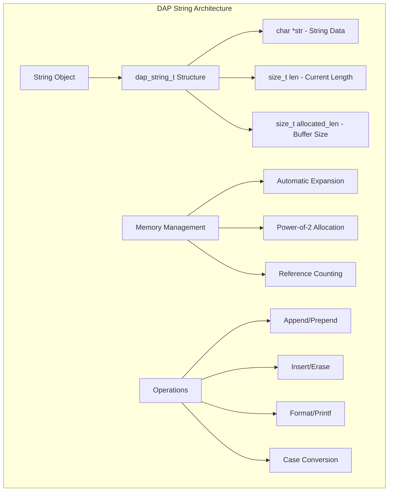

# DAP String Module (dap_string.h/c)

## Обзор

Модуль `dap_string.h/c` предоставляет объектно-ориентированный интерфейс для работы со строками в DAP SDK. В отличие от стандартных C-строк, `dap_string_t` автоматически управляет памятью, обеспечивая безопасность и удобство использования.

## Основные возможности

- **Автоматическое управление памятью**: Автоматическое расширение буфера при необходимости
- **Безопасные операции**: Защита от переполнения буфера и утечек памяти
- **Гибкие модификации**: Вставка, добавление, удаление в любой позиции
- **Форматированный вывод**: Поддержка printf-стиля форматирования
- **Unicode поддержка**: Работа с многобайтовыми символами
- **Оптимизации**: Inline функции для часто используемых операций

## Архитектура



## Основные структуры данных

### Структура строки

```c
typedef struct _dap_string {
    char *str;              // Указатель на строку (с завершающим '\0')
    size_t len;             // Текущая длина строки (без '\0')
    size_t allocated_len;   // Выделенный размер буфера
} dap_string_t;
```

## Создание и уничтожение строк

### Создание пустой строки

```c
dap_string_t *dap_string_sized_new(size_t default_size);
```

**Пример:**
```c
#include <dap_string.h>

// Создание строки с начальным буфером на 64 байта
dap_string_t *str = dap_string_sized_new(64);
if (!str) {
    // Обработка ошибки выделения памяти
    return NULL;
}

// Использование строки...
// ...

// Освобождение памяти
char *final_string = dap_string_free(str, TRUE);  // Освободить всю память
DAP_DELETE(final_string);  // Освободить возвращенную строку
```

### Создание строки с начальным значением

```c
dap_string_t *dap_string_new(const char *initial_text);
dap_string_t *dap_string_new_len(const char *initial_text, ssize_t length);
```

**Пример:**
```c
// Создание строки с начальным текстом
dap_string_t *str1 = dap_string_new("Hello");
dap_string_t *str2 = dap_string_new(NULL);  // Пустая строка

// Создание строки заданной длины
const char *data = "Hello, World!";
dap_string_t *str3 = dap_string_new_len(data, 5);  // "Hello"
```

### Освобождение памяти

```c
char *dap_string_free(dap_string_t *string, bool free_segment);
```

**Пример:**
```c
dap_string_t *str = dap_string_new("test");

// Вариант 1: Освободить объект, сохранить строку
char *saved_string = dap_string_free(str, FALSE);
printf("String: %s\n", saved_string);
// saved_string нужно освободить вручную: DAP_DELETE(saved_string);

// Вариант 2: Освободить все
dap_string_free(str, TRUE);  // str становится недействительным
```

## Модификация строк

### Добавление текста

#### Добавление в конец строки

```c
dap_string_t *dap_string_append(dap_string_t *string, const char *text);
dap_string_t *dap_string_append_len(dap_string_t *string, const char *text, ssize_t length);
dap_string_t *dap_string_append_c(dap_string_t *string, char character);
```

**Пример:**
```c
dap_string_t *str = dap_string_new("Hello");

// Добавление строки
str = dap_string_append(str, ", World");     // "Hello, World"

// Добавление части строки
str = dap_string_append_len(str, "!!!123", 3);  // "Hello, World!!!"

// Добавление символа
str = dap_string_append_c(str, '!');         // "Hello, World!!!!"
```

#### Добавление в начало строки

```c
dap_string_t *dap_string_prepend(dap_string_t *string, const char *text);
dap_string_t *dap_string_prepend_c(dap_string_t *string, char character);
dap_string_t *dap_string_prepend_len(dap_string_t *string, const char *text, ssize_t length);
```

**Пример:**
```c
dap_string_t *str = dap_string_new("World");

// Добавление в начало
str = dap_string_prepend(str, "Hello, ");    // "Hello, World"
str = dap_string_prepend_c(str, '[');        // "[Hello, World"
str = dap_string_prepend_c(str, ']');        // "][Hello, World"
```

### Вставка текста

```c
dap_string_t *dap_string_insert(dap_string_t *string, ssize_t position, const char *text);
dap_string_t *dap_string_insert_c(dap_string_t *string, ssize_t position, char character);
dap_string_t *dap_string_insert_len(dap_string_t *string, ssize_t position, const char *text, ssize_t length);
```

**Пример:**
```c
dap_string_t *str = dap_string_new("Hello World");

// Вставка в позицию 5
str = dap_string_insert(str, 5, ",");        // "Hello, World"

// Вставка символа
str = dap_string_insert_c(str, 5, '!');      // "Hello! , World"

// Вставка в конец (position = -1)
str = dap_string_insert(str, -1, "!!!");     // "Hello! , World!!!"
```

### Перезапись текста

```c
dap_string_t *dap_string_overwrite(dap_string_t *string, size_t position, const char *text);
dap_string_t *dap_string_overwrite_len(dap_string_t *string, size_t position, const char *text, ssize_t length);
```

**Пример:**
```c
dap_string_t *str = dap_string_new("Hello, cruel world!");

// Перезапись части строки
str = dap_string_overwrite(str, 7, "beautiful");  // "Hello, beautiful world!"
str = dap_string_overwrite_len(str, 0, "Hi", 2);   // "Hi, beautiful world!"
```

### Удаление текста

```c
dap_string_t *dap_string_erase(dap_string_t *string, ssize_t position, ssize_t length);
```

**Пример:**
```c
dap_string_t *str = dap_string_new("Hello, beautiful world!");

// Удаление 11 символов начиная с позиции 7
str = dap_string_erase(str, 7, 11);  // "Hello, world!"

// Удаление одного символа
str = dap_string_erase(str, 5, 1);   // "Hello world!"
```

### Изменение размера

```c
dap_string_t *dap_string_truncate(dap_string_t *string, size_t length);
dap_string_t *dap_string_set_size(dap_string_t *string, size_t length);
```

**Пример:**
```c
dap_string_t *str = dap_string_new("Hello, World!");

// Усечение до 5 символов
str = dap_string_truncate(str, 5);   // "Hello"

// Установка точного размера (расширение с заполнением '\0')
str = dap_string_set_size(str, 10);  // "Hello\0\0\0\0\0"
```

## Форматированный вывод

### Printf-стиль форматирование

```c
void dap_string_printf(dap_string_t *string, const char *format, ...);
void dap_string_append_printf(dap_string_t *string, const char *format, ...);
void dap_string_prepend_printf(dap_string_t *string, const char *format, ...);
```

**Пример:**
```c
dap_string_t *str = dap_string_new("Result: ");

// Замена содержимого
dap_string_printf(str, "Value: %d, Text: %s", 42, "test");
// str содержит: "Value: 42, Text: test"

// Добавление в конец
dap_string_append_printf(str, ", Time: %.2f", 3.14159);
// str содержит: "Value: 42, Text: test, Time: 3.14"

// Добавление в начало
dap_string_prepend_printf(str, "INFO: ");
// str содержит: "INFO: Value: 42, Text: test, Time: 3.14"
```

### Vprintf функции

```c
void dap_string_vprintf(dap_string_t *string, const char *format, va_list args);
void dap_string_append_vprintf(dap_string_t *string, const char *format, va_list args);
void dap_string_prepend_vprintf(dap_string_t *string, const char *format, va_list args);
```

**Пример:**
```c
void log_message(dap_string_t *log_buffer, const char *level, const char *format, ...) {
    va_list args;
    va_start(args, format);

    // Добавление уровня логирования
    dap_string_append_printf(log_buffer, "[%s] ", level);

    // Добавление форматированного сообщения
    dap_string_append_vprintf(log_buffer, format, args);

    // Добавление временной метки
    dap_string_append_printf(log_buffer, " (%llu)", dap_time_now());

    va_end(args);
}
```

## Операции со строками

### Сравнение строк

```c
bool dap_string_equal(const dap_string_t *string1, const dap_string_t *string2);
```

**Пример:**
```c
dap_string_t *str1 = dap_string_new("Hello");
dap_string_t *str2 = dap_string_new("Hello");
dap_string_t *str3 = dap_string_new("World");

if (dap_string_equal(str1, str2)) {
    printf("str1 equals str2\n");  // TRUE
}

if (!dap_string_equal(str1, str3)) {
    printf("str1 not equals str3\n");  // TRUE
}
```

### Хеширование строк

```c
unsigned int dap_string_hash(const dap_string_t *string);
```

**Пример:**
```c
dap_string_t *str = dap_string_new("test string");
unsigned int hash = dap_string_hash(str);

// Использование для хеш-таблиц
size_t bucket_index = hash % TABLE_SIZE;
```

### Преобразование регистра

```c
dap_string_t *dap_string_up(dap_string_t *string);    // В верхний регистр
dap_string_t *dap_string_down(dap_string_t *string);  // В нижний регистр
```

**Пример:**
```c
dap_string_t *str = dap_string_new("Hello, World!");

str = dap_string_up(str);     // "HELLO, WORLD!"
str = dap_string_down(str);   // "hello, world!"
```

### Присваивание

```c
dap_string_t *dap_string_assign(dap_string_t *string, const char *new_value);
```

**Пример:**
```c
dap_string_t *str = dap_string_new("old value");

// Замена содержимого
str = dap_string_assign(str, "new value");
```

## Примеры использования

### 1. Построение SQL запросов

```c
#include <dap_string.h>

dap_string_t *build_select_query(const char *table, const char *where_clause) {
    dap_string_t *query = dap_string_new("SELECT * FROM ");

    // Добавление имени таблицы
    dap_string_append(query, table);

    if (where_clause && *where_clause) {
        dap_string_append(query, " WHERE ");
        dap_string_append(query, where_clause);
    }

    dap_string_append(query, ";");

    return query;
}

// Использование
dap_string_t *query = build_select_query("users", "age > 18");
printf("Query: %s\n", query->str);  // "SELECT * FROM users WHERE age > 18;"

// Получение финальной строки
char *sql = dap_string_free(query, FALSE);
execute_sql(sql);
DAP_DELETE(sql);
```

### 2. Формирование JSON ответов

```c
#include <dap_string.h>

typedef struct {
    int id;
    const char *name;
    double balance;
} user_account_t;

char *create_json_response(const user_account_t *account) {
    dap_string_t *json = dap_string_new("{");

    // Добавление полей
    dap_string_append_printf(json, "\"id\": %d,", account->id);
    dap_string_append_printf(json, "\"name\": \"%s\",", account->name);
    dap_string_append_printf(json, "\"balance\": %.2f", account->balance);

    dap_string_append_c(json, '}');

    // Возврат строки (без освобождения объекта)
    return dap_string_free(json, FALSE);
}

// Использование
user_account_t account = {123, "John Doe", 1500.50};
char *json_response = create_json_response(&account);
printf("Response: %s\n", json_response);  // {"id": 123,"name": "John Doe","balance": 1500.50}
free(json_response);
```

### 3. Логирование с форматированием

```c
#include <dap_string.h>

typedef enum {
    LOG_INFO,
    LOG_WARNING,
    LOG_ERROR
} log_level_t;

typedef struct {
    dap_string_t *buffer;
    size_t max_size;
} log_context_t;

void log_init(log_context_t *ctx, size_t max_size) {
    ctx->buffer = dap_string_sized_new(max_size);
    ctx->max_size = max_size;
}

void log_message(log_context_t *ctx, log_level_t level, const char *format, ...) {
    static const char *level_names[] = {"INFO", "WARN", "ERROR"};

    // Добавление временной метки и уровня
    dap_string_append_printf(ctx->buffer, "[%llu] %s: ",
                           dap_time_now(), level_names[level]);

    // Добавление форматированного сообщения
    va_list args;
    va_start(args, format);
    dap_string_append_vprintf(ctx->buffer, format, args);
    va_end(args);

    // Добавление переноса строки
    dap_string_append_c(ctx->buffer, '\n');

    // Проверка размера буфера
    if (ctx->buffer->len > ctx->max_size) {
        // Усечение буфера
        dap_string_erase(ctx->buffer, 0, ctx->buffer->len - ctx->max_size);
    }
}

void log_flush(log_context_t *ctx, FILE *output) {
    if (ctx->buffer->len > 0) {
        fprintf(output, "%s", ctx->buffer->str);
        // Очистка буфера
        dap_string_truncate(ctx->buffer, 0);
    }
}
```

### 4. Строитель URL

```c
#include <dap_string.h>

typedef struct {
    dap_string_t *url;
    bool has_params;
} url_builder_t;

url_builder_t *url_builder_create(const char *base_url) {
    url_builder_t *builder = DAP_NEW(url_builder_t);
    builder->url = dap_string_new(base_url);
    builder->has_params = false;
    return builder;
}

void url_builder_add_param(url_builder_t *builder, const char *name, const char *value) {
    if (!builder->has_params) {
        dap_string_append_c(builder->url, '?');
        builder->has_params = true;
    } else {
        dap_string_append_c(builder->url, '&');
    }

    // URL-кодирование параметров (упрощенная версия)
    dap_string_append(builder->url, name);
    dap_string_append_c(builder->url, '=');
    dap_string_append(builder->url, value);
}

void url_builder_add_path(url_builder_t *builder, const char *path) {
    // Удаление начального слеша из пути, если есть
    if (path[0] == '/') {
        path++;
    }

    // Добавление слеша в конец URL, если нет
    if (builder->url->str[builder->url->len - 1] != '/') {
        dap_string_append_c(builder->url, '/');
    }

    dap_string_append(builder->url, path);
}

char *url_builder_build(url_builder_t *builder) {
    char *result = dap_string_free(builder->url, FALSE);
    DAP_DELETE(builder);
    return result;
}

// Использование
url_builder_t *builder = url_builder_create("https://api.example.com");
url_builder_add_path(builder, "users");
url_builder_add_param(builder, "limit", "10");
url_builder_add_param(builder, "offset", "0");

char *url = url_builder_build(builder);
printf("URL: %s\n", url);  // "https://api.example.com/users?limit=10&offset=0"
free(url);
```

### 5. Парсер CSV

```c
#include <dap_string.h>

typedef struct {
    dap_string_t **fields;
    size_t count;
} csv_row_t;

csv_row_t *csv_parse_line(const char *line) {
    csv_row_t *row = DAP_NEW(csv_row_t);
    row->fields = NULL;
    row->count = 0;

    dap_string_t *current_field = dap_string_new("");
    bool in_quotes = false;

    for (const char *p = line; *p; p++) {
        if (*p == '"') {
            in_quotes = !in_quotes;
        } else if (*p == ',' && !in_quotes) {
            // Сохраняем поле
            row->count++;
            row->fields = DAP_REALLOC(row->fields, row->count * sizeof(dap_string_t*));
            row->fields[row->count - 1] = current_field;
            current_field = dap_string_new("");
        } else {
            dap_string_append_c(current_field, *p);
        }
    }

    // Сохраняем последнее поле
    row->count++;
    row->fields = DAP_REALLOC(row->fields, row->count * sizeof(dap_string_t*));
    row->fields[row->count - 1] = current_field;

    return row;
}

void csv_row_free(csv_row_t *row) {
    for (size_t i = 0; i < row->count; i++) {
        dap_string_free(row->fields[i], TRUE);
    }
    DAP_DELETE(row->fields);
    DAP_DELETE(row);
}

// Использование
const char *csv_line = "\"John Doe\",\"Developer\",\"New York\",30";
csv_row_t *row = csv_parse_line(csv_line);

printf("Parsed %zu fields:\n", row->count);
for (size_t i = 0; i < row->count; i++) {
    printf("  Field %zu: %s\n", i, row->fields[i]->str);
}

csv_row_free(row);
```

## Производительность

### Характеристики производительности

| Операция | Сложность | Комментарий |
|----------|-----------|-------------|
| `dap_string_append_c` | O(1) amortized | С перераспределением |
| `dap_string_append` | O(n) | Копирование строки |
| `dap_string_insert` | O(n) | Сдвиг данных |
| `dap_string_erase` | O(n) | Сдвиг данных |
| `dap_string_printf` | O(n) | Форматирование |

### Оптимизации

- **Экспоненциальное расширение**: Буфер увеличивается в 2 раза при нехватке места
- **Inline функции**: Оптимизация для часто используемых операций
- **Минимизация копирований**: Переиспользование буфера где возможно
- **Отложенное перераспределение**: Расширение только при необходимости

## Безопасность

### Защита от переполнения буфера

```c
// БЕЗОПАСНО: автоматическое управление памятью
dap_string_t *str = dap_string_new("Hello");
for (int i = 0; i < 1000; i++) {
    str = dap_string_append(str, ", World");  // Автоматическое расширение
}

// НЕБЕЗОПАСНО: ручное управление памятью
char buffer[100];
strcpy(buffer, "Hello");
for (int i = 0; i < 1000; i++) {
    strcat(buffer, ", World");  // Переполнение буфера!
}
```

### Валидация входных данных

```c
dap_string_t *safe_string_create(const char *input) {
    if (!input) {
        return dap_string_new("");
    }

    // Ограничение максимальной длины
    size_t len = strlen(input);
    if (len > MAX_STRING_LENGTH) {
        return NULL;
    }

    return dap_string_new_len(input, len);
}
```

## Совместимость

### Интеграция с другими модулями

- **dap_common.h**: Использует макросы управления памятью
- **dap_list.h**: Совместим с элементами списков
- **dap_hash.h**: Может использоваться для создания строковых ключей

### Миграция с C-строк

```c
// Старый подход с C-строками
char *old_way(const char *prefix, int number, const char *suffix) {
    char buffer[1024];
    snprintf(buffer, sizeof(buffer), "%s%d%s", prefix, number, suffix);
    return strdup(buffer);  // Не забудьте освободить!
}

// Новый подход с dap_string_t
char *new_way(const char *prefix, int number, const char *suffix) {
    dap_string_t *str = dap_string_new(prefix);
    dap_string_append_printf(str, "%d", number);
    dap_string_append(str, suffix);
    return dap_string_free(str, FALSE);  // Автоматическое управление памятью
}
```

## Заключение

Модуль `dap_string.h/c` предоставляет мощный и безопасный способ работы со строками в DAP SDK. Автоматическое управление памятью, богатый набор операций и высокая производительность делают его идеальным выбором для манипуляции строками в сложных приложениях.
