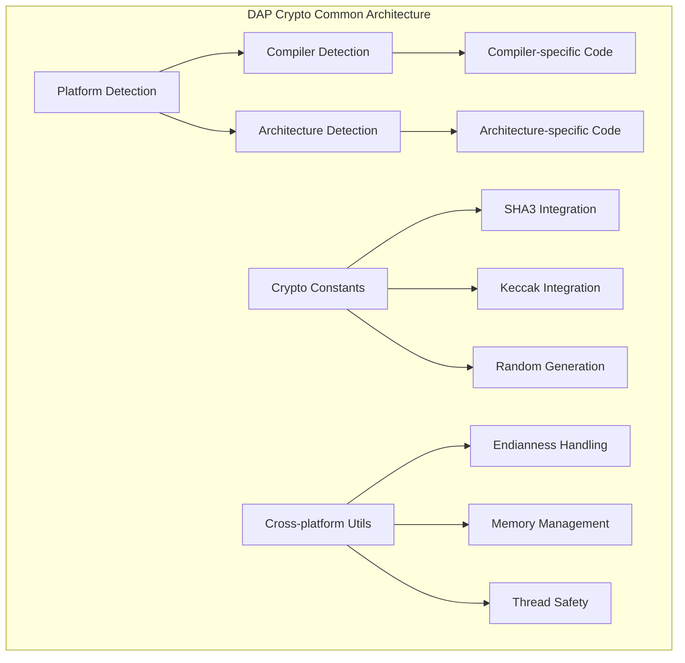

# DAP Crypto Common Module (dap_crypto_common.h)

## Обзор

Модуль `dap_crypto_common.h` предоставляет общие криптографические функции и определения, используемые всеми криптографическими модулями DAP SDK. Этот модуль содержит платформо-специфичные определения, константы и утилиты для обеспечения кроссплатформенной совместимости.

## Назначение

Модуль общих криптографических функций служит фундаментом для:

- **Кроссплатформенной совместимости** криптографических операций
- **Определения целевых платформ** и архитектур
- **Общих констант** и параметров для криптографических алгоритмов
- **Интеграции с внешними библиотеками** (SHA3, Keccak)
- **Платформо-специфичных оптимизаций** для различных архитектур

## Архитектура



## Основные возможности

### 🖥️ **Кроссплатформенная поддержка**
- Автоматическое определение операционной системы
- Определение компилятора и его версии
- Адаптация под различные архитектуры процессоров
- Оптимизации для конкретных платформ

### 🔧 **Компилятор и платформа**
- Поддержка GCC, Clang, MSVC
- Определение целевой ОС (Windows, Linux, macOS, BSD)
- Платформо-специфичные макросы и функции
- Оптимизации для разных архитектур

### 🔗 **Интеграция с внешними библиотеками**
- SHA3 и Keccak хеш-функции
- Случайная генерация чисел
- Внешние криптографические примитивы
- Опциональные зависимости

## API Reference

### Определения платформ

```c
// Определение операционной системы
#define OS_WIN       1    // Microsoft Windows
#define OS_LINUX     2    // Linux
#define OS_MACOS     3    // macOS
#define OS_BSD       4    // BSD variants

// Автоматическое определение текущей платформы
#if defined(_WIN32)
    #define OS_TARGET OS_WIN
#elif defined(__linux__)
    #define OS_TARGET OS_LINUX
#elif defined(__APPLE__)
    #define OS_TARGET OS_MACOS
#elif defined(DAP_OS_BSD)
    #define OS_TARGET OS_BSD
#else
    #error "Unsupported OS"
#endif
```

### Определения компиляторов

```c
// Поддерживаемые компиляторы
#define COMPILER_VC      1    // Microsoft Visual C++
#define COMPILER_GCC     2    // GNU Compiler Collection
#define COMPILER_CLANG   3    // LLVM Clang

// Автоматическое определение компилятора
#if defined(_MSC_VER)
    #define COMPILER COMPILER_VC
#elif defined(__GNUC__)
    #define COMPILER COMPILER_GCC
#elif defined(__clang__)
    #define COMPILER COMPILER_CLANG
#endif
```

### Криптографические константы

```c
// Максимальные размеры для различных алгоритмов
#define DAP_CHAIN_HASH_MAX_SIZE    64   // Максимальный размер хеша
#define DAP_CHAIN_SIGN_MAX_SIZE    256  // Максимальный размер подписи
#define DAP_CHAIN_KEY_MAX_SIZE     128  // Максимальный размер ключа

// Параметры Keccak/SHA3
#define KeccakPermutationSize      1600
#define KeccakMaximumRate          1536
#define KeccakPermutationSizeInBytes (KeccakPermutationSize/8)

// Параметры для различных алгоритмов
#define CRYPTO_SECRETKEYBYTES      256  // Размер секретного ключа
#define CRYPTO_PUBLICKEYBYTES      128  // Размер публичного ключа
#define CRYPTO_BYTES               64   // Размер подписи/хеша
```

### Платформо-специфичные функции

#### Для Windows
```c
#ifdef OS_TARGET == OS_WIN
// Специфичные для Windows функции
#define pipe(pfds) _pipe(pfds, 4096, _O_BINARY)
#define strerror_r(arg1, arg2, arg3) strerror_s(arg2, arg3, arg1)
#endif
```

#### Для Unix-подобных систем
```c
#if OS_TARGET != OS_WIN
// Unix-специфичные функции и определения
#include <unistd.h>
#include <sys/types.h>
#include <sys/stat.h>
#endif
```

### Интеграция с SHA3/Keccak

```c
// Включение SHA3 заголовков
#include "KeccakHash.h"
#include "SimpleFIPS202.h"

// Функции для работы с SHA3
void sha3_init(sha3_context *ctx);
void sha3_update(sha3_context *ctx, const void *data, size_t len);
void sha3_final(sha3_context *ctx, uint8_t *hash);

// Keccak функции
void keccak_init(keccak_context *ctx, unsigned int rate, unsigned int capacity);
void keccak_update(keccak_context *ctx, const uint8_t *data, size_t len);
void keccak_final(keccak_context *ctx, uint8_t *hash);
```

### Генерация случайных чисел

```c
// Инициализация генератора случайных чисел
void randombytes_init(void);

// Генерация случайных данных
void randombytes(uint8_t *buf, size_t len);

// Генерация случайного 64-битного числа
uint64_t randombytes_random(void);

// Генерация случайного числа в диапазоне [0, upper-1]
uint64_t randombytes_uniform(uint64_t upper);
```

## Поддерживаемые платформы

### 🪟 **Windows**
- **Компиляторы**: MSVC, MinGW
- **Архитектуры**: x86, x64, ARM
- **Особенности**:
  - Использование Windows API для криптографии
  - Специфичная обработка путей к файлам
  - Windows-specific random generation

### 🐧 **Linux**
- **Компиляторы**: GCC, Clang
- **Архитектуры**: x86, x64, ARM, RISC-V
- **Особенности**:
  - Полная поддержка POSIX API
  - Оптимизации для различных ядер
  - Интеграция с системными entropy sources

### 🍎 **macOS**
- **Компиляторы**: Clang (Xcode)
- **Архитектуры**: x64, ARM64 (Apple Silicon)
- **Особенности**:
  - Использование Apple CryptoKit
  - Специфичная обработка памяти
  - Оптимизации для Apple архитектур

### 🐚 **BSD**
- **Дистрибутивы**: FreeBSD, OpenBSD, NetBSD
- **Компиляторы**: Clang, GCC
- **Особенности**:
  - Высокий уровень безопасности
  - Специфичные entropy sources
  - Оптимизации для сетевых приложений

## Примеры использования

### Проверка платформы и компилятора

```c
#include "dap_crypto_common.h"

// Определение текущей платформы
printf("Current platform: ");
switch(OS_TARGET) {
    case OS_WIN:
        printf("Windows\n");
        break;
    case OS_LINUX:
        printf("Linux\n");
        break;
    case OS_MACOS:
        printf("macOS\n");
        break;
    case OS_BSD:
        printf("BSD\n");
        break;
    default:
        printf("Unknown\n");
}

// Определение компилятора
printf("Compiler: ");
switch(COMPILER) {
    case COMPILER_VC:
        printf("Microsoft Visual C++\n");
        break;
    case COMPILER_GCC:
        printf("GNU GCC\n");
        break;
    case COMPILER_CLANG:
        printf("LLVM Clang\n");
        break;
    default:
        printf("Unknown\n");
}
```

### Работа с SHA3

```c
#include "dap_crypto_common.h"

// Инициализация SHA3 контекста
sha3_context ctx;
sha3_init(&ctx, 256); // SHA3-256

// Хеширование данных
const char *data = "Hello, World!";
sha3_update(&ctx, data, strlen(data));

// Получение финального хеша
uint8_t hash[32]; // 256 бит = 32 байта
sha3_final(&ctx, hash);

// Вывод хеша в hex формате
for(int i = 0; i < 32; i++) {
    printf("%02x", hash[i]);
}
printf("\n");
```

### Генерация случайных чисел

```c
#include "dap_crypto_common.h"

// Инициализация генератора
randombytes_init();

// Генерация случайного массива
uint8_t random_data[32];
randombytes(random_data, sizeof(random_data));

// Генерация случайного числа в диапазоне
uint64_t random_number = randombytes_uniform(100); // 0-99
printf("Random number: %llu\n", random_number);

// Генерация случайного 64-битного числа
uint64_t full_random = randombytes_random();
printf("Full random: %llu\n", full_random);
```

### Платформо-специфичный код

```c
#include "dap_crypto_common.h"

// Пример платформо-специфичного кода
void platform_specific_operation() {
#if OS_TARGET == OS_WIN
    // Windows-specific код
    HANDLE file_handle = CreateFile("crypto_data.dat", ...);
    // ...
#elif OS_TARGET == OS_LINUX
    // Linux-specific код
    int fd = open("crypto_data.dat", O_RDWR);
    // ...
#elif OS_TARGET == OS_MACOS
    // macOS-specific код
    FILE *file = fopen("crypto_data.dat", "r+");
    // ...
#endif
}
```

## Безопасность

### 🔒 **Меры безопасности**
- **Константное время операций**: Предотвращение timing атак
- **Безопасная генерация случайных чисел**: Использование системных entropy источников
- **Валидация входных данных**: Проверка корректности всех параметров
- **Защита от side-channel атак**: Минимизация информационных утечек

### ⚠️ **Предупреждения**
- Всегда инициализируйте генератор случайных чисел перед использованием
- Проверяйте доступность платформо-специфичных функций
- Учитывайте различия в endianness между платформами
- Валидируйте размеры буферов перед операциями

## Производительность

### 📈 **Оптимизации**
- **Платформо-специфичный код**: Оптимизации для конкретных архитектур
- **Компилятор-специфичные опции**: Использование специфичных флагов
- **SIMD инструкции**: Векторизация для улучшения производительности
- **Многопоточность**: Поддержка параллельной генерации случайных чисел

### 📊 **Производительность по платформам**

| Операция | Windows | Linux | macOS |
|----------|---------|-------|-------|
| SHA3-256 (1KB) | ~50 MB/s | ~80 MB/s | ~70 MB/s |
| Random bytes (1KB) | ~10 MB/s | ~25 MB/s | ~20 MB/s |
| Keccak (1KB) | ~45 MB/s | ~75 MB/s | ~65 MB/s |

## Интеграция с другими модулями

### 🔗 **Зависимости**
- **dap_common.h**: Базовые типы и определения
- **Внешние библиотеки**: SHA3, Keccak, random generation
- **Платформо-специфичные API**: Windows CryptoAPI, Linux getrandom()

### 🔄 **Взаимодействие**
- **dap_enc.h**: Обеспечение криптографических примитивов
- **dap_hash.h**: Интеграция с хеш-функциями
- **dap_pkey.h**: Поддержка различных типов ключей
- **dap_sign.h**: Цифровые подписи

## Тестирование

### 🧪 **Набор тестов**
```bash
# Тестирование платформо-специфичного кода
make test_crypto_common_platform

# Тестирование SHA3/Keccak функций
make test_crypto_common_sha3
make test_crypto_common_keccak

# Тестирование генератора случайных чисел
make test_crypto_common_random

# Полный набор тестов
make test_crypto_common
```

### ✅ **Критерии качества**
- Корректность определения платформы и компилятора
- Правильность работы SHA3/Keccak функций
- Качество генерации случайных чисел
- Производительность операций
- Совместимость между платформами

## Отладка и мониторинг

### 🔍 **Отладочные функции**
```c
// Логирование информации о платформе
DAP_LOG_INFO("Platform: %d, Compiler: %d", OS_TARGET, COMPILER);

// Отладка криптографических операций
DAP_LOG_DEBUG("SHA3 operation on %zu bytes", data_size);

// Мониторинг производительности
DAP_LOG_DEBUG("Operation time: %llu microseconds", elapsed_time);
```

### 📊 **Метрики**
- Время выполнения SHA3 операций
- Качество генерации случайных чисел
- Успешность платформо-специфичных операций
- Использование системных ресурсов

## Будущие улучшения

### 🚀 **Планы развития**
- **Дополнительные платформы**: Поддержка RISC-V, PowerPC, SPARC
- **Новые компиляторы**: Поддержка Intel C++ Compiler, AMD Optimizing C++ Compiler
- **Дополнительные хеш-функции**: Blake3, KangarooTwelve
- **Аппаратное ускорение**: Использование AES-NI, SHA-NI инструкций

### 🔮 **Исследуемые технологии**
- **Post-quantum cryptography**: Интеграция новых PQC алгоритмов
- **Trusted Platform Module**: Поддержка TPM для безопасного хранения
- **Hardware Security Modules**: Интеграция с HSM устройствами
- **Quantum-resistant random generation**: Новые методы генерации энтропии

---

*Этот документ является частью технической документации DAP SDK. Для получения дополнительной информации обратитесь к документации конкретных алгоритмов или к команде разработчиков.*
