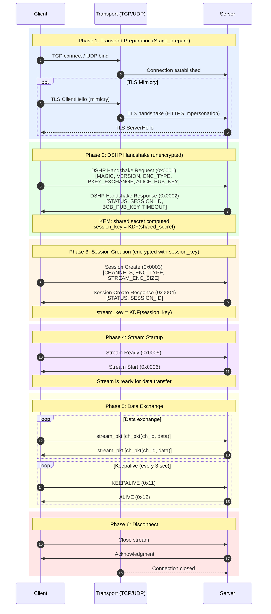
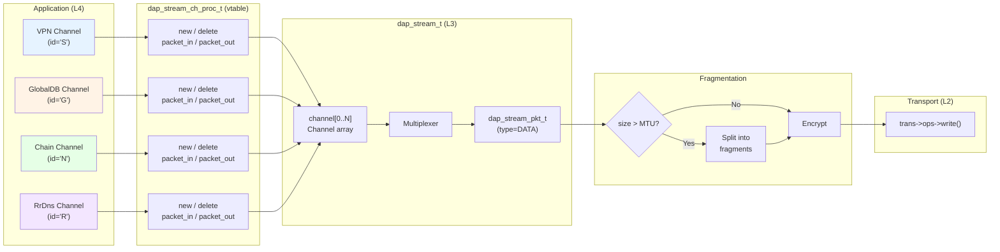
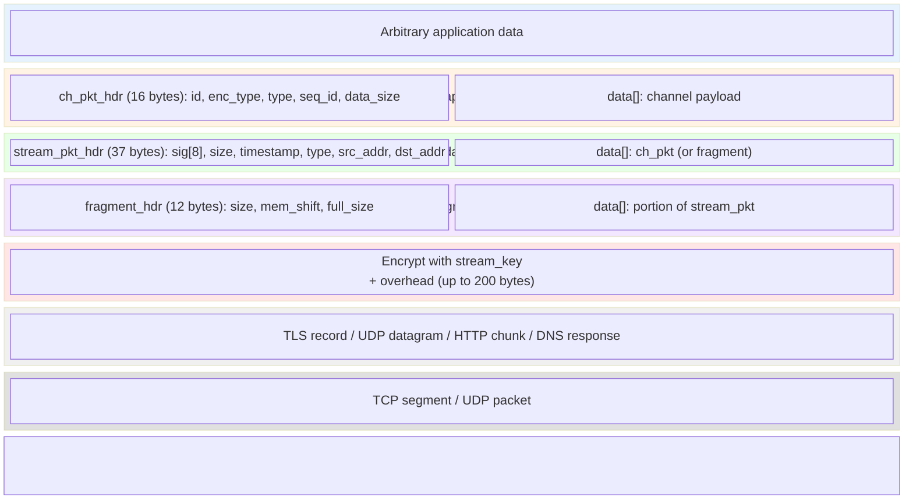
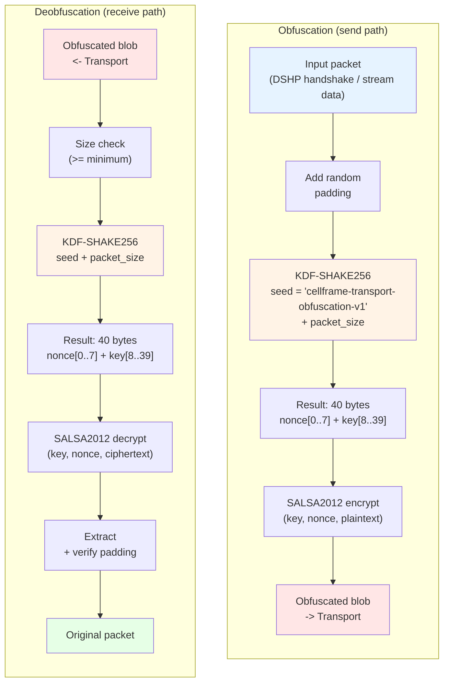
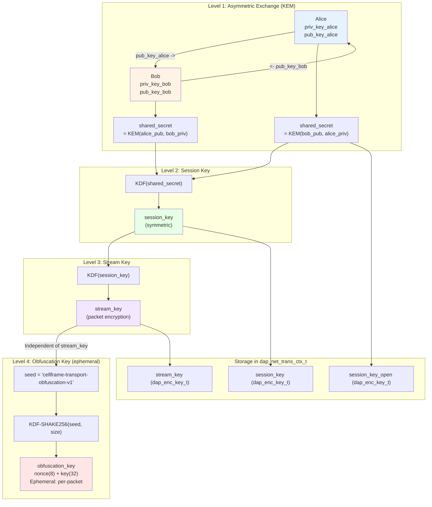

# DAP Stream Protocol Diagrams

> **Version:** 1.0 | **Date:** 2026-07-20 | **Module:** `dap-sdk/net/stream/`

## Overview

This document contains the complete set of DAP Stream protocol diagrams: connection sequence, client and server state machines, fragmentation, channel multiplexing, packet encapsulation, obfuscation, and key derivation. All diagrams use Mermaid syntax.

---

## 1. Full Connection Sequence Diagram

Complete flow from TCP connection to data exchange.



### Phase Description

| Phase | Description | Encryption |
|-------|-------------|------------|
| 1. Preparation | TCP connect, optional TLS mimicry | None (or TLS) |
| 2. Handshake | Public key exchange (DSHP) | None (KEM) |
| 3. Session | Session creation, channel selection | session_key |
| 4. Startup | Stream Ready / Stream Start signals | session_key |
| 5. Data | Stream packet exchange + keepalive | stream_key |
| 6. Disconnect | Connection teardown | stream_key |

---

## 2. Client FSM State Machine

The client FSM manages connection stages. Each stage has a status: `NONE` -> `IN_PROGRESS` -> `DONE` / `ERROR`.

```mermaid
stateDiagram-v2
    [*] --> STAGE_BEGIN

    state STAGE_BEGIN {
        note right of STAGE_BEGIN
            Initial state
            Prepare parameters
        end note
    }

    STAGE_BEGIN --> STAGE_ENC_INIT : go_stage(ENC_INIT)
    STAGE_ENC_INIT --> STAGE_BEGIN : ERROR (reconnect)

    state STAGE_ENC_INIT {
        note right of STAGE_ENC_INIT
            Key exchange (DSHP)
            - TCP/TLS connection
            - Handshake Request (Alice pub key)
            - Handshake Response (Bob pub key)
            - Compute session_key
        end note
    }

    STAGE_ENC_INIT --> STAGE_STREAM_CTL : DONE
    STAGE_ENC_INIT --> STAGE_BEGIN : ERROR<br/>reconnect_attempts++

    state STAGE_STREAM_CTL {
        note right of STAGE_STREAM_CTL
            Stream control
            - stream_ctl request
            - Authorization
        end note
    }

    STAGE_STREAM_CTL --> STAGE_STREAM_SESSION : DONE
    STAGE_STREAM_CTL --> STAGE_ENC_INIT : ERROR<br/>reconnect (reset keys)

    state STAGE_STREAM_SESSION {
        note right of STAGE_STREAM_SESSION
            Session creation
            - Session Create
            - Channel selection
            - Compute stream_key
        end note
    }

    STAGE_STREAM_SESSION --> STAGE_STREAM_CONNECTED : DONE
    STAGE_STREAM_SESSION --> STAGE_ENC_INIT : ERROR<br/>reconnect

    state STAGE_STREAM_CONNECTED {
        note right of STAGE_STREAM_CONNECTED
            Stream connected
            - Stream Ready / Stream Start
            - Channels created
        end note
    }

    STAGE_STREAM_CONNECTED --> STAGE_STREAM_STREAMING : DONE
    STAGE_STREAM_CONNECTED --> STAGE_ENC_INIT : ERROR<br/>reconnect

    state STAGE_STREAM_STREAMING {
        note right of STAGE_STREAM_STREAMING
            Active data transfer
            - Packet exchange
            - Keepalive
        end note
    }

    STAGE_STREAM_STREAMING --> STAGE_QOS_PROBE : go_stage(QOS_PROBE)
    STAGE_STREAM_STREAMING --> STAGE_ENC_INIT : ERROR / frozen<br/>reconnect

    state STAGE_QOS_PROBE {
        note right of STAGE_QOS_PROBE
            QoS probing
            - Latency measurement
            - Quality check
        end note
    }

    STAGE_QOS_PROBE --> STAGE_STREAM_STREAMING : DONE
    STAGE_QOS_PROBE --> STAGE_ENC_INIT : ERROR<br/>reconnect
```

### Client Error Codes

| Error | Code | FSM Action |
|-------|------|------------|
| `ERROR_NO_ERROR` | 0 | — |
| `ERROR_OUT_OF_MEMORY` | 1 | Reconnect |
| `ERROR_ENC_NO_KEY` | 2 | Reconnect (STAGE_BEGIN) |
| `ERROR_ENC_WRONG_KEY` | 3 | Reconnect (STAGE_BEGIN) |
| `ERROR_ENC_SESSION_CLOSED` | 4 | Reconnect (STAGE_BEGIN) |
| `ERROR_STREAM_CTL_ERROR` | 5 | Reconnect (STAGE_ENC_INIT) |
| `ERROR_STREAM_CTL_ERROR_AUTH` | 6 | Reconnect (STAGE_ENC_INIT) |
| `ERROR_STREAM_CTL_ERROR_RESPONSE_FORMAT` | 7 | Reconnect (STAGE_ENC_INIT) |
| `ERROR_STREAM_CONNECT` | 8 | Reconnect (STAGE_ENC_INIT) |
| `ERROR_STREAM_RESPONSE_WRONG` | 9 | Reconnect (STAGE_ENC_INIT) |
| `ERROR_STREAM_RESPONSE_TIMEOUT` | 10 | Reconnect (STAGE_ENC_INIT) |
| `ERROR_STREAM_FREEZED` | 11 | Reconnect (STAGE_ENC_INIT) |
| `ERROR_STREAM_ABORTED` | 12 | Reconnect (STAGE_ENC_INIT) |
| `ERROR_NETWORK_CONNECTION_REFUSE` | 13 | Reconnect (STAGE_BEGIN) |
| `ERROR_NETWORK_CONNECTION_TIMEOUT` | 14 | Reconnect (STAGE_BEGIN) |
| `ERROR_WRONG_STAGE` | 15 | — |
| `ERROR_WRONG_ADDRESS` | 16 | — |

### Reconnect Behavior

```
reconnect_attempts++ on each error
always_reconnect == true  -> infinite retries
session_resume_mode == true -> hot reconnect
    (copy session_key, attempt STREAM_CTL without ENC_INIT)
```

---

## 3. Server-Side Stream Lifecycle

Server-side state machine handling incoming connections.

```mermaid
stateDiagram-v2
    [*] --> LISTENING : Server started

    state LISTENING {
        note right of LISTENING
            Awaiting connections
            HTTP / UDP / DNS / WS
        end note
    }

    LISTENING --> ACCEPTED : New connection

    state ACCEPTED {
        note right of ACCEPTED
            Transport established
            TCP accept / UDP bind
            Deobfuscation (if enabled)
        end note
    }

    ACCEPTED --> HANDSHAKE : DSHP Magic detected

    state HANDSHAKE {
        note right of HANDSHAKE
            DSHP processing
            - Parse Handshake Request
            - Validate MAGIC + VERSION
            - Compute shared secret
            - Send Handshake Response
            - Derive session_key
        end note
    }

    HANDSHAKE --> SESSION : Handshake OK

    state SESSION {
        note right of SESSION
            Session management
            - Parse Session Create
            - Authorization check
            - Create channels
            - Derive stream_key
            - Send Session Create Response
        end note
    }

    SESSION --> STREAMING : Session created

    state STREAMING {
        note right of STREAMING
            Active data transfer
            - Dispatch packets to channels
            - Process keepalive
            - Fragmentation/reassembly
        end note
    }

    STREAMING --> CLOSED : Client disconnected<br/>Timeout<br/>Error

    state CLOSED {
        note right of CLOSED
            Resource cleanup
            - Destroy channels
            - Free session
            - Close transport
            - Remove from hash table
        end note
    }

    CLOSED --> [*]

    HANDSHAKE --> CLOSED : Validation error
    SESSION --> CLOSED : Authorization error
    STREAMING --> CLOSED : Keepalive timeout
    STREAMING --> HANDSHAKE : Session check failed

    ACCEPTED --> CLOSED : Transport error
```

### Server Error Handling

| State | Error | Action |
|-------|-------|--------|
| ACCEPTED | Transport error | Close connection |
| HANDSHAKE | Invalid MAGIC/VERSION | Send ERROR_CODE, close |
| HANDSHAKE | Unknown ENC_TYPE | Send ERROR_CODE, close |
| SESSION | Authorization failure | Send ERROR_CODE, close |
| SESSION | Invalid channels | Send ERROR_CODE, close |
| STREAMING | Keepalive timeout (3 missed keepalives) | Close stream, cleanup |
| STREAMING | Read/write error | Close stream, cleanup |

---

## 4. Fragmentation

Flow chart of the fragmentation and reassembly process for packets exceeding MTU.

```mermaid
flowchart TD
    subgraph Sender
        A["Input data<br/>dap_stream_ch_pkt_t"] --> B{Size > MTU?}
        B -->|No| C["Wrap in<br/>dap_stream_pkt_t<br/>(type = DATA 0x00)"]
        B -->|Yes| D["Calculate parameters:<br/>fragment_size = MTU<br/>- ENC_OVERHEAD(200)<br/>- fragment_hdr(12)"]

        D --> E["Fragment #0<br/>mem_shift = 0<br/>Includes ch_pkt_hdr"]
        D --> F["Fragment #1<br/>mem_shift = fragment_size"]
        D --> G["Fragment #N<br/>mem_shift = N * fragment_size"]

        E --> H["Wrap in dap_stream_pkt_t<br/>(type = FRAGMENT 0x01)"]
        F --> H
        G --> H

        C --> I["Encrypt<br/>dap_stream_pkt_write_unsafe"]
        H --> I

        I --> J["Send via transport"]
    end

    subgraph Receiver
        K["Receive data"] --> L["Scan for signature<br/>sig = {a0,95,96,a9,9e,5c,fb,fa}"]
        L --> M{Packet type?}

        M -->|"DATA (0x00)"| N["Decrypt<br/>dap_stream_pkt_read_unsafe"]
        N --> O["Extract<br/>dap_stream_ch_pkt_t"]
        O --> P["Dispatch<br/>to channel"]

        M -->|"FRAGMENT (0x01)"| Q["Decrypt"]
        Q --> R["Extract<br/>dap_stream_fragment_pkt_t"]
        R --> S{mem_shift ==<br/>buf_fragments_size_filled?}

        S -->|Yes| T["Copy into<br/>buf_fragments<br/>at offset"]
        S -->|No| U["ORDER ERROR<br/>Drop packet"]

        T --> V{buf_fragments_size_filled<br/>== full_size?}
        V -->|No| W["Wait for<br/>next fragment"]
        V -->|Yes| X["All fragments received"]
        X --> O
    end

    style A fill:#e6f3ff
    style P fill:#e6ffe6
    style U fill:#ffe6e6
```



### Fragmentation Parameters

| Parameter | Value | Description |
|-----------|-------|-------------|
| `DAP_STREAM_PKT_ENCRYPTION_OVERHEAD` | 200 bytes | Maximum encryption overhead |
| `sizeof(dap_stream_fragment_pkt_t)` | 12 bytes | Fragment header size |
| UDP MTU | 1200 bytes | Typical UDP MTU |
| DNS MTU | 500 bytes | Typical DNS MTU |
| TCP MTU | 0 (no fragmentation) | TCP does not require fragmentation |

### Fragment Structure

```c
typedef struct dap_stream_fragment_pkt {
    uint32_t    size;         // Size of this fragment
    uint32_t    mem_shift;    // Offset within the original packet
    uint32_t    full_size;    // Full size of the original packet
    uint8_t     data[];       // Fragment payload
} __attribute__((packed)) dap_stream_fragment_pkt_t;  // 12-byte header
```

---

## 5. Channel Multiplexing

Shows how multiple channels coexist within a single stream.



### Channel Packet Header

```c
typedef struct dap_stream_ch_pkt_hdr {
    uint8_t     id;           // Channel ID ('S', 'D', 'N', ...)
    uint8_t     enc_type;     // Encryption type (0 = none)
    uint8_t     type;         // Channel packet type
    uint8_t     padding;
    uint64_t    seq_id;       // Sequence ID
    uint32_t    data_size;    // Data size
} __attribute__((packed)) dap_stream_ch_pkt_hdr_t;  // 16 bytes
```

### Dispatch (read path)

```
1. Decrypted stream packet -> extract dap_stream_ch_pkt_t
2. ch_pkt_hdr.id -> lookup channel in stream->channel[id]
3. channel->proc->packet_in_callback(channel, ch_pkt)
4. Iterate packet_in_notifiers
```

---

## 6. Packet Encapsulation

Sequential encapsulation of data from application to network.



### Header Sizes

| Layer | Structure | Header Size |
|-------|-----------|-------------|
| Channel | `dap_stream_ch_pkt_hdr_t` | 16 bytes |
| Stream | `dap_stream_pkt_hdr_t` | 37 bytes |
| Fragment | `dap_stream_fragment_pkt_t` | 12 bytes |
| Encryption | Overhead | up to 200 bytes |

### Example: Full Overhead

```
Channel payload:           1000 bytes
+ ch_pkt_hdr:               16 bytes  -> 1016 bytes
+ stream_pkt_hdr:           37 bytes  -> 1053 bytes
+ encryption_overhead:     200 bytes  -> 1253 bytes
-----------------------------------------------
Total on wire:            1253 bytes (overhead ~25%)
```

```
With fragmentation (UDP MTU = 1200):
  Fragment 0: stream_pkt_hdr(37) + frag_hdr(12) + ch_pkt_hdr(16) + data(947) + enc(200) = 1212
  Fragment 1: stream_pkt_hdr(37) + frag_hdr(12) + data(53) + enc(200) = 302
```

---

## 7. Obfuscation (Anti-DPI)

Obfuscation protects against Deep Packet Inspection (DPI) but is not a cryptographic protection layer.



### Obfuscation Properties

| Property | Value |
|----------|-------|
| Algorithm | SALSA2012 (Salsa20/12) |
| KDF | SHAKE256 |
| Seed | `"cellframe-transport-obfuscation-v1"` (static) |
| Key | Ephemeral (depends on packet size) |
| Nonce | 8 bytes (from KDF) |
| Key size | 32 bytes (from KDF) |
| Purpose | Anti-DPI, not cryptographic protection |

### Obfuscation Techniques

| Technique | Description |
|-----------|-------------|
| Padding | Add random bytes (16-256 bytes) |
| Mimicry | Impersonate TLS/HTTPS traffic |
| Timing | Random delays between packets |
| Polymorphic | Dynamic magic numbers per session |
| Mixing | Generate artificial traffic |

---

## 8. Key Derivation

Three-level key model: from asymmetric exchange to stream encryption.



### Supported KEM Algorithms

| Algorithm | Type | Description |
|-----------|------|-------------|
| Kyber | KEM | Post-quantum (Kyber512/768/1024) |
| MSRLN | KEM | Legacy lattice-based (P2P compatibility) |
| ECDSA | Signature | Elliptic Curve (secp256k1, P-256) |
| Falcon | Signature | Post-quantum (Falcon-512/1024) |
| Dilithium | Signature | Post-quantum (Dilithium2/3/5) |

### Keys in Transport Context

```c
typedef struct dap_net_trans_ctx {
    dap_enc_key_t *session_key_open;   // Asymmetric KEM (Level 1)
    dap_enc_key_t *session_key;        // Session key (Level 2)
    dap_enc_key_t *stream_key;         // Stream encryption (Level 3)
    char          *session_key_id;     // Key identifier
    // ...
} dap_net_trans_ctx_t;
```

---

## Related Documents

- [01 -- Stream Protocol](01-stream-protocol_en.md) -- stream protocol core
- [02 -- Channels](02-channels_en.md) -- channel multiplexing
- [03 -- DSHP Handshake](03-handshake_en.md) -- handshake protocol
- [04 -- Encryption](04-encryption_en.md) -- cryptographic model
