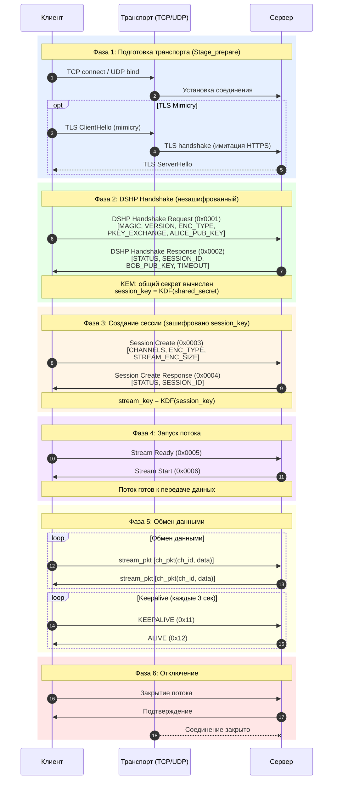
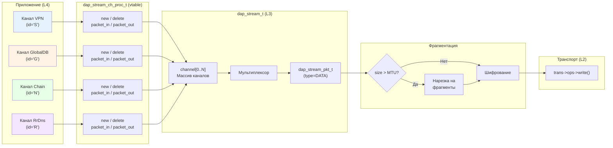
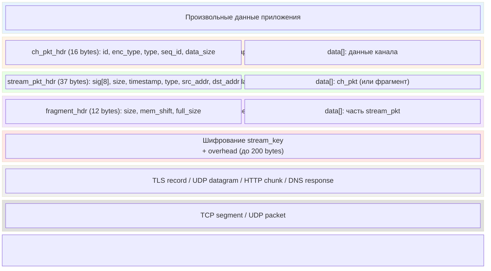
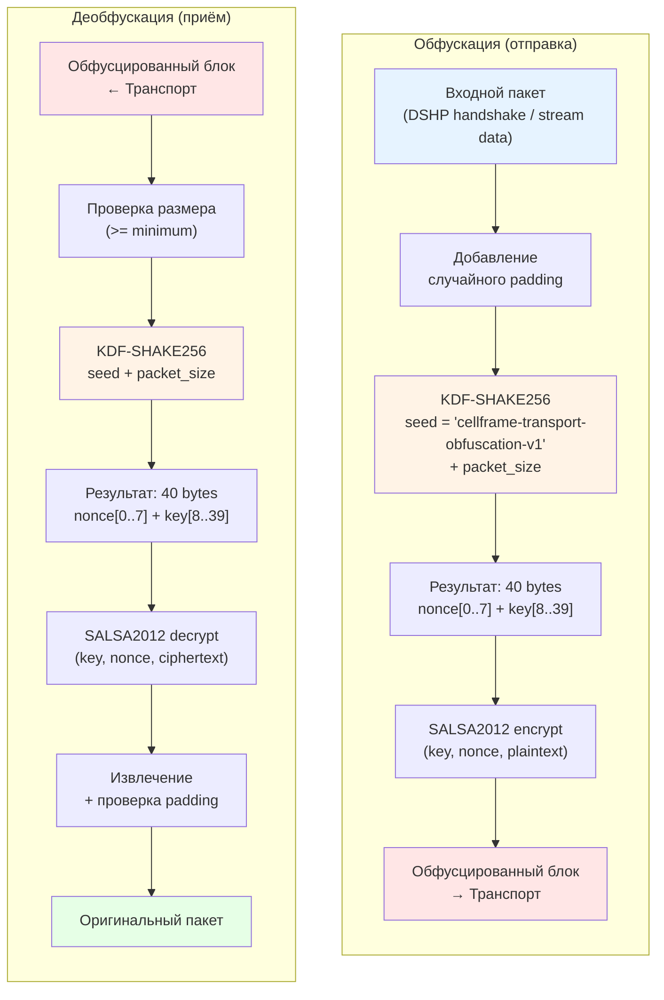
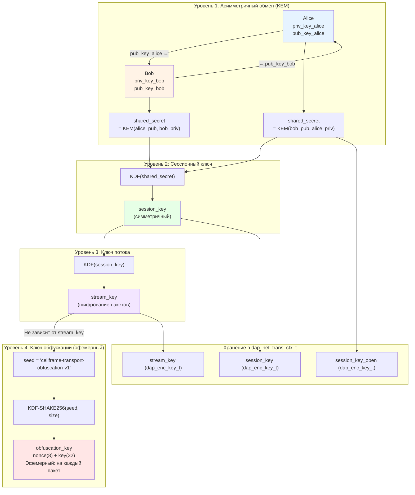

# Диаграммы протокола DAP Stream

> **Версия:** 1.0 | **Дата:** 2026-07-20 | **Модуль:** `dap-sdk/net/stream/`

## Обзор

Документ содержит полный набор диаграмм протокола DAP Stream: последовательность подключения, конечные автоматы клиента и сервера, фрагментация, мультиплексирование каналов, инкапсуляция пакетов, обфускация и развёртывание ключей. Все диаграммы выполнены в синтаксисе Mermaid.

---

## 1. Полная последовательность подключения

Полный поток установки соединения: от TCP-подключения до обмена данными.



### Описание фаз

| Фаза | Описание | Шифрование |
|------|----------|------------|
| 1. Подготовка | TCP connect, опциональный TLS mimicry | Нет (или TLS) |
| 2. Handshake | Обмен публичными ключами (DSHP) | Нет (KEM) |
| 3. Сессия | Создание сессии, выбор каналов | session_key |
| 4. Запуск | Сигналы Stream Ready/Start | session_key |
| 5. Данные | Обмен stream пакетами + keepalive | stream_key |
| 6. Отключение | Закрытие соединения | stream_key |

---

## 2. Конечный автомат клиента (Client FSM)

Клиентский FSM управляет стадиями подключения. Каждая стадия имеет статус: `NONE` -> `IN_PROGRESS` -> `DONE` / `ERROR`.

```mermaid
stateDiagram-v2
    [*] --> STAGE_BEGIN

    state STAGE_BEGIN {
        note right of STAGE_BEGIN
            Начальное состояние
            Подготовка параметров
        end note
    }

    STAGE_BEGIN --> STAGE_ENC_INIT : go_stage(ENC_INIT)
    STAGE_ENC_INIT --> STAGE_BEGIN : ERROR (reconnect)

    state STAGE_ENC_INIT {
        note right of STAGE_ENC_INIT
            Обмен ключами (DSHP)
            - TCP/TLS подключение
            - Handshake Request (Alice pub key)
            - Handshake Response (Bob pub key)
            - Вычисление session_key
        end note
    }

    STAGE_ENC_INIT --> STAGE_STREAM_CTL : DONE
    STAGE_ENC_INIT --> STAGE_BEGIN : ERROR<br/>reconnect_attempts++

    state STAGE_STREAM_CTL {
        note right of STAGE_STREAM_CTL
            Управление потоком
            - stream_ctl запрос
            - Авторизация
        end note
    }

    STAGE_STREAM_CTL --> STAGE_STREAM_SESSION : DONE
    STAGE_STREAM_CTL --> STAGE_ENC_INIT : ERROR<br/>reconnect (reset keys)

    state STAGE_STREAM_SESSION {
        note right of STAGE_STREAM_SESSION
            Создание сессии
            - Session Create
            - Выбор каналов
            - Вычисление stream_key
        end note
    }

    STAGE_STREAM_SESSION --> STAGE_STREAM_CONNECTED : DONE
    STAGE_STREAM_SESSION --> STAGE_ENC_INIT : ERROR<br/>reconnect

    state STAGE_STREAM_CONNECTED {
        note right of STAGE_STREAM_CONNECTED
            Поток подключён
            - Stream Ready / Stream Start
            - Каналы созданы
        end note
    }

    STAGE_STREAM_CONNECTED --> STAGE_STREAM_STREAMING : DONE
    STAGE_STREAM_CONNECTED --> STAGE_ENC_INIT : ERROR<br/>reconnect

    state STAGE_STREAM_STREAMING {
        note right of STAGE_STREAM_STREAMING
            Активная передача данных
            - Обмен пакетами
            - Keepalive
        end note
    }

    STAGE_STREAM_STREAMING --> STAGE_QOS_PROBE : go_stage(QOS_PROBE)
    STAGE_STREAM_STREAMING --> STAGE_ENC_INIT : ERROR / frozen<br/>reconnect

    state STAGE_QOS_PROBE {
        note right of STAGE_QOS_PROBE
            QoS зондирование
            - Измерение latency
            - Проверка качества
        end note
    }

    STAGE_QOS_PROBE --> STAGE_STREAM_STREAMING : DONE
    STAGE_QOS_PROBE --> STAGE_ENC_INIT : ERROR<br/>reconnect
```

### Коды ошибок клиента

| Ошибка | Код | Действие FSM |
|--------|-----|-------------|
| `ERROR_NO_ERROR` | 0 | — |
| `ERROR_OUT_OF_MEMORY` | 1 | Reconnect |
| `ERROR_ENC_NO_KEY` | 2 | Reconnect (STAGE_BEGIN) |
| `ERROR_ENC_WRONG_KEY` | 3 | Reconnect (STAGE_BEGIN) |
| `ERROR_ENC_SESSION_CLOSED` | 4 | Reconnect (STAGE_BEGIN) |
| `ERROR_STREAM_CTL_ERROR` | 5 | Reconnect (STAGE_ENC_INIT) |
| `ERROR_STREAM_CTL_ERROR_AUTH` | 6 | Reconnect (STAGE_ENC_INIT) |
| `ERROR_STREAM_CTL_ERROR_RESPONSE_FORMAT` | 7 | Reconnect (STAGE_ENC_INIT) |
| `ERROR_STREAM_CONNECT` | 8 | Reconnect (STAGE_ENC_INIT) |
| `ERROR_STREAM_RESPONSE_WRONG` | 9 | Reconnect (STAGE_ENC_INIT) |
| `ERROR_STREAM_RESPONSE_TIMEOUT` | 10 | Reconnect (STAGE_ENC_INIT) |
| `ERROR_STREAM_FREEZED` | 11 | Reconnect (STAGE_ENC_INIT) |
| `ERROR_STREAM_ABORTED` | 12 | Reconnect (STAGE_ENC_INIT) |
| `ERROR_NETWORK_CONNECTION_REFUSE` | 13 | Reconnect (STAGE_BEGIN) |
| `ERROR_NETWORK_CONNECTION_TIMEOUT` | 14 | Reconnect (STAGE_BEGIN) |
| `ERROR_WRONG_STAGE` | 15 | — |
| `ERROR_WRONG_ADDRESS` | 16 | — |

### Повторные подключения

```
reconnect_attempts++ при каждой ошибке
always_reconnect == true  → бесконечные попытки
session_resume_mode == true → горячее переподключение
    (копирование session_key, попытка STREAM_CTL без ENC_INIT)
```

---

## 3. Жизненный цикл на стороне сервера

Серверный конечный автомат обрабатывает входящие соединения.

```mermaid
stateDiagram-v2
    [*] --> LISTENING : Сервер запущен

    state LISTENING {
        note right of LISTENING
            Ожидание подключений
            HTTP / UDP / DNS / WS
        end note
    }

    LISTENING --> ACCEPTED : Новое подключение

    state ACCEPTED {
        note right of ACCEPTED
            Транспорт установлен
            TCP accept / UDP bind
            Деобфускация (если включена)
        end note
    }

    ACCEPTED --> HANDSHAKE : DSHP Magic обнаружен

    state HANDSHAKE {
        note right of HANDSHAKE
            Обработка DSHP
            - Парсинг Handshake Request
            - Валидация MAGIC + VERSION
            - Вычисление общего секрета
            - Отправка Handshake Response
            - Вычисление session_key
        end note
    }

    HANDSHAKE --> SESSION : Handshake OK

    state SESSION {
        note right of SESSION
            Управление сессией
            - Парсинг Session Create
            - Проверка авторизации
            - Создание каналов
            - Вычисление stream_key
            - Отправка Session Create Response
        end note
    }

    SESSION --> STREAMING : Сессия создана

    state STREAMING {
        note right of STREAMING
            Активная передача данных
            - Диспетчеризация пакетов по каналам
            - Обработка keepalive
            - Фрагментация/реассемблея
        end note
    }

    STREAMING --> CLOSED : Клиент отключён<br/>Timeout<br/>Ошибка

    state CLOSED {
        note right of CLOSED
            Очистка ресурсов
            - Удаление каналов
            - Освобождение сессии
            - Закрытие транспорта
            - Удаление из хеш-таблицы
        end note
    }

    CLOSED --> [*]

    HANDSHAKE --> CLOSED : Ошибка валидации
    SESSION --> CLOSED : Ошибка авторизации
    STREAMING --> CLOSED : Keepalive timeout
    STREAMING --> HANDSHAKE : Session check failed

    ACCEPTED --> CLOSED : Ошибка транспорта
```

### Обработка ошибок на сервере

| Состояние | Ошибка | Действие |
|-----------|--------|----------|
| ACCEPTED | Ошибка транспорта | Закрытие соединения |
| HANDSHAKE | Невалидный MAGIC/VERSION | Отправка ERROR_CODE, закрытие |
| HANDSHAKE | Неизвестный ENC_TYPE | Отправка ERROR_CODE, закрытие |
| SESSION | Ошибка авторизации | Отправка ERROR_CODE, закрытие |
| SESSION | Невалидные каналы | Отправка ERROR_CODE, закрытие |
| STREAMING | Keepalive timeout (3 пропущенных keepalive) | Закрытие потока, очистка |
| STREAMING | Ошибка чтения/записи | Закрытие потока, очистка |

---

## 4. Фрагментация

Потоковая диаграмма процесса фрагментации и реассемблеи пакетов.

```mermaid
flowchart TD
    subgraph Отправитель
        A["Входные данные<br/>dap_stream_ch_pkt_t"] --> B{Размер > MTU?}
        B -->|Нет| C["Обёртка в<br/>dap_stream_pkt_t<br/>(type = DATA 0x00)"]
        B -->|Да| D["Расчёт параметров:<br/>fragment_size = MTU<br/>- ENC_OVERHEAD(200)<br/>- fragment_hdr(12)"]

        D --> E["Фрагмент #0<br/>mem_shift = 0<br/>Включает ch_pkt_hdr"]
        D --> F["Фрагмент #1<br/>mem_shift = fragment_size"]
        D --> G["Фрагмент #N<br/>mem_shift = N * fragment_size"]

        E --> H["Обёртка в dap_stream_pkt_t<br/>(type = FRAGMENT 0x01)"]
        F --> H
        G --> H

        C --> I["Шифрование<br/>dap_stream_pkt_write_unsafe"]
        H --> I

        I --> J["Отправка через транспорт"]
    end

    subgraph Получатель
        K["Приём данных"] --> L["Поиск сигнатуры<br/>sig = {a0,95,96,a9,9e,5c,fb,fa}"]
        L --> M{Тип пакета?}

        M -->|"DATA (0x00)"| N["Расшифровка<br/>dap_stream_pkt_read_unsafe"]
        N --> O["Извлечение<br/>dap_stream_ch_pkt_t"]
        O --> P["Диспетчеризация<br/>в канал"]

        M -->|"FRAGMENT (0x01)"| Q["Расшифровка"]
        Q --> R["Извлечение<br/>dap_stream_fragment_pkt_t"]
        R --> S{mem_shift ==<br/>buf_fragments_size_filled?}

        S -->|Да| T["Копирование в<br/>buf_fragments<br/>по смещению"]
        S -->|Нет| U["ОШИБКА порядка<br/>Отбросить пакет"]

        T --> V{buf_fragments_size_filled<br/>== full_size?}
        V -->|Нет| W["Ожидание<br/>следующего фрагмента"]
        V -->|Да| X["Все фрагменты получены"]
        X --> O
    end

    style A fill:#e6f3ff
    style P fill:#e6ffe6
    style U fill:#ffe6e6
```



### Параметры фрагментации

| Параметр | Значение | Описание |
|----------|----------|----------|
| `DAP_STREAM_PKT_ENCRYPTION_OVERHEAD` | 200 bytes | Максимальный overhead шифрования |
| `sizeof(dap_stream_fragment_pkt_t)` | 12 bytes | Заголовок фрагмента |
| UDP MTU | 1200 bytes | Типичный MTU для UDP |
| DNS MTU | 500 bytes | Типичный MTU для DNS |
| TCP MTU | 0 (без фрагментации) | TCP не требует фрагментации |

### Структура фрагмента

```c
typedef struct dap_stream_fragment_pkt {
    uint32_t    size;         // Размер этого фрагмента
    uint32_t    mem_shift;    // Смещение в оригинальном пакете
    uint32_t    full_size;    // Полный размер оригинального пакета
    uint8_t     data[];       // Данные фрагмента
} __attribute__((packed)) dap_stream_fragment_pkt_t;  // 12 bytes header
```

---

## 5. Мультиплексирование каналов

Показывает, как несколько каналов сосуществуют в одном потоке.



### Структура заголовка канала

```c
typedef struct dap_stream_ch_pkt_hdr {
    uint8_t     id;           // ID канала ('S', 'D', 'N', ...)
    uint8_t     enc_type;     // Тип шифрования (0 = нет)
    uint8_t     type;         // Тип пакета канала
    uint8_t     padding;
    uint64_t    seq_id;       // Sequence ID
    uint32_t    data_size;    // Размер данных
} __attribute__((packed)) dap_stream_ch_pkt_hdr_t;  // 16 bytes
```

### Диспетчеризация (чтение)

```
1. Расшифрованный stream пакет → извлечение dap_stream_ch_pkt_t
2. ch_pkt_hdr.id → поиск канала в stream->channel[id]
3. channel->proc->packet_in_callback(channel, ch_pkt)
4. Итерация packet_in_notifiers
```

---

## 6. Инкапсуляция пакетов

Последовательная инкапсуляция данных от приложения до сети.



### Размеры заголовков

| Уровень | Структура | Размер заголовка |
|---------|-----------|-----------------|
| Канал | `dap_stream_ch_pkt_hdr_t` | 16 bytes |
| Поток | `dap_stream_pkt_hdr_t` | 37 bytes |
| Фрагмент | `dap_stream_fragment_pkt_t` | 12 bytes |
| Шифрование | Overhead | до 200 bytes |

### Пример: полный overhead

```
Полезная нагрузка канала: 1000 bytes
+ ch_pkt_hdr:              16 bytes  → 1016 bytes
+ stream_pkt_hdr:          37 bytes  → 1053 bytes
+ encryption_overhead:    200 bytes  → 1253 bytes
─────────────────────────────────────────────────
Итого на проводе:         1253 bytes (overhead ~25%)
```

```
С фрагментацией (UDP MTU = 1200):
  Фрагмент 0: stream_pkt_hdr(37) + frag_hdr(12) + ch_pkt_hdr(16) + data(947) + enc(200) = 1212
  Фрагмент 1: stream_pkt_hdr(37) + frag_hdr(12) + data(53) + enc(200) = 302
```

---

## 7. Обфускация (Anti-DPI)

Обфускация защищает от глубокого анализа пакетов (DPI), не являясь при этом криптографической защитой.



### Свойства обфускации

| Свойство | Значение |
|----------|----------|
| Алгоритм | SALSA2012 (Salsa20/12) |
| KDF | SHAKE256 |
| Seed | `"cellframe-transport-obfuscation-v1"` (статический) |
| Ключ | Эфемерный (зависит от размера пакета) |
| Nonce | 8 bytes (из KDF) |
| Key | 32 bytes (из KDF) |
| Цель | Anti-DPI, не криптографическая защита |

### Техники обфускации

| Техника | Описание |
|---------|----------|
| Padding | Добавление случайных байтов (16-256 bytes) |
| Mimicry | Имитация TLS/HTTPS трафика |
| Timing | Случайные задержки между пакетами |
| Polymorphic | Динамические magic numbers |
| Mixing | Генерация искусственного трафика |

---

## 8. Развёртывание ключей (Key Derivation)

Трёхуровневая модель ключей: от асимметричного обмена до шифрования потока.



### Поддерживаемые алгоритмы KEM

| Алгоритм | Тип | Описание |
|----------|-----|----------|
| Kyber | KEM | Post-quantum (Kyber512/768/1024) |
| MSRLN | KEM | Legacy lattice-based (P2P совместимость) |
| ECDSA | Подпись | Elliptic Curve (secp256k1, P-256) |
| Falcon | Подпись | Post-quantum (Falcon-512/1024) |
| Dilithium | Подпись | Post-quantum (Dilithium2/3/5) |

### Ключи в контексте транспорта

```c
typedef struct dap_net_trans_ctx {
    dap_enc_key_t *session_key_open;   // Асимметричный KEM (Уровень 1)
    dap_enc_key_t *session_key;        // Сессионный (Уровень 2)
    dap_enc_key_t *stream_key;         // Шифрование потока (Уровень 3)
    char          *session_key_id;     // Идентификатор ключа
    // ...
} dap_net_trans_ctx_t;
```

---

## Связанные документы

- [01 -- Stream Protocol](01-stream-protocol_ru.md) -- ядро потокового протокола
- [02 -- Каналы](02-channels_ru.md) -- мультиплексирование каналов
- [03 -- DSHP Handshake](03-handshake_ru.md) -- протокол рукопожатия
- [04 -- Шифрование](04-encryption_ru.md) -- криптографическая модель
