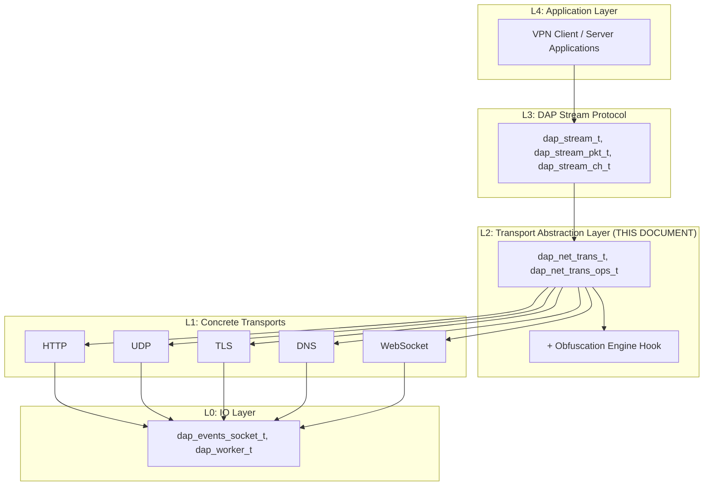

# Transport Abstraction Layer -- Architecture and Interface

> **Version:** 1.0 | **Date:** 2026-07-20 | **Module:** `dap-sdk/net/trans/`

## Overview

The Transport Abstraction Layer (TAL) is the second level of the DAP SDK network stack. It provides a uniform interface for working with different network transports (HTTP, UDP, TLS, DNS, WebSocket), allowing the DAP Stream protocol to remain transport-agnostic.

**Core principle:** DAP Stream does not know which transport is in use. It operates on `dap_net_trans_t` through a vtable of 17 operations, while the concrete implementation (UDP, TLS mimicry, DNS tunnel) is plugged in from below.

## Position in the Stack



```
+----------------------------------------------------------+
| L3: DAP Stream Protocol                                  |
|     (dap_stream_t, dap_stream_pkt_t, dap_stream_ch_t)   |
+----------------------------------------------------------+
| L2: Transport Abstraction Layer <-- THIS DOCUMENT        |
|     (dap_net_trans_t, dap_net_trans_ops_t)               |
|     + Obfuscation Engine Hook                            |
+----------------------------------------------------------+
| L1: Concrete Transports                                  |
|     +------+ +-----+ +------+ +-----+ +-----------+     |
|     | HTTP | | UDP | | TLS  | | DNS | | WebSocket |     |
|     +------+ +-----+ +------+ +-----+ +-----------+     |
+----------------------------------------------------------+
| L0: IO Layer (dap_events_socket_t, dap_worker_t)        |
+----------------------------------------------------------+
```

## Transport Registration

Each transport registers itself in the system via `dap_net_trans_register()` and becomes accessible by type or by name:

```c
// Registration
int dap_net_trans_register(const char *a_name,
                           dap_net_trans_type_t a_type,
                           const dap_net_trans_ops_t *a_ops,
                           dap_net_trans_socket_type_t a_socket_type,
                           void *a_inheritor);

// Lookup
dap_net_trans_t *t = dap_net_trans_find(DAP_NET_TRANS_UDP_BASIC);
dap_net_trans_t *t = dap_net_trans_find_by_name("udp_basic");

// List all registered transports
dap_list_t *list = dap_net_trans_list_all(void);
```

To remove a transport from the registry:

```c
dap_net_trans_unregister(trans);
```

## Transport Types

```c
typedef enum dap_net_trans_type {
    DAP_NET_TRANS_HTTP           = 0x01,  // HTTP/HTTPS (legacy default)
    DAP_NET_TRANS_UDP_BASIC      = 0x02,  // UDP without guarantees, low latency
    DAP_NET_TRANS_UDP_RELIABLE   = 0x03,  // UDP with ARQ (retransmission)
    DAP_NET_TRANS_UDP_QUIC_LIKE  = 0x04,  // QUIC-inspired multiplexed
    DAP_NET_TRANS_WEBSOCKET      = 0x05,  // WebSocket
    DAP_NET_TRANS_TLS_DIRECT     = 0x06,  // TLS direct connection
    DAP_NET_TRANS_DNS_TUNNEL     = 0x07,  // DNS tunnel
} dap_net_trans_type_t;
```

## Capability Flags

Each transport declares its capabilities through a bitmask:

```c
typedef enum dap_net_trans_cap {
    DAP_NET_TRANS_CAP_RELIABLE        = 0x0001,  // Guaranteed delivery
    DAP_NET_TRANS_CAP_ORDERED         = 0x0002,  // Guaranteed ordering
    DAP_NET_TRANS_CAP_OBFUSCATION     = 0x0004,  // Obfuscation support
    DAP_NET_TRANS_CAP_PADDING         = 0x0008,  // Traffic padding
    DAP_NET_TRANS_CAP_MIMICRY         = 0x0010,  // Protocol mimicry (disguise as legitimate traffic)
    DAP_NET_TRANS_CAP_MULTIPLEXING    = 0x0020,  // Stream multiplexing
    DAP_NET_TRANS_CAP_BIDIRECTIONAL   = 0x0040,  // Bidirectional communication
    DAP_NET_TRANS_CAP_LOW_LATENCY     = 0x0080,  // Low latency path
    DAP_NET_TRANS_CAP_HIGH_THROUGHPUT = 0x0100,  // High throughput path
} dap_net_trans_cap_t;
```

Example capability sets:

| Transport     | Capabilities                                              |
|---------------|----------------------------------------------------------|
| HTTP          | RELIABLE, ORDERED, BIDIRECTIONAL                         |
| UDP Basic     | LOW_LATENCY, BIDIRECTIONAL                               |
| UDP Reliable  | RELIABLE, ORDERED, LOW_LATENCY, BIDIRECTIONAL            |
| TLS Direct    | RELIABLE, ORDERED, OBFUSCATION, MIMICRY, HIGH_THROUGHPUT, BIDIRECTIONAL |
| DNS Tunnel    | OBFUSCATION, LOW_LATENCY, BIDIRECTIONAL                  |

## Vtable: dap_net_trans_ops_t

Each transport implements 17 operations. Most operations are asynchronous — they accept a callback for completion notification:

```c
// Callback types for async operations
typedef void (*dap_net_trans_connect_cb_t)(dap_stream_t *stream, int error);
typedef void (*dap_net_trans_handshake_cb_t)(dap_stream_t *stream,
    const void *response, size_t response_size, int error);
typedef void (*dap_net_trans_session_cb_t)(dap_stream_t *a_stream,
    uint32_t a_session_id, const char *a_response_data,
    size_t a_response_size, int a_error_code);
typedef void (*dap_net_trans_ready_cb_t)(dap_stream_t *stream, int error);

typedef struct dap_net_trans_ops {
    // Lifecycle
    int  (*init)(dap_net_trans_t *a_trans, dap_config_t *a_config);
    void (*deinit)(dap_net_trans_t *a_trans);

    // Client-side operations (async)
    int  (*connect)(dap_stream_t *a_stream, const char *a_host,
                    uint16_t a_port, dap_net_trans_connect_cb_t a_callback);
    int  (*handshake_init)(dap_stream_t *a_stream,
                           dap_net_handshake_params_t *a_params,
                           dap_net_trans_handshake_cb_t a_callback);
    int  (*session_create)(dap_stream_t *a_stream,
                           dap_net_session_params_t *a_params,
                           dap_net_trans_session_cb_t a_callback);
    int  (*session_start)(dap_stream_t *a_stream, uint32_t a_session_id,
                          dap_net_trans_ready_cb_t a_callback);
    ssize_t (*read)(dap_stream_t *a_stream, void *a_buffer, size_t a_size);
    ssize_t (*write)(dap_stream_t *a_stream, const void *a_data, size_t a_size);
    void (*close)(dap_stream_t *a_stream);

    // Server-side operations
    int  (*listen)(dap_net_trans_t *a_trans, const char *a_addr,
                   uint16_t a_port, dap_server_t *a_server);
    int  (*accept)(dap_events_socket_t *a_listener, dap_stream_t **a_stream_out);
    int  (*register_server_handlers)(dap_net_trans_t *a_trans, void *a_trans_ctx);
    int  (*handshake_process)(dap_stream_t *a_stream, const void *a_data,
                              size_t a_data_size, void **a_response,
                              size_t *a_response_size);

    // Utilities
    uint32_t (*get_capabilities)(dap_net_trans_t *a_trans);
    int  (*stage_prepare)(dap_net_trans_t *a_trans,
                          const dap_net_stage_prepare_params_t *a_params,
                          dap_net_stage_prepare_result_t *a_result);
    void *(*get_client_context)(dap_stream_t *a_stream);
    size_t (*get_max_packet_size)(dap_net_trans_t *a_trans);  // MTU
} dap_net_trans_ops_t;
```

### Key Operations

| Operation                | Description                                                                                          |
|--------------------------|------------------------------------------------------------------------------------------------------|
| `stage_prepare`          | Prepare transport resources for a client connection. Returns esocket and stream.                     |
| `handshake_init`         | Initiate key exchange (client side). Replaces the legacy HTTP POST to `/enc/gd4y5yh78w42aaagh`.      |
| `handshake_process`      | Process handshake on the server side. Accepts client data, returns response.                         |
| `session_create`         | Create a streaming session. Replaces the legacy HTTP POST to `/stream_ctl`.                          |
| `session_start`          | Start streaming with a given session ID. Replaces the legacy HTTP GET to `/stream/globaldb`.         |
| `get_max_packet_size`    | Returns MTU for fragmentation. UDP = 1200, DNS = 1200, TCP = 0 (no limit).                            |
| `get_capabilities`       | Returns the capability bitmask for this transport.                                                   |
| `connect`                | Establish a connection to a remote host and port.                                                    |
| `read` / `write`         | Read from or write to an established transport context.                                              |
| `close`                  | Tear down a transport context and release associated resources.                                      |
| `listen`                 | Bind a server to a port for incoming connections.                                                    |
| `accept`                 | Accept an incoming connection on a listener socket.                                                  |
| `register_server_handlers` | Register protocol-specific handlers on a server instance.                                          |

## Transport Structure: dap_net_trans_t

```c
typedef struct dap_net_trans {
    dap_net_trans_type_t        type;           // Transport type identifier
    const dap_net_trans_ops_t   *ops;           // Vtable of operations
    void                        *_inheritor;    // Inheritor data (subclass payload)
    dap_stream_obfuscation_t    *obfuscation;   // Obfuscation engine
    uint32_t                    capabilities;   // Capability bitmask
    dap_net_trans_socket_type_t socket_type;    // TCP, UDP, or OTHER
    char                        name[64];       // Human-readable transport name
    bool                        is_close_session;
    bool                        has_session_control;
    uint16_t                    mtu;            // Maximum transmission unit
    UT_hash_handle              hh;             // Hash table handle (key = type)
} dap_net_trans_t;
```

## Per-Stream Context: dap_net_trans_ctx_t

For every active stream a transport context is created. It holds all state needed for the lifetime of that stream:

```c
typedef struct dap_net_trans_ctx {
    dap_net_trans_t     *trans;              // Shared transport configuration
    dap_stream_t        *stream;             // Owning stream (lifecycle-bound)
    dap_http_client_t   *http_client;        // HTTP client (NULL for UDP/DNS)
    dap_events_socket_t *esocket;            // Underlying stream esocket

    // Cryptographic keys
    dap_enc_key_t       *session_key_open;   // Asymmetric key exchange (KEM)
    dap_enc_key_t       *session_key;        // Symmetric session key
    dap_enc_key_t       *stream_key;         // Per-stream encryption key
    char                *session_key_id;

    uint32_t            stream_id;           // Session identifier
    uint32_t            uplink_protocol_version;
    uint32_t            remote_protocol_version;
    bool                authorized;
    bool                session_create_sent;     // Duplicate-protection flag for session_create

    // Callbacks
    dap_net_trans_handshake_cb_t  handshake_cb;
    dap_net_trans_session_cb_t    session_create_cb;

    char                remote_addr_str[INET6_ADDRSTRLEN];
    uint16_t            remote_port;
    void                *transport_priv;     // Transport-specific private data
    void                *_inheritor;         // Upper-layer context
    struct dap_worker   *esocket_worker;     // Worker owning the transport esocket
} dap_net_trans_ctx_t;
```

### Key Architecture

Three key levels provide layered protection for stream data:

```
session_key_open  (asymmetric, KEM)
    |  public key exchange
    v
session_key       (symmetric, session-scoped)
    |  derives
    v
stream_key        (per-stream data encryption)
```

1. **session_key_open** -- an asymmetric key encapsulation mechanism (KEM) used during the initial handshake to establish a shared secret without transmitting it in the clear.
2. **session_key** -- a symmetric key derived from the KEM exchange, scoped to the lifetime of one session.
3. **stream_key** -- derived from the session key and used for the actual data-plane encryption of individual stream packets.

## Connection Stages

The Transport Abstraction Layer manages four stages of connection establishment:

```
+--------------+    +--------------+    +--------------+    +--------------+
| stage_prepare|--->|  handshake   |--->|session_create|--->| stream_ready |
|              |    |              |    |              |    |              |
| TCP connect  |    | Key exchange |    | Session      |    | Begin        |
| DNS resolve  |    | (DSHP)       |    | creation     |    | streaming    |
| TLS mimicry  |    |              |    | (encrypted)  |    |              |
+--------------+    +--------------+    +--------------+    +--------------+
```

1. **stage_prepare** -- Prepare transport resources: DNS resolution, TCP connect, TLS mimicry handshake. Returns an esocket and a stream handle.
2. **handshake** -- Exchange cryptographic keys via DSHP (DAP Stream Handshake Protocol). Produces `session_key`.
3. **session_create** -- Create a streaming session over the encrypted channel. Specifies which channels to open.
4. **stream_ready** -- Confirmation that the connection is ready. Data transfer begins.

## Obfuscation

The Transport Abstraction Layer supports transparent obfuscation through a hook mechanism:

```c
// Attach an obfuscation engine to a transport
dap_net_trans_attach_obfuscation(trans, obfuscation);

// Transparent obfuscation on write
dap_net_trans_write_obfuscated(dap_stream_t *a_stream, const void *a_data, size_t a_size);

// Transparent deobfuscation on read
dap_net_trans_read_deobfuscated(dap_stream_t *a_stream, void *a_buffer, size_t a_size);
```

Obfuscation operates at the handshake packet level: padding, then KDF-SHAKE256 key derivation, then SALSA2012 encryption. See [04 -- Obfuscation](04-obfuscation_en.md) for details.

## QoS (Quality of Service)

TAL provides wrappers for measuring transport quality metrics:

```c
int dap_net_trans_probe_latency(dap_net_trans_t *a_trans, const char *a_host,
                                uint16_t a_port, uint32_t a_timeout_ms);     // Latency (ms)
int dap_net_trans_measure_rtt(dap_net_trans_t *a_trans, const char *a_host, uint16_t a_port,
                              uint32_t a_count, uint32_t a_timeout_ms,
                              uint32_t *a_out_rtt, uint32_t *a_out_ok);      // Round-trip time
int dap_net_trans_measure_throughput(dap_net_trans_t *a_trans, const char *a_host, uint16_t a_port,
                                     uint32_t a_timeout_ms,
                                     float *a_out_down_mbps, float *a_out_up_mbps); // Throughput
```

These measurements feed into transport selection logic and QoS-based routing decisions. A client can probe multiple transports in parallel and pick the one that best satisfies latency or throughput requirements.

## Header Files

- `net/trans/include/dap_net_trans.h` -- transport registration, types, capability flags
- `net/trans/include/dap_net_trans_ctx.h` -- per-stream context definition

## Related Documents

- [01 -- IO Layer](01-io-layer_en.md) -- the underlying event-driven IO layer
- [03 -- Concrete Transports](03-transports_en.md) -- implementations for TLS, UDP, HTTP, DNS, WebSocket
- [04 -- Obfuscation](04-obfuscation_en.md) -- DPI bypass and traffic obfuscation
- [05 -- Client Transport](05-client-transport_en.md) -- client-side transport orchestration
