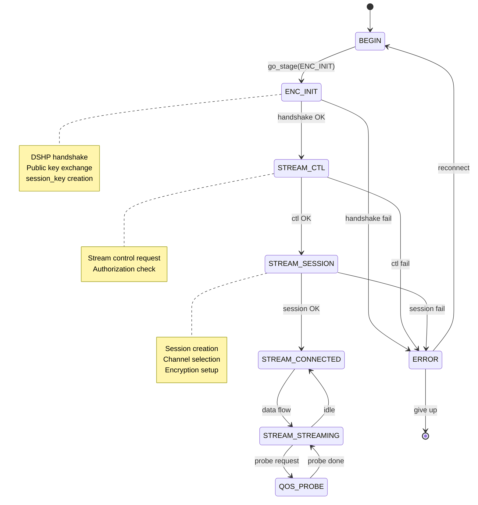

# Client Transport — FSM, Stages, Connection

> **Version:** 1.0 | **Date:** 2026-07-20 | **Module:** `dap-sdk/net/client/`

## Overview

The client transport manages server connections through a finite state machine (FSM) with well-defined stages. The architecture is split into three layers: public API (`dap_client_t`), FSM with cryptography (`dap_client_fsm_t`), and transport context (`dap_net_trans_ctx_t`).

## Architecture

```
┌─────────────────────────────────────────────────────┐
│ dap_client_t (public API, any thread)               │
│   stage_target, callbacks, trans_type, link_info    │
├─────────────────────────────────────────────────────┤
│ dap_client_fsm_t (FSM + crypto, dedicated FSM thread)│
│   stage, stage_status, session_key, reconnect logic │
├─────────────────────────────────────────────────────┤
│ dap_net_trans_ctx_t (session keys, stream ownership) │
│   session_key, stream_key, session_key_open         │
├─────────────────────────────────────────────────────┤
│ dap_client_trans_ctx_t (IO context, esocket)        │
│   _inheritor → back-reference to client             │
└─────────────────────────────────────────────────────┘
```

**Key design:** Heavy cryptography (key generation, signing) runs on the FSM thread, not on the IO worker. This keeps workers free for pure IO.

## Connection Stages

```c
typedef enum dap_client_stage {
    STAGE_UNDEFINED          = -1,
    STAGE_BEGIN              = 0,   // Initial state
    STAGE_ENC_INIT           = 1,   // Key exchange (handshake)
    STAGE_STREAM_CTL         = 2,   // Stream control
    STAGE_STREAM_SESSION     = 3,   // Session creation
    STAGE_STREAM_CONNECTED   = 4,   // Connected
    STAGE_STREAM_STREAMING   = 5,   // Active data transfer
    STAGE_QOS_PROBE          = 100, // Quality probing (optional)
} dap_client_stage_t;
```

### Stage Statuses

```c
typedef enum dap_client_stage_status {
    STAGE_STATUS_NONE        = 0,
    STAGE_STATUS_IN_PROGRESS,
    STAGE_STATUS_ERROR,
    STAGE_STATUS_DONE,
    STAGE_STATUS_COMPLETE,
} dap_client_stage_status_t;
```

## State Machine



## Stage Details

### STAGE_ENC_INIT — Key Exchange

Initiates the DSHP (DAP Stream Handshake Protocol) handshake:

1. Client forms `DSHP_MSG_HANDSHAKE_REQUEST` with Alice's public key
2. Server responds with `DSHP_MSG_HANDSHAKE_RESPONSE` with Bob's public key and session_id
3. Both parties compute shared secret via KEM
4. `session_key` is derived from shared secret via KDF

**Legacy mode:** For P2P connections, legacy HTTP POST to `/enc/gd4y5yh78w42aaagh` with `protocol_version=0` and MSRLN is supported. Enabled via `legacy_enc_handshake` flag on the client.

### STAGE_STREAM_CTL — Stream Control

Stream management: request to create stream, authorization check via `service_key`.

### STAGE_STREAM_SESSION — Session Creation

1. Client sends `DSHP_MSG_SESSION_CREATE` with channel list (e.g. "C,F,N")
2. Server creates session, assigns `session_id`
3. Server responds with `DSHP_MSG_SESSION_CREATE_RESPONSE`
4. Client confirms with `DSHP_MSG_STREAM_READY`
5. Server begins streaming with `DSHP_MSG_STREAM_START`

## Transport Selection

Client selects transport via `dap_client_set_trans_type()`:

```c
// Set transport BEFORE calling go_stage
dap_client_set_trans_type(client, DAP_NET_TRANS_TLS_DIRECT);

// Start connection
dap_client_go_stage(client, STAGE_STREAM_STREAMING, callback);
```

**Important:** Transport must be set before calling `dap_client_go_stage()`.

### Transport Fallback

On failure, the client can automatically switch to another transport:

```c
typedef struct dap_client_fsm {
    dap_net_trans_type_t  *tried_transports;      // Attempted transports
    size_t                tried_transport_count;
    size_t                tried_transport_capacity;
    // ...
} dap_client_fsm_t;
```

Algorithm: on error with current transport → add to `tried_transports` → try next from registered transports → if all exhausted, return error.

The `no_transport_fallback` flag disables automatic fallback.

## Session Resume

"Hot reconnect" mode — on connection drop, the client can try to restore the session without a full handshake:

```c
client->session_resume_mode = true;
```

Algorithm: on reconnect → try STREAM_CTL with copied `session_key` → if server accepts, continue without ENC_INIT → if rejected, full handshake.

## FSM Threading

```c
typedef struct dap_client_fsm {
    uint64_t          uuid;
    uint32_t          fsm_thread_idx;  // Bound FSM thread index
    dap_worker_t      *worker;         // IO dispatch worker
    // ...
} dap_client_fsm_t;
```

- **Sticky binding:** `fsm_thread_idx = uuid % fsm_pool_size`. Same client always on same FSM thread.
- **Division of labor:** FSM thread performs cryptography, IO worker handles network operations.
- **Dispatch:** `dap_client_fsm_dispatch()` allows scheduling arbitrary callbacks on the FSM thread.

## Errors

```c
typedef enum dap_client_error {
    ERROR_NO_ERROR = 0,
    ERROR_OUT_OF_MEMORY,
    ERROR_ENC_NO_KEY,
    ERROR_ENC_WRONG_KEY,
    ERROR_ENC_SESSION_CLOSED,
    ERROR_STREAM_CTL_ERROR,
    ERROR_STREAM_CTL_ERROR_AUTH,
    ERROR_STREAM_CTL_ERROR_RESPONSE_FORMAT,
    ERROR_STREAM_CONNECT,
    ERROR_STREAM_RESPONSE_WRONG,
    ERROR_STREAM_RESPONSE_TIMEOUT,
    ERROR_STREAM_FREEZED,
    ERROR_STREAM_ABORTED,
    ERROR_NETWORK_CONNECTION_REFUSE,
    ERROR_NETWORK_CONNECTION_TIMEOUT,
    ERROR_WRONG_STAGE,
    ERROR_WRONG_ADDRESS,
} dap_client_error_t;
```

## Reconnect Policy

On error, the client can automatically reconnect:
- `always_reconnect` — reconnect on any disconnect
- `connect_on_demand` — connect only when needed
- `reconnect_attempts` — attempt counter (in `dap_client_fsm_t`)
- `reconnect_pending` — reconnect waiting flag

## Related Documents

- [02 — Transport Abstraction Layer](02-transport-abstraction_en.md) — transport interface
- [03 — Concrete Transports](03-transports_en.md) — TLS, UDP, etc.
- [03 — DSHP Handshake](../protocol/03-handshake_en.md) — key exchange protocol
- Header files: `net/client/include/dap_client.h`, `dap_client_fsm.h`, `dap_client_trans_ctx.h`
