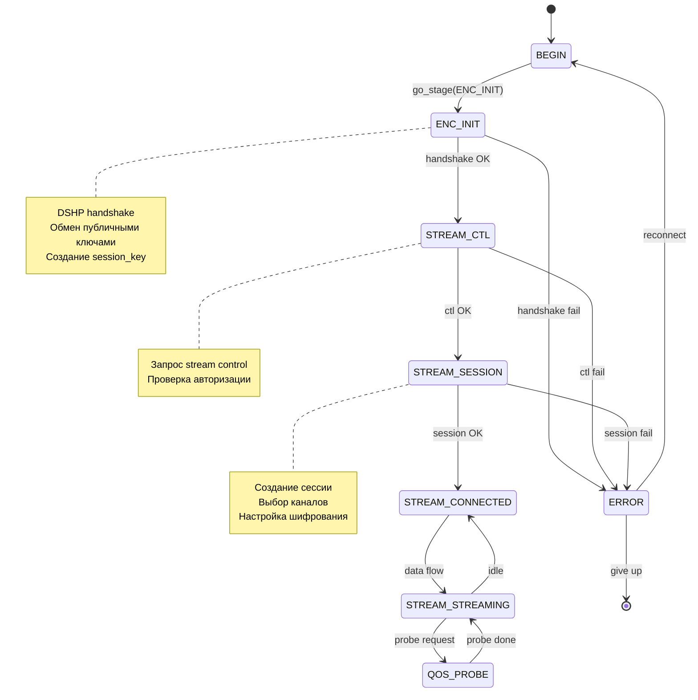

# Клиентский транспорт — FSM, стадии, подключение

> **Версия:** 1.0 | **Дата:** 2026-07-20 | **Модуль:** `dap-sdk/net/client/`

## Обзор

Клиентский транспорт управляет установкой соединения с сервером через конечный автомат (FSM) с чётко определёнными стадиями. Архитектура разделена на три слоя: публичный API (`dap_client_t`), FSM с криптографией (`dap_client_fsm_t`), и транспортный контекст (`dap_net_trans_ctx_t`).

## Архитектура

```
┌─────────────────────────────────────────────────────┐
│ dap_client_t (публичный API, любой поток)           │
│   stage_target, callbacks, trans_type, link_info    │
├─────────────────────────────────────────────────────┤
│ dap_client_fsm_t (FSM + крипто, выделенный FSM thread)│
│   stage, stage_status, session_key, reconnect logic │
├─────────────────────────────────────────────────────┤
│ dap_net_trans_ctx_t (сессионные ключи, stream)      │
│   session_key, stream_key, session_key_open         │
├─────────────────────────────────────────────────────┤
│ dap_client_trans_ctx_t (IO контекст, esocket)       │
│   _inheritor → обратная ссылка на client            │
└─────────────────────────────────────────────────────┘
```

**Ключевой дизайн:** Тяжёлая криптография (генерация ключей, подписи) выполняется на FSM потоке, а не на IO worker. Это освобождает worker для чистого IO.

## Стадии подключения (Client Stages)

```c
typedef enum dap_client_stage {
    STAGE_UNDEFINED          = -1,
    STAGE_BEGIN              = 0,   // Начальное состояние
    STAGE_ENC_INIT           = 1,   // Обмен ключами (handshake)
    STAGE_STREAM_CTL         = 2,   // Stream control (управление потоком)
    STAGE_STREAM_SESSION     = 3,   // Создание сессии
    STAGE_STREAM_CONNECTED   = 4,   // Подключено
    STAGE_STREAM_STREAMING   = 5,   // Активная передача данных
    STAGE_QOS_PROBE          = 100, // Измерение качества (опционально)
} dap_client_stage_t;
```

### Статусы стадий

```c
typedef enum dap_client_stage_status {
    STAGE_STATUS_NONE        = 0,
    STAGE_STATUS_IN_PROGRESS,    // Выполняется
    STAGE_STATUS_ERROR,          // Ошибка
    STAGE_STATUS_DONE,           // Завершено
    STAGE_STATUS_COMPLETE,       // Полностью завершено
} dap_client_stage_status_t;
```

## State Machine



## Этапы подключения детально

### STAGE_ENC_INIT — Обмен ключами

Инициирует DSHP (DAP Stream Handshake Protocol) handshake:

1. Клиент формирует `DSHP_MSG_HANDSHAKE_REQUEST` с публичным ключом Alice
2. Сервер отвечает `DSHP_MSG_HANDSHAKE_RESPONSE` с публичным ключом Bob и session_id
3. Обе стороны вычисляют общий секрет через KEM
4. Из общего секрета через KDF производится `session_key`

**Legacy mode:** Для P2P соединений поддерживается legacy HTTP POST к `/enc/gd4y5yh78w42aaagh` с `protocol_version=0` и MSRLN. Включается флагом `legacy_enc_handshake` на клиенте.

### STAGE_STREAM_CTL — Stream Control

Управление потоком: запрос на создание stream, проверка авторизации через `service_key`.

### STAGE_STREAM_SESSION — Создание сессии

1. Клиент отправляет `DSHP_MSG_SESSION_CREATE` с списком каналов (например "C,F,N")
2. Сервер создаёт сессию, назначает `session_id`
3. Сервер отвечает `DSHP_MSG_SESSION_CREATE_RESPONSE`
4. Клиент подтверждает `DSHP_MSG_STREAM_READY`
5. Сервер начинает streaming `DSHP_MSG_STREAM_START`

## Transport Selection

Клиент выбирает транспорт через `dap_client_set_trans_type()`:

```c
// Установить транспорт ДО вызова go_stage
dap_client_set_trans_type(client, DAP_NET_TRANS_TLS_DIRECT);

// Запустить подключение
dap_client_go_stage(client, STAGE_STREAM_STREAMING, callback);
```

**Важно:** Транспорт должен быть установлен до вызова `dap_client_go_stage()`.

### Transport Fallback

При неудаче клиент может автоматически переключиться на другой транспорт:

```c
typedef struct dap_client_fsm {
    dap_net_trans_type_t  *tried_transports;      // Попробованные транспорты
    size_t                tried_transport_count;
    size_t                tried_transport_capacity;
    // ...
} dap_client_fsm_t;
```

Алгоритм: при ошибке на текущем транспорте → добавить в `tried_transports` → попробовать следующий из зарегистрированных → если все исчерпаны, вернуть ошибку.

Флаг `no_transport_fallback` отключает автоматический fallback.

## Session Resume

Режим «горячего переподключения» — при обрыве соединения клиент может попробовать восстановить сессию без полного handshake:

```c
client->session_resume_mode = true;
```

Алгоритм: при reconnect → попробовать STREAM_CTL с скопированным `session_key` → если сервер принял, продолжить без ENC_INIT → если отклонил, полный handshake.

## FSM Threading

```c
typedef struct dap_client_fsm {
    uint64_t          uuid;
    uint32_t          fsm_thread_idx;  // Индекс привязанного FSM потока
    dap_worker_t      *worker;         // IO dispatch worker
    // ...
} dap_client_fsm_t;
```

- **Sticky binding:** `fsm_thread_idx = uuid % fsm_pool_size`. Один и тот же клиент всегда на одном FSM потоке.
- **Разделение труда:** FSM поток выполняет криптографию, IO worker — сетевые операции.
- **Dispatch:** `dap_client_fsm_dispatch()` позволяет запланировать произвольный callback на FSM потоке.

## Ошибки

```c
typedef enum dap_client_error {
    ERROR_NO_ERROR = 0,
    ERROR_OUT_OF_MEMORY,
    ERROR_ENC_NO_KEY,
    ERROR_ENC_WRONG_KEY,
    ERROR_ENC_SESSION_CLOSED,
    ERROR_STREAM_CTL_ERROR,
    ERROR_STREAM_CTL_ERROR_AUTH,
    ERROR_STREAM_CTL_ERROR_RESPONSE_FORMAT,
    ERROR_STREAM_CONNECT,
    ERROR_STREAM_RESPONSE_WRONG,
    ERROR_STREAM_RESPONSE_TIMEOUT,
    ERROR_STREAM_FREEZED,
    ERROR_STREAM_ABORTED,
    ERROR_NETWORK_CONNECTION_REFUSE,
    ERROR_NETWORK_CONNECTION_TIMEOUT,
    ERROR_WRONG_STAGE,
    ERROR_WRONG_ADDRESS,
} dap_client_error_t;
```

## Reconnect Policy

При ошибке клиент может автоматически переподключаться:
- `always_reconnect` — переподключаться при любом разрыве
- `connect_on_demand` — подключаться только при необходимости
- `reconnect_attempts` — счётчик попыток (в `dap_client_fsm_t`)
- `reconnect_pending` — флаг ожидания переподключения

## Связанные документы

- [02 — Transport Abstraction Layer](02-transport-abstraction_ru.md) — интерфейс транспортов
- [03 — Конкретные транспорты](03-transports_ru.md) — реализации TLS, UDP и др.
- [03 — DSHP Handshake](../protocol/03-handshake_ru.md) — протокол обмена ключами
- Заголовочные файлы: `net/client/include/dap_client.h`, `dap_client_fsm.h`, `dap_client_trans_ctx.h`
