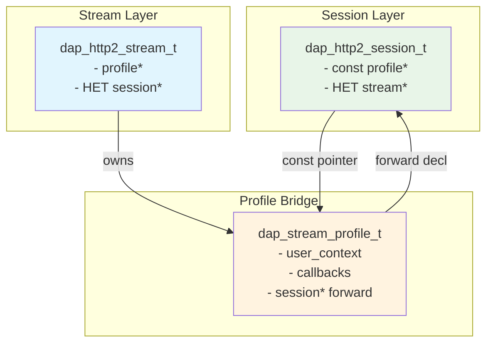
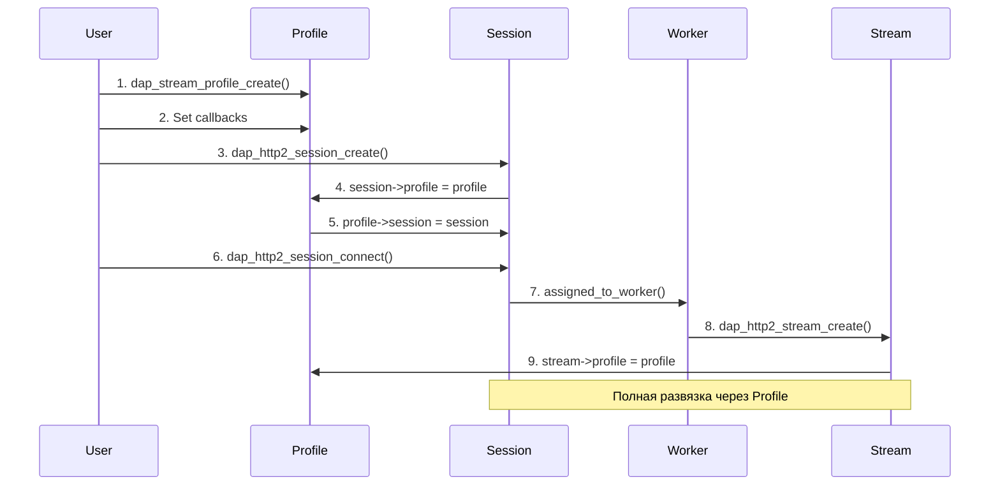
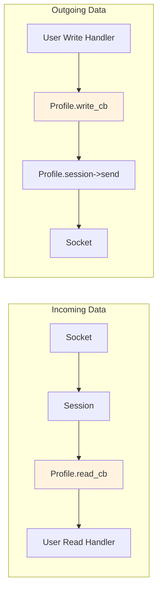

# Stream Profile Decoupling Master Plan
## Полная развязка Session ↔ Stream через минимальный Profile

### 🎯 **Цель архитектуры**
Убрать прямую связь между Session и Stream, заменив на связь через минимальный Profile с forward declaration.

---

## 📋 **Architecture Overview**

### **Before (текущее состояние)**
```
Session ←→ Stream (прямые указатели)
```

### **After (целевое состояние)**
```
Session → Profile ← Stream (через Profile bridge)
```

---

## 🏗️ **Architecture Diagrams**

### **1. Data Structure Relations**


### **2. Lifecycle Flow**


### **3. Data Flow**


---

## 📊 **Detailed Call Flow Analysis**

### **Current vs New Call Chains**

#### **Current (Problematic)**
```
Socket Data → Session → session->stream → stream->read_cb(stream*, data, size)
                    ↑_____circular dependency_____↑
```

#### **New (Clean)**
```
Socket Data → Session → profile->read_cb(data, size, context)
                                    ↓
Stream Write → profile->session->send(data, size)
```

### **Protocol Upgrade Scenario**
```
HTTP Request → Profile{http_read, http_write} → WebSocket Upgrade → 
→ Stream changes Profile callbacks → Profile{ws_read, ws_write} → WebSocket Data
```

---

## 🔧 **Implementation Steps**

### **Step 1: Create dap_stream_profile.h**
```c
// Forward declaration для развязки
struct dap_http2_session;

// Минимальная структура профиля
typedef struct dap_stream_profile {
    // USER INTERFACE
    void *user_context;
    dap_stream_read_callback_t read_cb;
    dap_stream_write_callback_t write_cb;
    // ... остальные callbacks
    
    // INTERNAL SESSION REFERENCE
    struct dap_http2_session *session;  // Forward declaration
    
} dap_stream_profile_t;
```

### **Step 2: Update Session Structure**
```c
// В dap_http2_session.h
typedef struct dap_http2_session {
    // УБРАТЬ: dap_http2_stream_t *stream;
    const dap_stream_profile_t *stream_profile;  // ДОБАВИТЬ
    // ... остальные поля
} dap_http2_session_t;
```

### **Step 3: Update Stream Structure**
```c
// В dap_http2_stream.h
struct dap_http2_session;  // Forward declaration

typedef struct dap_http2_stream {
    // УБРАТЬ: dap_http2_session_t *session;
    dap_stream_profile_t *profile;  // ДОБАВИТЬ (owns)
    // ... остальные поля
} dap_http2_stream_t;
```

### **Step 4: Update Session Read Callback**
```c
// В dap_http2_session.c
static void s_session_read_callback(dap_events_socket_t *a_esocket, 
                                   void *a_data, size_t a_data_size) {
    dap_http2_session_t *session = (dap_http2_session_t *)a_esocket->_inheritor;
    
    // СТАРЫЙ КОД:
    // if (session->stream) {
    //     dap_http2_stream_process_data(session->stream, a_data, a_data_size);
    // }
    
    // НОВЫЙ КОД:
    if (session->stream_profile && session->stream_profile->read_cb) {
        session->stream_profile->read_cb(a_data, a_data_size, 
                                        session->stream_profile->user_context);
    }
}
```

### **Step 5: Update Stream Write Operations**
```c
// В dap_http2_stream.c
struct dap_http2_session;  // Forward declaration

int stream_write_data(dap_http2_stream_t *stream, const void *data, size_t size) {
    // СТАРЫЙ КОД:
    // return dap_http2_session_send(stream->session, data, size);
    
    // НОВЫЙ КОД:
    if (stream->profile && stream->profile->session) {
        return dap_http2_session_send(stream->profile->session, data, size);
    }
    return -1;
}
```

---

## 🎯 **Complete Callback Signatures**

### **Generic Callbacks (New)**
```c
// Убираем типизацию - максимальная гибкость
typedef size_t (*dap_stream_read_callback_t)(const void *data, size_t size, void *context);
typedef ssize_t (*dap_stream_write_callback_t)(void *buffer, size_t buffer_size, void *context);
typedef void (*dap_stream_connected_callback_t)(void *context);
typedef void (*dap_stream_error_callback_t)(int error, void *context);
typedef void (*dap_stream_closed_callback_t)(void *context);
```

### **User Implementation Example**
```c
// HTTP Protocol
size_t http_read_callback(const void *data, size_t size, void *context) {
    http_context_t *http_ctx = (http_context_t*)context;
    // Parse HTTP data
    return size;
}

ssize_t http_write_callback(void *buffer, size_t buffer_size, void *context) {
    http_context_t *http_ctx = (http_context_t*)context;
    // Format HTTP response
    return snprintf(buffer, buffer_size, "HTTP/1.1 200 OK\r\n\r\n");
}

// WebSocket Protocol  
size_t ws_read_callback(const void *data, size_t size, void *context) {
    ws_context_t *ws_ctx = (ws_context_t*)context;
    // Parse WebSocket frames
    return size;
}
```

---

## 🚀 **Zero-Copy Buffer Management**

### **API Functions (declared in profile, implemented in session)**
```c
// В dap_stream_profile.h
void* dap_stream_profile_get_write_buffer(struct dap_http2_session *session, size_t *available_size);
int dap_stream_profile_flush_write_buffer(struct dap_http2_session *session, size_t bytes_written);

// В dap_http2_session.c
void* dap_stream_profile_get_write_buffer(dap_http2_session_t *session, size_t *available_size) {
    if (session && session->private_data) {
        dap_http2_session_private_t *priv = session->private_data;
        if (priv->es && priv->encryption_type == DAP_SESSION_ENCRYPTION_NONE) {
            // Zero-copy: direct socket buffer
            *available_size = priv->es->buf_out_size_max - priv->es->buf_out_size;
            return priv->es->buf_out + priv->es->buf_out_size;
        }
    }
    
    // Fallback: temporary buffer
    *available_size = 4096;
    return malloc(*available_size);
}
```

---

## 📊 **Performance Analysis**

### **Memory Footprint**
- **Profile structure**: ~64 bytes (6 pointers + user context + session pointer)
- **Additional overhead**: 0 bytes (replaces existing callback structures)
- **Total impact**: Neutral or slightly positive

### **Call Chain Overhead**
- **Current**: Session → Stream → Callback (2 indirections)
- **New**: Session → Profile → Callback (2 indirections)
- **Performance**: Identical

### **Zero-Copy Efficiency**
- **Direct buffer access**: через forward declaration
- **No additional copies**: данные остаются в исходном буфере
- **Optimal path**: Socket → Profile → User (минимальные копирования)

---

## 🎯 **Verification Criteria**

### **Architecture Compliance**
- [ ] Session НЕ содержит прямых указателей на Stream
- [ ] Stream НЕ содержит прямых указателей на Session  
- [ ] Все связи идут через Profile
- [ ] Forward declarations используются для минимальной связности

### **Functionality Preservation**
- [ ] Данные передаются Session → Profile → User
- [ ] Данные передаются User → Profile → Session
- [ ] Lifecycle работает корректно
- [ ] Protocol upgrades возможны через изменение callbacks

### **Performance Requirements**
- [ ] Нет дополнительного overhead от поиска объектов
- [ ] Прямой вызов функций через указатели
- [ ] Минимальная memory footprint для Profile
- [ ] Zero-copy оптимизация работает

---

## 🔄 **File Changes Summary**

### **New Files**
1. **`dap_stream_profile.h`** - новый заголовочный файл (~50 строк)
2. **`dap_stream_profile.c`** - реализация API (~100 строк)

### **Modified Files**
1. **`dap_http2_session.h`** - изменить структуру (~3 строки)
2. **`dap_http2_session.c`** - изменить read callback (~5 строк)
3. **`dap_http2_stream.h`** - изменить структуру (~3 строки)
4. **`dap_http2_stream.c`** - изменить write operations (~5 строк)
5. **`dap_http2_client.c`** - обновить user callbacks (~10 строк)

### **Total Impact: ~176 новых строк, ~26 измененных строк**

---

## 🚀 **Implementation Phases**

### **Phase 1: Core Structure**
1. Создать `dap_stream_profile.h` с forward declarations
2. Обновить Session и Stream структуры
3. Компиляция и базовая проверка

### **Phase 2: Data Flow**
1. Обновить Session read callback
2. Обновить Stream write operations
3. Тестирование передачи данных

### **Phase 3: User Interface**
1. Обновить user callback signatures
2. Обновить примеры использования
3. Integration testing

### **Phase 4: Advanced Features**
1. Protocol upgrade scenarios
2. Zero-copy buffer management
3. Performance optimization

---

## 🔍 **Pre-Implementation Checklist**

### **Architecture Design**
- [ ] Диаграммы утверждены
- [ ] Call flow понятен
- [ ] Lifecycle проработан
- [ ] Performance implications оценены

### **Code Design**
- [ ] Структуры спроектированы
- [ ] Callback signatures определены
- [ ] Forward declarations планированы
- [ ] API функции определены

### **Integration Planning**
- [ ] Existing code analysis завершен
- [ ] Migration strategy определена
- [ ] Testing approach планирован
- [ ] Rollback plan готов

---

## 📈 **Success Metrics**

### **Decoupling Achievement**
- Session и Stream компилируются независимо
- Нет прямых #include зависимостей между ними
- Forward declarations работают корректно

### **Functional Equivalence**
- Все существующие HTTP/WebSocket сценарии работают
- Performance не хуже текущего
- API остается интуитивным

### **Flexibility Gains**
- Protocol upgrades через изменение callbacks
- Multiple stream support готов
- Легкое тестирование компонентов

---

## 🎉 **Final Architecture Benefits**

1. **Complete Decoupling** - Session ↔ Stream через минимальный Profile
2. **Generic Callbacks** - без типизации, максимальная гибкость
3. **Forward Declarations** - минимальные зависимости заголовков
4. **Simple API** - прямые вызовы функций
5. **Performance** - нет overhead от поиска или сложных вызовов
6. **Zero-Copy Ready** - прямой доступ к socket buffers
7. **Protocol Agnostic** - HTTP/WebSocket/Custom protocols
8. **Multiple Streams** - архитектура готова для расширения

---

## ✅ **Implementation Authorization**

**Этот мастер-план готов к утверждению и поэтапной реализации!**

**Следующий шаг**: Утверждение архитектуры и переход к Phase 1 - Core Structure implementation. 