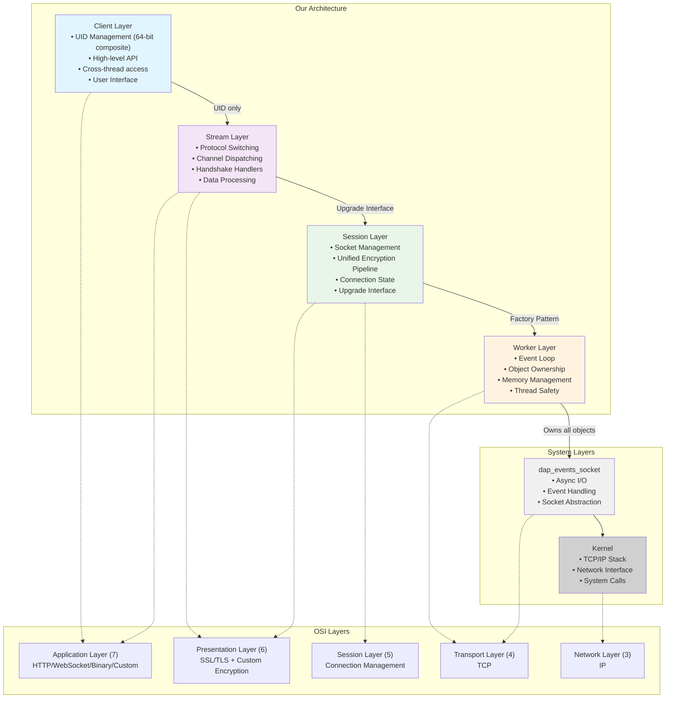
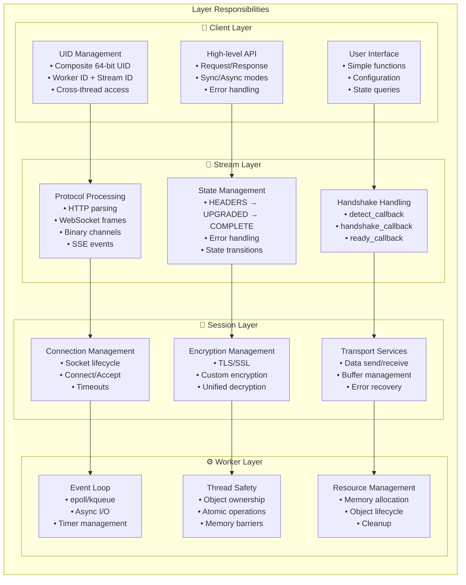
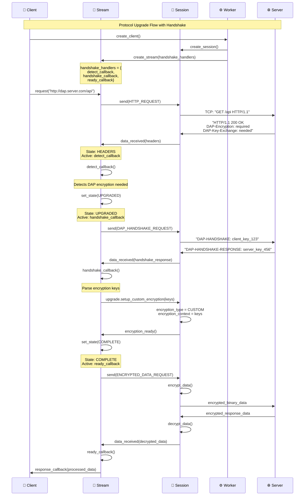
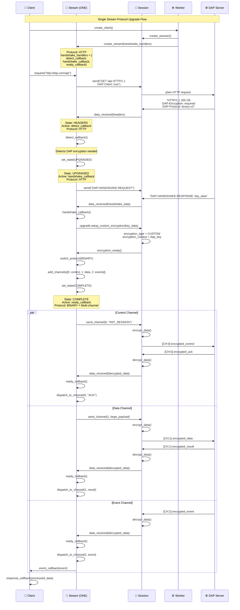
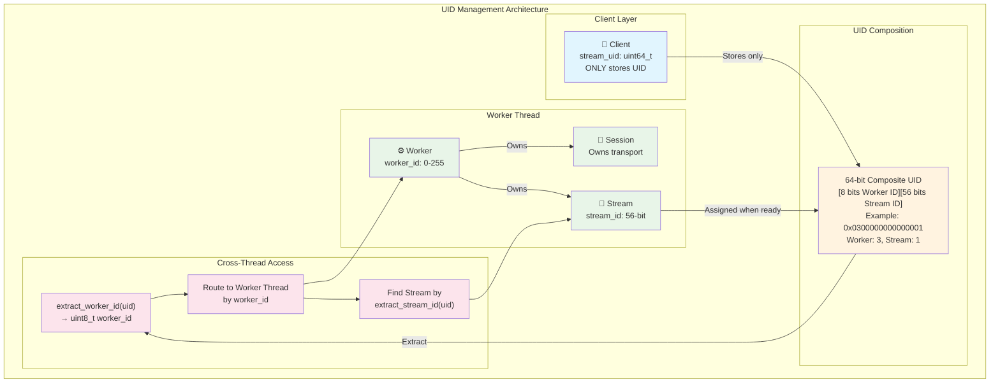
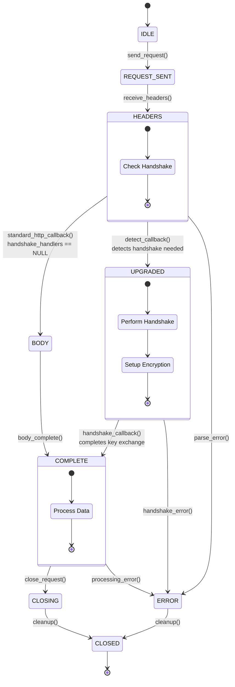
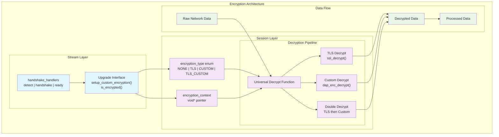
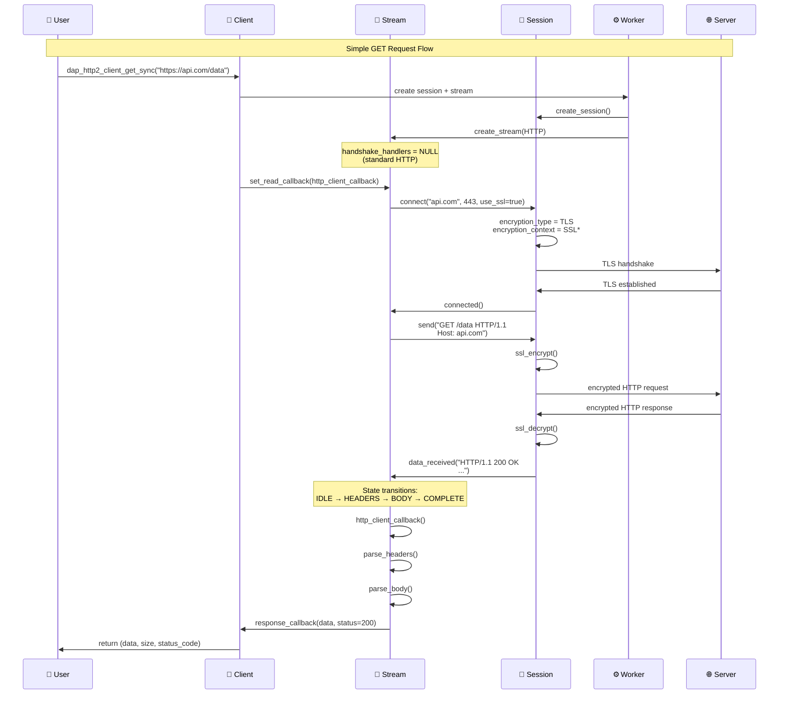
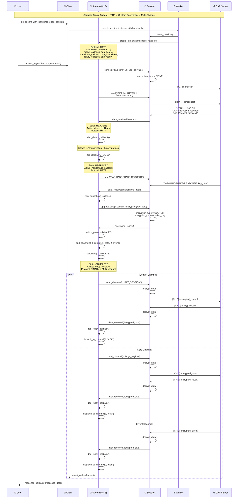

# 📊 Architecture Diagrams Index

## 🎯 **Полный набор диаграмм HTTP2 Client архитектуры**

---

## **1. 🏗️ OSI Layer Mapping**

---

## **2. 🎯 Layer Responsibilities**

---

## **3. 🔄 Protocol Upgrade with Handshake**

---

## **4. 🌊 Single Stream Protocol Upgrade**

---

## **5. 📊 UID Management Architecture**

---

## **6. 🔄 Stream State Machine**

---

## **7. 🔐 Unified Encryption Architecture**

---

## **8. 📈 Simple GET Request Flow**

---

## **9. 🎯 Complex Single Stream Flow**

---

## 🎯 **Summary**

**9 диаграмм покрывают:**
- ✅ **Структурную архитектуру** (OSI mapping, responsibilities)
- ✅ **UID Management** (composite UID, cross-thread access)
- ✅ **Protocol Upgrades** (handshake, multi-stream)
- ✅ **State Management** (Stream states, transitions)
- ✅ **Encryption Architecture** (unified decryption pipeline)
- ✅ **Data Flow Examples** (simple GET, complex multi-channel)

**Все диаграммы отражают упрощенную архитектуру без избыточных enum'ов!** 🚀 